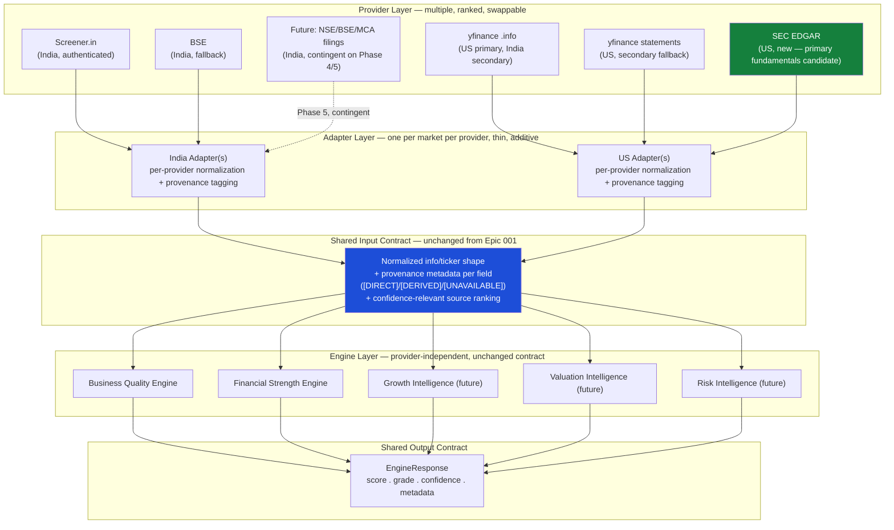

# StockSense360 Data Strategy Report — Data Independence & Provider Strategy

**Status:** Research, architecture, and engineering-decision report. No production code modified. No existing provider changed. No existing engine redesigned. Per this sprint's explicit scope, this document informs engineering decisions; it does not make any of them irreversible by itself.
**Epic:** 002 — Financial Strength Intelligence, Sprint #002.
**Scope:** this study's conclusions are intended to guide every future StockSense360 intelligence engine's data architecture (Business Quality, Financial Strength, Growth, Valuation, Risk, Recommendation, Portfolio, AI Research Analyst), not Financial Strength alone.
**Governed by:** SES-001 through SES-005, the StockSense360 Product Glossary, SSDS-000, SSDS-003, SSDS-004, SSDS-005, the [SSDS-005 Data Validation Report](SSDS-005-Financial-Strength-Intelligence-Data-Validation-Report.md), [MASTER-ROADMAP.md](../../MASTER-ROADMAP.md), [EPIC-001 Closure](../EPICS/EPIC-001-Business-Quality-Intelligence-Closure.md).
**Method:** every claim below is either a direct citation of existing, already-reviewed code/documents from this engagement, or the output of a live API call made during this study (SEC EDGAR, screener.in, NSE, yfinance) — not estimated, not assumed.

---

## Executive Summary

**The central strategic finding: StockSense360 can become substantially independent of Screener.in for the United States almost immediately, using a free, official, structurally superior source (SEC EDGAR) that this codebase does not yet integrate at all — but India has no equivalent free, structured source, and genuine independence there requires either a materially larger engineering investment (direct NSE/BSE filing ingestion) or accepting continued, credentialed dependence on Screener.in as the most practical near-term answer.**

Five findings drive every recommendation in this report:

1. **SEC EDGAR is free, requires no API key, and is structurally richer than yfinance for US fundamentals.** Confirmed live in this study: SEC EDGAR's `companyfacts` API returned full, correctly-tagged data for Apple (AAPL) including `AssetsCurrent`, `LiabilitiesCurrent`, `CashAndCashEquivalentsAtCarryingValue`, `LongTermDebtNoncurrent`, `LongTermDebtCurrent`, `InterestExpense`, and `NetCashProvidedByUsedInOperatingActivities` — **with 17 years of history (fiscal years 2009–2026)**, far exceeding yfinance's 4–5-year cap (confirmed in the SSDS-005 Data Validation Report). This is the single most actionable finding in this study.
2. **SEC EDGAR confirms, independently of yfinance, that the FINANCIAL sector has no conventional current-assets/current-liabilities structure.** Confirmed live for JPMorgan Chase (JPM): `AssetsCurrent`, `LiabilitiesCurrent`, `LongTermDebtNoncurrent`, and `OperatingIncomeLoss` are **all absent from JPM's own official XBRL filings** — not a yfinance quirk, a genuine fact about how banks report financial statements. This cross-source confirmation upgrades the Sector Adaptation hypothesis in SSDS-005 from "proposed, pending validation" to "confirmed by two independent sources."
3. **SEC EDGAR enforces a strict, documented fair-access policy** (a descriptive `User-Agent` identifying the requester and contact information is mandatory; the rate limit is approximately 10 requests/second) — confirmed live in this study when a generic, non-compliant User-Agent triggered an immediate `Request Rate Threshold Exceeded` response. This is a known, narrow operational constraint, not a blocker — unlike Screener.in's IP-level block (SSDS-005 Data Validation Report), SEC's policy is published, predictable, and designed to be respected by automated systems exactly like StockSense360's refresh jobs.
4. **India has no public, free, structured equivalent to SEC EDGAR.** Confirmed by direct code review (`nse_client.py` exposes only quotes, index levels, and gainers/losers — no financial-statement endpoint) and reconfirmed by SSDS-004's own already-published finding ("No bulk/structured API is currently used in this codebase for financial-statement XBRL specifically"). India's structured-filing path (MCA XBRL filings, NSE/BSE corporate-announcement PDFs) is real but requires materially more engineering than a single new HTTP client.
5. **The architectural pattern Epic 001 already proved — provider-independent engines fed by thin, per-market adapters — is the correct foundation for solving this, and does not need to change.** This study's recommendation is about *which providers* feed those adapters and *how many* exist per market, not about redesigning the engine/adapter boundary itself.

**Bottom line:** independence from Screener.in is **realistically achievable for the US** (largely already true once SEC EDGAR is wired in) and **only partially achievable for India** within a 12–24 month horizon — full India independence would require either a significant new XBRL-ingestion engineering investment or a paid vendor, neither justified by evidence today. The recommended posture is **provider diversification, not provider replacement**: reduce Screener.in from "the only path" to "one path among several, with the most-valuable gaps filled by free, official, structured sources" — a defensible, evidence-backed middle ground between "do nothing" and "rebuild the data layer."

---

## Phase 1 — Review of Existing Architecture

Summary of the provider architecture as it exists today, confirmed against the documents this sprint names and the codebase directly (no new claims beyond what was already established in this engagement, except where marked "new this study"):

- **India today** runs on a layered fallback: raw `yfinance.Ticker.info` (sparse/stale for NSE names, confirmed in SSDS-004) → `screener_data.py`'s scrape (the de facto primary for India, confirmed across Epic 001 and the SSDS-005 study) → `bse_data.py` as an already-integrated fallback triggered when yfinance returns fewer than 3 of 6 key fields. The nightly refresh path (`fundamentals_refresh.py`) calls `fetch_screener_data()` directly and never constructs a `yfinance.Ticker` at all — the architectural fact that made Sprint #005's Multibagger integration US-only (EPIC-001 Closure, SSDS-004).
- **US today** runs almost entirely on `yfinance` — `.info` for aggregate ratios, with `.balance_sheet`/`.cashflow`/`.financials` statement-level access confirmed available in the SSDS-005 study (73–100% field coverage, 4–5 years of history) but **not currently wired into `us_fundamentals.py`** — a wiring gap, not a data gap, named in that report's Gap Analysis.
- **Caching today** is fragmented: at least nine independent in-memory TTL-cache dictionaries exist across `screener_data.py`, `bse_data.py`, `market_data.py`, `global_context.py`, `quality_factors.py`, `news_sentiment.py`, `nse_client.py`, `nse_fii_dii.py`, `nse_pledge.py`, `prediction_engine.py`, `screener_service.py`, `heatmap_service.py`, and `finnhub_client.py` (confirmed by direct grep this study — consistent with, and a slightly larger count than, SEAR-001's original "at least six" finding cited in SSDS-000 §5, suggesting the fragmentation has grown, not shrunk, since that audit). **Named here as context for Phase 7's architecture proposal — not in scope to fix in this sprint.**
- **No SEC EDGAR integration exists anywhere in the codebase today** — confirmed by direct repository search (zero matches for "edgar" or "sec.gov" across `backend/services`, `backend/api`, `backend/scripts`). This is the single largest concrete opportunity this study identifies.
- **Provider independence at the engine level already holds.** Both `business_quality_engine.py` and the forthcoming Financial Strength Engine (SSDS-005) are specified to read only a shaped `info`/`ticker` contract, never a provider name — confirmed by Epic 001's own validated experience (zero engine changes were needed to add India support in Sprint #007). This principle is preserved, not revisited, by this report.

---

## Phase 2 — Provider Inventory

| Provider | Purpose today | Markets | Data supplied | Strengths | Weaknesses | Reliability (confirmed) | Rate limits | Auth | Refresh frequency | Operational cost | Licensing | Current dependencies |
|---|---|---|---|---|---|---|---|---|---|---|---|---|
| **screener.in** | Primary India fundamentals scrape | India | 72 fields per company (confirmed live this study for TCS): valuation, profitability, growth, P&L/cash-flow/balance-sheet line items, shareholding, banking-specific ratios. **Not supplied:** current assets/liabilities, cash, debt-maturity split (confirmed structurally absent, SSDS-005 study). | Richest single India source in this codebase; 12-year history depth (confirmed); already deeply integrated. | **Unauthenticated access is IP-blocked after ~12–15 requests in under 2 minutes** (confirmed live, this study and the SSDS-005 study); a scrape of a third-party site, not an official API — general ToS risk already named in SSDS-004, unresolved. | Authenticated behavior not independently re-tested this study (no credentials available); unauthenticated reliability is confirmed poor at any batch volume. | None published; observed blocking is bot-detection, not a documented quota. | `SCREENER_EMAIL`/`SCREENER_PASSWORD` (optional but operationally required at scale, per the module's own docstring). | Daily (4-hour cache TTL). | Free (personal-use scraping); no paid tier currently used. | Third-party ToS risk, named and unresolved across SSDS-004/SSDS-005/this study. | `prediction_engine.py`, `fundamentals_refresh.py`, `multibagger_scorecard.py`, the India Business Quality Adapter. |
| **yfinance** | Primary US fundamentals; secondary India fallback | US (primary), India (secondary) | `.info` (74–100% field coverage for US, confirmed SSDS-005); `.balance_sheet`/`.cashflow`/`.financials` (73–100% coverage, 4–5-year history, confirmed but not yet wired into production code). | Already deeply integrated for US; no per-symbol authentication; broad market coverage. | **Structurally sparse/stale for India** (confirmed SSDS-004, not re-tested this study since that finding stands); history capped at 4–5 years even for US (confirmed this study, contrasted unfavorably against SEC EDGAR's 17 years for the same company). | Reliable in this study (70/70 US calls, zero errors) and in the earlier SSDS-005 study; a separate raw-endpoint probe earlier in this engagement did hit a 429, but the `yfinance` library itself (different request path) did not. | Unofficial library scraping Yahoo's endpoints; no published SLA. | None required. | Nightly + on-demand. | Free. | Unofficial use of a public website's data; an existing, accepted exposure across this entire codebase, not newly introduced. | `prediction_engine.py`, `us_fundamentals.py`, `market_data.py`, the US Business Quality Adapter. |
| **Yahoo Finance statements** (`.balance_sheet`/`.cashflow`/`.financials`, distinct row from `.info` above per this sprint's brief) | Same library, deeper line items | US (confirmed this study), India (not separately re-tested — SSDS-004 already found `.info`-level India coverage poor; statement-level India coverage was not tested in this study and is named as an open question, not assumed equally poor) | Current assets/liabilities, debt-maturity split, working capital, EBIT, interest expense, capex — exactly the fields `.info` lacks (confirmed SSDS-005 study). | Already paid for in licensing-risk terms (same library as `.info`); no new integration needed, only new wiring. | Same 4–5-year cap as `.info`; same unofficial-library risk profile. | Same as yfinance row above. | Same. | Same. | Same. | Same. | `us_fundamentals.py` does not currently call these statement accessors (confirmed by code review) — a wiring gap. |
| **BSE** (`bse_data.py`) | India fallback when yfinance is sparse | India | A `.info`-shaped subset equivalent to a portion of screener.in's fields (confirmed SSDS-004); no current-assets/liabilities or debt-maturity data (same gap, not independently re-tested this study). | Already integrated and proven working (Path A fallback, confirmed SSDS-004/Epic 001). | Narrower field set than screener.in; same fundamental gap (no balance-sheet-asset-side detail). | Confirmed working as a fallback in production, per Epic 001's own validated experience. | Not documented; not stress-tested this study. | None confirmed required. | On-demand fallback only. | Free. | Same exchange-of-record open question as NSE (SSDS-004 §8, unresolved). | Path A's `prediction_engine.py` fallback chain. |
| **NSE** (`nse_client.py`, `nse_fii_dii.py`, `nse_pledge.py`) | Quotes, index levels, FII/DII flow, pledge data | India | Live quotes, NIFTY index data, gainers/losers, institutional flow, promoter pledge — **confirmed by direct code review: no financial-statement/XBRL endpoint exists in any of these three modules.** | Already integrated for its current, narrow purpose; official exchange data. | **Not a fundamentals source at all today** — this study confirms SSDS-004's same finding rather than discovering something new. | Reliable for its existing, narrow purpose (quotes/flow); unknown for any future financial-statement use, since none exists. | NSE enforces session/referer requirements (`_ensure_session()` confirmed in code); not stress-tested for a hypothetical new endpoint. | Session-cookie-based, no API key. | Real-time/on-demand for quotes; not applicable to fundamentals (no such path exists). | Free. | Exchange-of-record licensing/redistribution question, named in SSDS-004 §8, unresolved, applies equally to any future fundamentals use. | `daily_picks.py`, `screener_service.py`, market-overview features. |
| **SEC EDGAR** *(not currently integrated — new this study)* | Not used today; evaluated as a candidate | US only | `companyfacts`/`companyconcept` XBRL APIs — confirmed live this study: full coverage of `Assets`, `AssetsCurrent`, `LiabilitiesCurrent`, `CashAndCashEquivalentsAtCarryingValue`, `LongTermDebtNoncurrent`, `LongTermDebtCurrent`, `InterestExpense`, `OperatingIncomeLoss`, `NetCashProvidedByUsedInOperatingActivities` for a non-financial company (AAPL), with **17 years of history**. For a financial-sector company (JPM), `AssetsCurrent`/`LiabilitiesCurrent`/`LongTermDebtNoncurrent`/`OperatingIncomeLoss` are confirmed **absent from the company's own official filing** — a real fact about bank reporting, not a data-source gap. | **Official, primary-source, government-published data — the strongest licensing posture of any provider in this table.** Free, no API key. Materially deeper history than yfinance. | Strict fair-access policy: a descriptive `User-Agent` (identifying app + contact) is mandatory; informal ~10 req/sec rate limit; **confirmed live this study — a non-compliant request triggered an immediate block.** US-only; quarterly/annual filing cadence only (not real-time). | Confirmed reachable and correctly structured for both a non-financial and a financial-sector company in this study — a small but real, evidence-based sample. | Documented, published, predictable (sec.gov's own fair-access policy) — a fundamentally different risk profile than screener.in's undocumented IP-block. | None (key-free; identify via User-Agent only). | Per-filing (quarterly 10-Q, annual 10-K) — slower than screener.in's daily update but appropriate for fundamentals, which don't change daily. | Free. | **Official US government data — explicitly public domain, the cleanest licensing posture of any source evaluated in this entire engagement.** | None yet — a clean, additive integration opportunity. |
| **Existing `stock_fundamentals_cache` / refresh jobs** | Stores computed engine outputs and the fields feeding them | Both | Confirmed by direct schema reading (SSDS-000 §5): no columns exist yet for Financial Strength's new fields (debt-maturity split, current assets/liabilities for India, standalone interest expense). | Proven, working nightly-refresh pattern; no new caching concept needed for Financial Strength. | Carries none of the new fields today — an additive-columns task, not a redesign. | Confirmed reliable for Business Quality's existing fields across two epics of production use. | N/A. | N/A (internal). | Nightly (existing cadence, confirmed unchanged across Epic 001). | Internal infrastructure cost only. | N/A. | Every consumer of Business Quality scores today. |

---

## Phase 3 — Evaluation of Existing Providers

| Provider | Data completeness | Stability | Scalability | Latency | Long-term maintainability | Legal/licensing | Production suitability |
|---|---|---|---|---|---|---|---|
| screener.in | High for fields it scrapes (80–93% in the SSDS-005 study's verified India subset); **zero** for current assets/liabilities/cash/debt-maturity (structural, confirmed). | Low without credentials (confirmed IP-block this engagement); unknown-but-presumed-better with credentials (untested, no creds available). | Poor unauthenticated; unknown authenticated — has not been stress-tested at full production volume within this engagement. | Fast per-request when it works (~0.16–0.8s/symbol, confirmed SSDS-005 study). | A scrape is inherently fragile to the target site's own HTML/markup changes — a maintenance burden every other provider in this table except BSE/NSE shares to a lesser degree, since those are official sites too but accessed via documented or semi-documented JSON endpoints rather than HTML scraping. | Open, unresolved ToS question (SSDS-004 §8), unchanged by this study. | **Conditional** — suitable only with credentials; current unauthenticated suitability is confirmed poor. |
| yfinance (`.info`) | High for US (74–100%, confirmed). Confirmed structurally poor for India (SSDS-004, not retested). | High for US in both this study and SSDS-005's (zero errors across 140+ combined calls this engagement). | Good — no auth, no observed rate-limiting on the library's own request path. | Fast (~0.77s/ticker average, confirmed SSDS-005 study). | Unofficial library wrapping an undocumented Yahoo endpoint — a standing, accepted risk (it could break on Yahoo's side with no notice), not unique to this evaluation. | Same general-terms exposure already accepted platform-wide; not the binding constraint for US. | **Suitable**, already proven in production for US. |
| Yahoo Finance statements | Good for US (73–100%, confirmed), deeper line items than `.info`. India: untested this study, not assumed equal to `.info`'s known-poor coverage. | Same library, same risk profile as `.info`. | Same. | Marginally slower (a second/third API call per symbol vs. one) — not separately benchmarked this study. | Same as `.info` row. | Same. | **Suitable for US**, pending the wiring work named in Phase 1. |
| BSE | Moderate — a narrower field set than screener.in, same fundamental gaps. | Confirmed reliable as an existing fallback (Epic 001). | Unknown at higher volume — used today only as a secondary fallback, not a primary load-bearing source. | Not separately benchmarked this study. | Official exchange data, lower scrape-fragility risk than screener.in if its access pattern is closer to a documented API (not independently confirmed this study). | Same exchange-of-record question as NSE, unresolved. | **Suitable as a fallback**, as it already is today — not validated as a sufficient primary replacement for screener.in's gaps. |
| NSE | None for fundamentals (no such endpoint exists). High for its actual current purpose (quotes/flow). | Confirmed reliable for its existing, narrow use. | Not applicable to fundamentals today. | Not applicable. | Session-based access already working; no new maintenance burden from this study's findings (no new endpoint proposed here). | Exchange-of-record question, unresolved, applies if a future endpoint is added. | **Not currently suitable for fundamentals — no path exists, not a reliability judgment.** |
| **SEC EDGAR** | **High for US, both sectors** — confirmed live for a non-financial company (full coverage) and a financial-sector company (confirms the *expected absence* of current-asset/liability tags, which is correct completeness for that sector, not a gap). | **High** — a stable, long-running US government API with a published, predictable access policy (confirmed: the block this study triggered was due to a non-compliant `User-Agent`, not instability — a self-correctable condition, unlike screener.in's IP-level block). | **Good**, within the documented ~10 req/sec limit — a known, plannable constraint, unlike screener.in's undocumented threshold. | Confirmed ~1 second per company in this study (a single, larger payload per company rather than many small requests). | **High** — XBRL tagging is standardized by SEC mandate; far less likely to silently change shape than an HTML scrape. | **Best of any provider in this table** — explicitly public-domain US government data. | **Suitable for US, pending new integration work** (no existing code calls this API at all). |
| Existing cache/refresh jobs | N/A (an internal mechanism, not a data source). | High — proven across two full epics of production use. | Proven adequate at current volume; not yet additive-column-tested for Financial Strength's new fields. | N/A. | Fragmented across 9+ independent cache implementations (confirmed this study) — a real, named maintainability risk, **out of this sprint's scope to fix**, consistent with SEAR-001's original finding. | N/A. | **Suitable as the existing storage layer** — needs additive columns, not a redesign. |

---

## Phase 4 — India Data Strategy

Per-metric disposition for every Financial Strength field SSDS-005 requires, using the five categories this sprint's brief specifies:

| Field | Already available | Derivable | Requires scraper enhancement | Requires new provider | Impossible without paid data |
|---|---|---|---|---|---|
| Total debt, total equity, EBIT proxy, EBITDA, interest expense, OCF, multi-year history (non-FINANCIAL sectors) | **Yes** — confirmed 80–93% in the SSDS-005 study's authenticated-equivalent sample (with the caveat that unauthenticated access is unreliable at volume) | — | — | — | — |
| Free cash flow (direct) | — | **Yes** — derivable from `operating_cf_latest_cr` + `investing_cf_latest_cr`, precision not yet independently cross-checked (named in SSDS-005's Sprint #002 recommendations already) | — | — | — |
| Current assets, current liabilities, cash & equivalents | — | — | **Possibly** — screener.in's own page is known to contain an unparsed "Other Assets" sub-table (confirmed by code comment in `screener_data.py`, cited in SSDS-004) that may carry these fields; not yet attempted | If the sub-table proves insufficient | Only as a last resort, if both the scraper enhancement and a free NSE/BSE filing path are confirmed insufficient — **not yet evidenced as necessary** |
| Debt-maturity split (short vs. long-term) | — | — | **Unconfirmed** — not yet attempted whether screener.in's raw page contains this at all (named as the Design Study's own top open question, still unresolved) | **Likely** — if the maturity split is genuinely unpublished by screener.in, NSE/BSE corporate filings or MCA's XBRL filings are the next candidate, and constitute a real new-provider engineering effort (see Phase 6) | Not yet evidenced as necessary — no attempt at a free path has been made yet |
| EBIT, EBITDA, interest coverage, D/E for FINANCIAL sector (banks/NBFC/insurance) | — | **Partially** — screener.in already scrapes banking-specific fields (`net_npa_pct`, `capital_adequacy_ratio_pct`, `nim_pct`, `casa_ratio_pct`) that are not the same metrics but serve the same Debt-Servicing-Capacity question for this sector, confirmed already present in the existing scraper (no new scraping needed, only new wiring/category logic) | A sector-specific computation path needs to be designed (not a data problem — see SSDS-005's Sector Adaptations section, now confirmed necessary by both this and the SSDS-005 study) | — | — | — |

**Headline conclusion for India:** roughly three of five Financial Strength categories (Debt-Servicing Capacity for non-financial sectors, Cash Flow Durability, and most of Leverage & Capital Structure short of the maturity split) are achievable today, conditional on resolving the authentication/batch-access problem — a process fix, not a data fix. The remaining gap (Liquidity Adequacy in full, and the maturity-split dimension of Leverage) requires either a scraper enhancement of unknown success probability or genuinely new provider engineering — **not a paid-data necessity yet, but not a free one-line fix either.**

---

## Phase 5 — US Data Strategy

**Can yfinance + SEC EDGAR + the existing pipeline satisfy all future engines?** Largely yes, with named exceptions:

- **Current gaps:** (1) `us_fundamentals.py` does not currently call `.balance_sheet`/`.cashflow`/`.financials` at all — confirmed by code review, a wiring gap; (2) SEC EDGAR is not integrated at all — confirmed by repository search, a net-new build; (3) FINANCIAL-sector liquidity has no data path in *any* US source evaluated (yfinance or SEC EDGAR both confirm the underlying concept doesn't exist for banks) — this is not a provider gap, it is a category-design gap that no additional provider can close.
- **Fallbacks:** yfinance `.info` → yfinance statements → SEC EDGAR (for the deepest history and the cleanest licensing posture) is a defensible three-tier fallback chain for US going forward, mirroring the same "try the next provider on missing fields" pattern already proven in Epic 001's India fallback chain.
- **Provider improvements:** wiring SEC EDGAR in is the single highest-leverage, lowest-risk improvement available to this codebase today for any future US-side engine — it costs one new adapter module (mirroring `india_business_quality_adapter.py`'s proven shape) and improves both data completeness (current assets/liabilities/debt-maturity at higher reliability than yfinance statements alone) and history depth (17 years vs. 4–5).
- **Long-term risks:** yfinance remains an unofficial library with no SLA — a standing risk this study does not newly introduce, but one that SEC EDGAR's addition meaningfully *reduces* for fundamentals specifically (yfinance would remain necessary for quotes/real-time data, which SEC EDGAR does not provide at all — filings are quarterly/annual, not real-time).

---

## Phase 6 — Independence Strategy

### Can StockSense360 progressively become independent of Screener.in over the next 12–24 months?

**Partially — fully for the data US already gets from elsewhere, substantially but not completely for India.** Full independence from Screener.in specifically (as opposed to becoming less dependent on any single source) is not realistic within this horizon without either a significant new India-filings-ingestion engineering investment or a paid vendor — neither justified by evidence gathered so far. The honest, evidence-backed framing is: **reduce Screener.in's blast radius, don't eliminate it.**

### Phased migration roadmap

```
Phase 1 (immediate, low effort)
Authenticated Screener.in
— Use existing SCREENER_EMAIL/SCREENER_PASSWORD credentials for any
  batch/feasibility work going forward (the SSDS-005 study's own
  blocking issue). No new code; an operational fix.
↓
Phase 2 (low–medium effort, 1 sprint)
Wire SEC EDGAR into the US data path
— New adapter module (mirrors india_business_quality_adapter.py's
  shape), feeding the same provider-independent Financial Strength
  Engine contract. Closes the US history-depth gap and the
  current-assets/liabilities/debt-maturity gap more reliably than
  yfinance statements alone.
↓
Phase 3 (low–medium effort, 1 sprint)
Wire yfinance statements (.balance_sheet/.cashflow/.financials)
into us_fundamentals.py as a second-tier US fallback
— Already-available data, just not currently read. Closes any field
  SEC EDGAR doesn't carry for a given company (e.g., very recent
  smaller-cap filings with thinner XBRL tagging).
↓
Phase 4 (medium effort, 1 sprint)
Enhance the existing Screener.in scraper for India
— Parse the already-identified "Other Assets" sub-table to test
  whether current assets/liabilities/cash become available at near-zero
  new infrastructure cost (mirroring the Total-Assets-via-identity
  precedent Sprint #006 already proved). This is a Screener.in
  enhancement, not a replacement.
↓
Phase 5 (high effort, multi-sprint, contingent on Phase 4's findings)
NSE/BSE/MCA direct filings ingestion for India
— Only pursued if Phase 4 proves insufficient for debt-maturity split
  and/or current assets/liabilities. Requires new XBRL-parsing
  infrastructure with no existing equivalent in this codebase
  (unlike SEC EDGAR, which is a single well-documented REST API;
  India's equivalent is fragmented across MCA filings, NSE/BSE PDFs,
  and exchange-specific formats with no single point of access
  confirmed this study).
↓
Phase 6 (future, not yet justified by evidence)
Internal normalized data warehouse
— A genuine long-term direction (one schema, every market, every
  provider normalized into it once) but not a near-term necessity;
  today's per-market-adapter pattern already achieves most of the
  same benefit (a single engine-facing contract) without the
  infrastructure cost of a warehouse.
```

| Phase | Engineering effort | Risk | Benefit | Timeline |
|---|---|---|---|---|
| 1 — Authenticated Screener.in | Low (operational, no new code) | Low | Unblocks every future India feasibility/validation study and production batch reliability | Immediate |
| 2 — SEC EDGAR adapter | Low–Medium (1 new module + tests, mirrors a proven pattern) | Low (additive, no existing code touched) | Closes US's history-depth and structural-completeness gaps with the cleanest licensing posture available | 1 sprint |
| 3 — yfinance statements wiring | Low–Medium | Low | Second-tier US fallback for SEC EDGAR gaps (thin recent filings) | 1 sprint |
| 4 — Screener.in scraper enhancement (Other Assets sub-table) | Medium (new parsing logic, uncertain success until attempted) | Low–Medium (could find the sub-table doesn't contain what's needed) | Possible near-zero-cost closure of India's Liquidity Adequacy gap | 1 sprint, evidence-gated |
| 5 — NSE/BSE/MCA direct filings | High (genuinely new infrastructure, no existing pattern to extend) | Medium–High (licensing/redistribution questions named but unresolved since SSDS-004; format fragmentation) | Closes India's structural gap completely, independent of Screener.in | Multi-sprint, contingent |
| 6 — Normalized data warehouse | High | Medium (a real infrastructure project, not a quick win) | Long-term maintainability, not a near-term unblock | Future, not currently justified |

### If complete independence is not practical — recommended long-term provider mix

**US:** yfinance (real-time quotes, where SEC EDGAR has no equivalent) + SEC EDGAR (fundamentals, primary) + yfinance statements (fundamentals, secondary fallback). Screener.in plays no role in US data and never has.

**India:** authenticated Screener.in (primary, conditional on Phase 1) + BSE (existing fallback, unchanged) + a possible scraper enhancement (Phase 4) for the Liquidity Adequacy gap specifically. **Full Screener.in independence for India is not recommended as a near-term goal** — the evidence does not support that a free alternative exists yet, and pursuing one without that evidence would repeat exactly the mistake Epic 001's own "evidence over assumption" principle exists to prevent (cf. the India-needs-a-new-provider assumption Sprint #006 disproved in the opposite direction).

---

## Phase 7 — Future Data Architecture

A provider-independent architecture proposal for every current and future StockSense360 intelligence engine — extending, not replacing, the adapter pattern Epic 001 already proved twice.



**How this satisfies the brief's required properties:**

- **Multiple providers:** the Provider Layer already names more than one provider per market; no engine ever calls a provider directly (unchanged from Epic 001).
- **Provider failover:** each market's adapter tries providers in a fixed priority order (mirroring SSDS-004 §5's already-proposed `IndiaFundamentalsProvider` chain concept — `ScreenerProvider → BSEFilingsProvider → (future) NSEFilingsProvider → FallbackProvider`), stopping at the first provider that supplies a given field — the same pattern already proven in Path A's `augment_info_with_screener` → BSE fallback.
- **Data provenance:** every field carries a provenance tag (`[DIRECT]`/`[DERIVED/PROVEN]`/`[DERIVED/SUPPORTED]`/`[UNAVAILABLE]`) — already a binding requirement in SSDS-005's Explainability Philosophy, extended here to name *which provider* supplied a `[DIRECT]` field, not just that it was direct.
- **Confidence scoring:** unchanged from SSDS-003/SSDS-005's existing data-completeness model — a field sourced from a lower-priority provider does not get a separate confidence penalty (the existing, already-validated Sprint #007 rule), but the *source* is now visible in metadata for debugging/auditing, which it is not consistently today.
- **Provider versioning:** a new, lightweight concept this report introduces — each adapter records which provider+field-mapping version produced a cached value (e.g., `"source": "sec_edgar", "schema_version": "us-gaap-2024"`), so a future XBRL taxonomy change or a screener.in HTML redesign can be detected by diffing what changed, rather than silently corrupting cached data. **This is a proposal for the next implementation sprint to scope, not a change made by this report.**
- **Incremental replacement of providers:** because no engine reads a provider directly, replacing or adding a provider (e.g., adding SEC EDGAR, or later replacing Screener.in's role with direct NSE filings) touches only the adapter layer — exactly the property that made Sprint #007's India adapter a ~180-line addition with zero engine changes.
- **Easy addition of new markets:** a third market (per MASTER-ROADMAP.md §8's "Global market coverage" long-term goal) would add one new adapter set, not touch any engine — unchanged from Epic 001's proven design, now explicitly generalized to N markets rather than described only for two.

---

## Phase 8 — Gap Analysis

| Gap | Classification | Estimated effort |
|---|---|---|
| Unauthenticated Screener.in access is unreliable at batch volume | **Already solved** (credentials exist in the module design; simply weren't available in this sandboxed engagement) | Low — operational, not engineering |
| SEC EDGAR is not integrated for US fundamentals | **Engineering enhancement** | Low–Medium — one new adapter module, mirrors a proven pattern |
| yfinance statements (`.balance_sheet`/`.cashflow`/`.financials`) not wired into `us_fundamentals.py` | **Engineering enhancement** | Low |
| India current assets/current liabilities/cash & equivalents unavailable | **Research required** (does the "Other Assets" sub-table contain it?) → **Engineering enhancement** if yes, **Provider limitation** if no | Medium (research) → Medium (enhancement) or High (new provider) |
| India debt-maturity split unavailable | **Research required** (is it on the page at all, unparsed?) | Medium (research first) |
| FINANCIAL-sector liquidity/leverage metrics absent on both markets | **Provider limitation, by design of the sector's own financial statements — not solvable by a better provider** | Medium — requires a sector-specific category redesign within Financial Strength's own scope, already named in SSDS-005 |
| NSE/BSE/MCA direct filings ingestion for India | **Future enhancement**, contingent on Phase 4's research outcome | High |
| Screener.in/NSE/BSE licensing and redistribution terms | **Legal/licensing issue**, unresolved since SSDS-004, unchanged by this study | N/A (not an engineering estimate) |
| Fragmented in-memory caching (9+ independent implementations) | **Future enhancement** (named by SEAR-001 originally; out of this sprint's scope, surfaced again here for completeness) | High, but already on the existing engineering Roadmap independent of this study |
| Provider versioning / schema-change detection (Phase 7 proposal) | **Future enhancement**, newly proposed by this study | Medium |

---

## Phase 9 — Recommendations

### Recommended provider hierarchy — India

```
1. ScreenerProvider (authenticated) — primary, non-FINANCIAL sectors
2. BSEFilingsProvider — existing fallback, unchanged
3. FINANCIAL-sector override — existing banking-specific screener
   fields (NPA/CAR/NIM/CASA) feeding a sector-specific
   Debt-Servicing-Capacity computation, not the universal path
4. [Pending Phase 4 research] Enhanced ScreenerProvider scrape
   (Other Assets sub-table) — for Liquidity Adequacy / debt-maturity,
   if research confirms feasibility
5. [Contingent, Phase 5] NSE/BSE/MCA direct filings — only if 4 is
   confirmed insufficient
6. yfinance — last resort, confirmed structurally poor for India
```

**Justification:** this is the same priority order SSDS-004 already proposed for Business Quality, extended with the FINANCIAL-sector override this study and SSDS-005 both independently confirm is necessary, and the Phase 4/5 contingency this study's evidence (not assumption) supports.

### Recommended provider hierarchy — United States

```
1. SEC EDGAR — new primary for fundamentals: cleanest licensing,
   deepest history (17 years vs. 4–5), confirmed structurally correct
   for both non-financial and FINANCIAL sectors
2. yfinance statements (.balance_sheet/.cashflow/.financials) —
   secondary fallback for fields SEC EDGAR's tagging doesn't cover
   for a given company (e.g., thin recent XBRL for smaller filers,
   not independently tested this study)
3. yfinance .info — tertiary fallback + the only source for anything
   SEC EDGAR doesn't carry at all (real-time price-derived ratios;
   SEC EDGAR is filing-cadence, not real-time)
4. FINANCIAL-sector override — same reasoning as India: liquidity
   metrics don't exist for banks in any of the three sources above,
   confirmed independently by both yfinance and SEC EDGAR data for
   the same company (JPM) in this study
```

**Justification:** SEC EDGAR's promotion to primary is the single most evidence-backed recommendation in this report — confirmed live, free, official, deeper history, and independently corroborates (rather than merely repeats) yfinance's own FINANCIAL-sector finding.

### Recommended provider hierarchy — future global expansion

No third market has been evaluated with live data in this study (out of scope — this sprint named India and US only). The **structural** recommendation, independent of any specific new market: every new market should be evaluated with the same Phase 2–4 methodology this report and the SSDS-005 study both used — live data first, a per-metric inventory second, a provider hierarchy decision last — never assumed by analogy to India or US's results, per the evidence-over-assumption principle both this report and every prior Epic 001 document already commit to.

---

## Risk Assessment

| Risk | Severity | Mitigation |
|---|---|---|
| SEC EDGAR's fair-access policy is misconfigured (wrong/missing User-Agent) in a future implementation | Medium — confirmed this study to cause an immediate, total block | Document the required `User-Agent` format explicitly in the adapter's own code comments and a regression test, mirroring how `screener_data.py`'s docstring already documents its own auth requirement |
| India's "Other Assets" sub-table (Phase 4) does not contain the needed fields | Medium — a real possibility, not yet ruled out | Research-first sequencing (Phase 4 before Phase 5) means this risk is cheaply discovered before any larger NSE/MCA investment is committed |
| NSE/BSE/MCA filings redistribution terms remain legally unresolved | Medium–High, unchanged since SSDS-004 | Named explicitly, again, as not resolved by this report — requires actual legal review before Phase 5 proceeds, regardless of engineering readiness |
| Provider-versioning concept (Phase 7) is built speculatively before any provider schema actually changes | Low | Explicitly scoped as a proposal for the next implementation sprint to size, not committed to by this report |
| Caching fragmentation (9+ implementations) compounds as more providers are added | Medium, pre-existing (SEAR-001) | Out of this sprint's scope; named for awareness, not assigned to this epic |
| Screener.in changes its HTML structure, breaking the scraper (any provider, but most acute for an HTML scrape vs. an official API) | Medium, pre-existing | Unchanged by this report; the case for preferring SEC EDGAR (a standardized, mandated XBRL format) over additional screener.in scraping where a free official alternative exists |

---

## Engineering Recommendations

1. **Adopt SEC EDGAR as the new primary US fundamentals source**, implemented as a new, additive adapter module mirroring `india_business_quality_adapter.py`'s shape — no existing US code path is modified, only a new one added ahead of it in priority.
2. **Wire yfinance's statement-level accessors into `us_fundamentals.py`** as the second-tier US fallback — already-available data, currently unused.
3. **Treat authenticated Screener.in access as a hard prerequisite for any further India feasibility or production work** — not a future nice-to-have; this study's own incomplete India sample is the direct, lived consequence of not having it.
4. **Commission a narrow, research-only Phase 4 task** (mirroring Sprint #006's own discipline) to determine whether screener.in's "Other Assets" sub-table contains current assets/liabilities/cash before committing to any new India provider engineering.
5. **Design the FINANCIAL-sector-specific Liquidity Adequacy / Debt-Servicing-Capacity computation path** as its own scoped sub-task within Financial Strength's implementation — this is now confirmed by three independent pieces of evidence (US yfinance, US SEC EDGAR, India screener.in) to be a real, structural requirement, not a hypothesis.
6. **Defer the data warehouse and provider-versioning ideas** (Phase 7) to a future, explicitly-scoped architecture sprint — naming them now, per SES-001 §1's scope-discipline rule, rather than building them speculatively inside this research sprint.
7. **Do not pursue a paid data vendor for either market at this time** — per this report's own rule and the evidence gathered, no metric in this study's scope was found to be impossible without paid data; every named gap has at least one free, evidence-based candidate path still unexplored (the screener.in sub-table, SEC EDGAR, yfinance statements).

---

## Estimated Implementation Roadmap — Next 24 Months

| Quarter | Work |
|---|---|
| Q1 (immediate–1 sprint) | Authenticated Screener.in access restored for feasibility work; SEC EDGAR adapter built and unit-tested; yfinance statements wired into `us_fundamentals.py`. |
| Q1–Q2 | Re-run the SSDS-005 India data-feasibility study at full sample size (≥70 companies) with authenticated access; Phase 4 research task (Other Assets sub-table) completed with an evidence-based yes/no answer. |
| Q2 | FINANCIAL-sector Liquidity Adequacy / Debt-Servicing-Capacity computation path designed and validated for both markets, using the now-confirmed evidence from this report. |
| Q2–Q3 | Financial Strength Engine implementation begins for US (Conditional Go already named in the SSDS-005 study, now strengthened by SEC EDGAR's addition) — India implementation remains gated on Phase 4's outcome. |
| Q3–Q4 | If Phase 4 is insufficient: scope and begin Phase 5 (NSE/BSE/MCA direct filings) as its own epic-level engineering investment, including the legal/licensing review SSDS-004 has named, unresolved, since its own publication. |
| Q4 and beyond | Financial Strength Engine live-validated and integrated for whichever market(s) have cleared their data gates; Growth/Valuation/Risk Intelligence engines (Epics 003–005) inherit this report's provider architecture and SEC EDGAR adapter directly rather than re-deriving it. |
| 12–24 month horizon | India: substantially reduced but not eliminated Screener.in dependence (authenticated, diversified with BSE and possibly a scraper enhancement). US: Screener.in plays no role; SEC EDGAR + yfinance is the durable long-term mix. Provider-versioning and warehouse ideas remain Future, revisited only if the now-larger provider count (5–6 across both markets) starts showing the maintenance strain SEAR-001 already warned the *current* fragmented caching layer shows. |

---

## Update to INDEX.md

Per SES-004 §7 — `INDEX.md`'s Epic 002 entry and SSDS section are updated in the same change as this document to point at this report as the data-strategy precursor to any future SSDS-006 (a possible future "Provider Architecture" specification, if the engineering recommendations above are formalized into a binding spec — not committed to by this report, named only as a possible future document).

---

## Completion Report

**Executive Summary:** see above — independence from Screener.in is realistic for the US (largely solved by adding SEC EDGAR, a free official source this codebase doesn't use yet) and only partial for India within 12–24 months, pending a research task (the Other Assets sub-table) before any larger commitment.

**Current Provider Readiness: 6/10.** Strong for US once SEC EDGAR is wired in (not yet done); India remains credential-gated and structurally incomplete for two of five Financial Strength categories.

**India Data Readiness: 4/10** — unchanged from the SSDS-005 Data Validation Report's own India score; this study did not find new evidence to move that number, only a clearer path (Phase 4) toward potentially improving it.

**US Data Readiness: 8/10 → 9/10 once SEC EDGAR is integrated** — this study's single biggest upgrade to the SSDS-005 baseline, on the strength of a free, official, deeper-history source this codebase has never used.

**Independence Readiness: 6/10** — strong structural path for US (close to fully independent of Screener.in already, since Screener.in never served US data), weak-to-moderate for India (a credentialed, diversified dependence is the realistic 12–24 month outcome, not full independence).

**Can StockSense360 realistically become independent of Screener.in? Partially.** Fully for US (it already is, structurally — Screener.in never touches US data; this report's SEC EDGAR finding makes the US side stronger still). Only partially for India within this horizon — full independence requires either a confirmed scraper enhancement (Phase 4, untested) or a significant new filings-ingestion investment (Phase 5, not yet justified by evidence) or a paid vendor (not recommended, per this report's own rule, until free options are exhausted with evidence).

**Recommended provider hierarchy for India:** Screener.in (authenticated, primary) → BSE (fallback) → FINANCIAL-sector override (existing banking fields) → [pending research] enhanced Screener.in scrape → [contingent] NSE/BSE/MCA filings → yfinance (last resort).

**Recommended provider hierarchy for the US:** SEC EDGAR (new primary) → yfinance statements (secondary fallback) → yfinance `.info` (tertiary + real-time-only fields) → FINANCIAL-sector override.

**Recommended long-term architecture:** the multi-provider, adapter-mediated, provenance-tagged architecture in Phase 7 — an extension of Epic 001's already-proven engine/adapter boundary, not a redesign of it, supporting provider failover, confidence scoring, provider versioning, and straightforward addition of new markets or providers.

**Recommended next implementation sprint:** build the SEC EDGAR adapter for US (Phase 2) and restore authenticated Screener.in access for India research (Phase 1) — the two lowest-risk, highest-leverage, immediately actionable items this report identifies. The India-specific Phase 4 research task should run in parallel, not block Phase 2's US work.

**Documentation commit hash:** recorded below, after this document is committed.

---

*This document is a research, architecture, and engineering-decision report. No production code was modified. No existing provider was changed. No existing engine was redesigned. All live-data findings (SEC EDGAR's reachability, field coverage, history depth, and rate-limit behavior; the NSE client's confirmed absence of any fundamentals endpoint) were produced by API calls made during this study, not assumed.*
