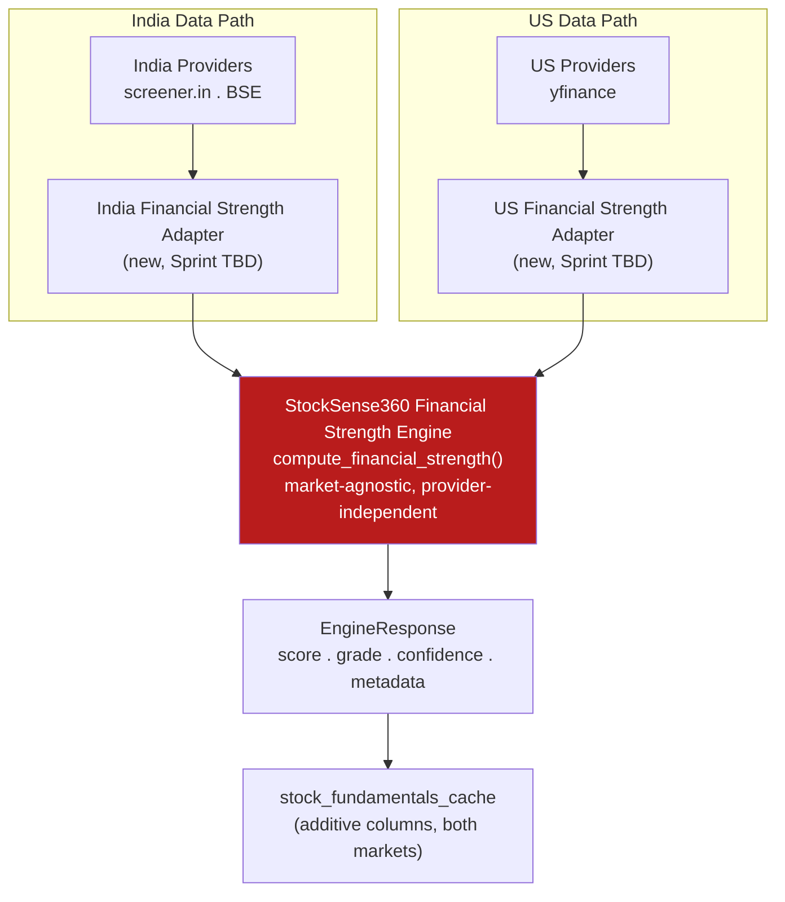

# Financial Strength Intelligence — Design Study

**Status:** Design proposal only. No code implemented, no existing architecture modified. This document is the official precursor to SSDS-005 — it preserves the design reasoning developed before Epic 002 begins, so that work does not need to be re-derived in a fresh conversation.

---

## Objectives

Design the scope of the StockSense360 **Financial Strength Intelligence Engine** — the engine that will answer a question the Business Quality Engine does not: *could this company survive a downturn, service its obligations, and avoid distress in the next 1–3 years?*

This is a near-term solvency, liquidity, and resilience question — answerable independently of whether the underlying business is excellent. A cyclical commodity producer with no moat can have a fortress balance sheet; a wonderful business can be over-levered. StockSense360 currently has no engine dedicated to this question; pieces of it are touched incidentally inside the Business Quality Engine (Altman Z-Score, a single-point D/E read) but never as a first-class, explainable diagnostic in its own right.

This document does not implement the engine. It exists to settle the scope and boundary questions *before* implementation, the same sequencing Epic 001 used for the Business Quality Engine (SSDS-003 before Sprint #004).

---

## Design Philosophy

Three commitments carried forward directly from Epic 001, because they were each validated under real pressure there, not just asserted:

1. **Provider independence.** The engine itself must never know about screener.in, yfinance, or BSE as concepts — only about a shaped `info` dict and an optional `ticker` object, exactly as `compute_business_quality()` has worked since Sprint #004. This was proven to generalize across two materially different markets with zero engine changes; Financial Strength should inherit the same contract rather than re-derive it.

2. **Evidence over assumption.** Every scope and threshold decision in this document is a *proposal*, not a finalized fact — Epic 001 repeatedly found that even well-reasoned assumptions (e.g., "India will need a new data provider") were wrong once tested against live data. SSDS-005 should not be finalized, and implementation should not begin, until a Sprint #006-style data validation study has actually run against real companies in both markets.

3. **One computation, one owner.** No metric should be computed in two places for two different purposes if it can instead be computed once and read by both. Epic 001's adapter pattern and Sprint #007's explicit "do not duplicate engine logic" instruction both encode this; this document applies it as the primary tool for resolving every Business-Quality-vs-Financial-Strength boundary question below.

---

## Engine Boundaries

Business Quality Intelligence asks *"is this a great business worth owning for decades?"* — moat, capital allocation discipline, earnings trustworthiness, long-term economics. Financial Strength Intelligence asks *"is this company financially sound right now, and resilient under stress?"* — liquidity, leverage, debt-servicing capacity. The two questions are genuinely separable and can disagree without contradiction: a quality company can be financially strained (e.g., a great brand mid-LBO); a financially fortress-like company can be a mediocre business (e.g., a debt-free, low-growth commodity producer).

**Exclusively Financial Strength territory:**
- Liquidity adequacy — current ratio, quick ratio, cash runway (months of opex covered by cash + equivalents).
- Leverage trajectory and structure — D/E trend over multiple years (not a single point), debt maturity mix (short vs long-term), refinancing risk, fixed vs floating exposure where disclosed.
- Debt-servicing capacity under stress — interest coverage *trend*, and a forward-looking stress view (see Financial Stress Simulation below).
- Capital structure resilience — net debt/EBITDA, off-balance-sheet/contingent liability awareness where disclosed.
- A credit-risk-style synthesis verdict — a simplified "financial safety margin," distinct in framing from Altman's bankruptcy-probability lens.

---

## Relationship to Business Quality Intelligence

### Metrics that already belong to Business Quality Intelligence — must NOT be duplicated

| Metric | Why it stays exclusively in BQE |
|---|---|
| **Altman Z-Score** | A hard-gate bankruptcy-risk disqualifier for business quality, not a standalone solvency diagnostic. Re-implementing the same formula in Financial Strength for a similar purpose would be literal duplication. |
| **Sloan Accruals, Beneish M-Score** | Earnings-quality / fraud-risk signals — "can the reported numbers be trusted," not a solvency question. |
| **Piotroski F-Score** | A composite quality-improvement signal already blended into BQE's Profitability category. |
| **Buffett/Munger checklist, Corporate Actions score** | Moat and capital-allocation-discipline signals — no solvency content. |
| **Cash Conversion Ratio, Asset Turnover, Working Capital Trend** | Operating-efficiency and earnings-quality signals, already scoped narrowly inside BQE's existing categories. |

**Non-duplication rule for Epic 002:** if Financial Strength needs any of the above as context (e.g., citing Altman's zone inside an explanation), it must **read** the value BQE already computed via a shared/passed reference — never recompute the formula independently.

### The one nuanced case: Debt-to-Equity

BQE already uses D/E as a coarse, single-point input feeding its Capital Allocation / Balance Sheet Strength categories. **This stays untouched** — no redesign of the existing engine. Financial Strength computes its **own, deeper D/E-family analysis** (multi-year trend, debt maturity mix, peer-relative leverage) as genuinely new content, not a relocation or a second copy of the same single-point number for the same purpose.

### Metrics that should move

**None.** Per the explicit instruction not to redesign existing engines, and because nothing reviewed is *purely* misplaced — every BQE metric above genuinely serves a quality question even though some touch balance-sheet data. The correct action for Epic 002 is an *additive, non-overlapping layer*, not a relocation.

### Metrics that remain in Business Quality Intelligence

All of the table above, unchanged: Altman Z-Score, Sloan Accruals, Beneish M-Score, Piotroski F-Score, Buffett/Munger checklist, Corporate Actions score, Cash Conversion Ratio, Asset Turnover, Working Capital Trend, and BQE's existing single-point D/E read.

---

## Proposed Architecture

Reuse the pattern Epic 001 proved twice (US and India):



A new `services/financial_strength_engine.py`, shaped exactly like `business_quality_engine.py`: a pure function `compute_financial_strength(symbol, ticker, df, info, market)` returning an `EngineResponse`, fed by per-market adapters that supply an already-shaped `info` dict. The engine never touches a provider directly — the adapter boundary is where market-specific unit conversion, field renaming, and any validated derivations live, exactly as `india_business_quality_adapter.py` demonstrated in Sprint #007.

---

## Proposed Scoring Categories

1. **Liquidity Adequacy** — current ratio, quick ratio, cash runway.
2. **Leverage & Capital Structure** — D/E trend, net debt/EBITDA, debt maturity mix.
3. **Debt-Servicing Capacity** — interest coverage level and trend, stress-tested coverage (see below).
4. **Balance Sheet Resilience** — off-balance-sheet/contingent liability awareness, equity cushion.
5. **Cash Flow Durability Under Stress** — FCF stability across cycles. Distinct from BQE's earnings-quality framing: this asks "does cash flow hold up under pressure," not "is reported income trustworthy."

A hard gate, mirroring BQE's pattern but with a distinct trigger so the two engines can disagree without contradiction: severe liquidity crisis (e.g., current ratio far below 1, combined with negative FCF and near-term debt maturities) → `Grade.REJECTED` with `rejection_reason="liquidity_distress"` — a different trigger than BQE's `distress_and_aggressive_accruals` / `fraud_risk`.

---

## Financial Stress Simulation Concept

A proposed, distinctive capability for this engine — not present anywhere in Business Quality Intelligence — that operationalizes "resilience" rather than just measuring a static snapshot:

**Concept:** apply a small number of named, simple, transparent stress scenarios to the company's most recent reported financials, and report whether debt-servicing capacity and liquidity would survive each one. Not a forecasting model, not a Monte Carlo simulation — a deterministic, fully explainable "what if" recompute of 2–3 existing ratios under a stated shock.

**Proposed initial scenarios (subject to validation, not finalized):**
- **Earnings shock:** EBIT down 20% — recompute interest coverage; does it stay above a minimum threshold?
- **Revenue shock:** Revenue down 15% with fixed costs held constant — recompute the same.
- **Liquidity shock:** assume the next 12 months of scheduled debt maturities must be refinanced at a higher rate, or repaid from cash on hand — does the cash runway survive?

**Why this belongs in Financial Strength, not Business Quality:** it is purely a stress-test of solvency mechanics under hypothetical pressure — it says nothing about whether the business is a good one, only whether its balance sheet has slack. This is the single most distinctive, additive capability this engine can offer that the rest of the Selection Engine does not.

**Design constraint:** each scenario's logic must be inspectable in the explanation (the specific shock applied and the specific ratio recomputed), not a black-box adjustment — consistent with the Explainability Philosophy below. This is explicitly a *concept* for SSDS-005 to formalize with real thresholds; the specific shock magnitudes (20%, 15%, etc.) above are illustrative placeholders, not calibrated values.

---

## Data Requirements

- **Balance sheet:** current assets, current liabilities, total debt (ideally split short vs long-term), cash & equivalents, total equity, EBIT/EBITDA.
- **Income statement:** interest expense, EBIT/EBITDA history (3–5 years, for trend).
- **Cash flow statement:** operating cash flow, free cash flow, multi-year history for stability assessment.

These map to fields already collected per market in Epic 001 (e.g., screener.in's `borrowings_latest_cr` / `interest_coverage_ratio`, yfinance's balance sheet) — but availability and reliability at the *trend* and *maturity-split* granularity this engine needs has **not** been validated. Epic 002 should run its own Sprint #006-style data validation study before implementation, not assume coverage carries over from Business Quality's experience.

---

## Sector Adaptations

Reuse `sector_quality_applicability.py`'s taxonomy and exemption *philosophy*, not its code — leverage in the FINANCIAL sector (banks/NBFCs) is the business model itself, not a risk signal, exactly as already proven true for Business Quality and equally true here; D/E and current-ratio concepts likely need exemption rather than adjustment for this sector. **UTILITIES_ENERGY** and **REAL_ESTATE** likely need *adjusted* thresholds rather than exemption, since structurally high, stable leverage is normal for both and not itself a distress signal. These are proposed hypotheses, not conclusions — they require the same empirical validation discipline Epic 001 applied throughout, not an assumption carried over by analogy.

---

## Confidence Philosophy

Identical philosophy to Business Quality: a data-completeness percentage over mandatory inputs, computed independently of the score itself, with its own `MIN_DATA_COMPLETENESS_PCT`-style insufficient-data path. Confidence must **not** drop when a validated derivation is used in place of a directly-scraped field — exactly the rule Sprint #007 established and enforced for India's Total Assets derivation. The same standard applies here: a derivation proven by evidence is not a lower-confidence substitute for direct data, it is a fully legitimate input.

---

## Explainability Philosophy

Match Business Quality's bar exactly, with no exceptions: every score decomposes into named category contributions; every hard-gate rejection states a specific `rejection_reason`; every derived or market-adapted input field carries the same `[DIRECT]` / `[DERIVED/PROVEN]` / `[DERIVED/SUPPORTED]` / `[UNAVAILABLE]` provenance tagging proven in Sprint #007's adapter. A user-facing explanation must be able to state *why* a company is "financially strong" or "financially strained" in plain language tied to specific ratios and, where applicable, a specific stress scenario result — never just a bare number.

---

## EngineResponse Philosophy

No new contract. Reuse the existing shared `EngineResponse` shape exactly as Business Quality does:

```
score: float (0-100)
grade: Grade enum (strong_buy / buy / hold / watch / rejected — same vocabulary as the rest of the Selection Engine; the same word means something different in this engine's context, exactly as Business Quality and the rest of the platform already coexist without confusion)
confidence: float (data completeness %)
risks: list[str]
explanation: str
metadata: dict (category_contributions, sector_bucket, key ratios, stress_simulation_results, rejection_reason if applicable)
```

Introducing a second contract shape would fragment the platform's explainability story for no benefit — every consumer that already knows how to read an `EngineResponse` should be able to read this engine's output without new integration work.

---

## Validation Strategy

Directly inherit Epic 001's proven sequence, in order:

1. A dedicated **data-feasibility study** (Sprint #006-style) per market, before any scoring logic is finalized — specifically testing whether debt-maturity-split and multi-year trend data are actually available at the granularity this engine needs, since that has not yet been demonstrated the way Total Assets and Altman/Sloan inputs were for Business Quality.
2. A **production-readiness live validation** against 50+ real companies per market, deliberately spanning known-distressed names (a company in real, public financial distress should score low) and known-fortress names (a recognized low-leverage, high-liquidity company should score high) — falsifiability by design, the same technique used throughout Epic 001's Production Readiness Validation.
3. **Evidence-over-assumption discipline** at every step: every claim traced to a live run, not memory or analogy to Business Quality's results.

---

## Testing Strategy

The same four-category structure proven across Epic 001: unit (scoring sub-functions, stress-simulation recomputation logic, sector adaptations), integration (adapter ↔ engine wiring per market), regression (no behavior change to Business Quality Intelligence or any existing consumer), golden (representative real-shaped companies per sector, both markets, including at least one genuinely distressed and one genuinely fortress-balance-sheet company per market). Carry forward Sprint #007's specific lesson: a live-data validation pass can surface defects in modules it wasn't explicitly testing (e.g., a sector classifier) — keep live-data validation as a standing practice through implementation, not a one-time gate before it.

---

## Proposed SSDS-005 Outline

1. Purpose & Motivating Question (distinct from SSDS-003's)
2. Scope Boundary vs. Business Quality Engine (this document's Engine Boundaries and Relationship sections, formalized with citations)
3. Scoring Categories & Formulas (with actual weights/caps, once calibrated against live data)
4. Financial Stress Simulation — Formal Scenario Definitions (shock magnitudes and thresholds, calibrated, not the illustrative placeholders above)
5. Sector Adaptation Table (mirroring SSDS-003 §4's format)
6. Data Requirements & Provider Mapping per Market
7. Hard Gate Definition (`liquidity_distress` trigger, explicit statement of non-overlap with BQE's gate)
8. Confidence Model
9. EngineResponse Contract (pointer to the shared contract — no new shape)
10. Explainability Requirements
11. Validation Strategy (data-feasibility study first, then live-company validation)
12. Known Limitations & Out-of-Scope Items (named up front)
13. Integration Plan (first consumer, market sequencing)

---

## Open Questions

- Should the Financial Stress Simulation's shock scenarios be fixed (a small, named set) or sector-adjustable (e.g., a smaller earnings shock for historically low-volatility sectors like Utilities)? Not resolved here — needs a calibration pass against real sector volatility data, not an a priori decision.
- Is debt-maturity-split data (short vs long-term debt breakdown) reliably available from screener.in at all, or only from yfinance/BSE? Unknown — this is the single highest-priority question for the upcoming data-feasibility study, since the Leverage & Capital Structure category depends on it.
- Should Financial Strength read BQE's Altman zone as cross-reference context in its explanation (e.g., "also see: Business Quality flags this company as balance-sheet distressed"), or should the two engines remain fully independent in their explanations to avoid implying false correlation? Leaning toward independence, but not decided.
- What should happen when Business Quality and Financial Strength disagree sharply (e.g., `strong_buy` quality but `rejected`-tier financial strength)? This is a downstream consumer-integration question, likely for whichever sprint first combines both engines' outputs — explicitly out of scope for SSDS-005 itself, but worth naming now so it isn't forgotten.

---

## Future Considerations

- A combined "Investment Readiness" view that synthesizes Business Quality and Financial Strength without merging their engines — likely the natural next integration point once both exist independently, mirroring how Sprint #005 integrated Business Quality into Multibagger without altering the engine itself.
- The Financial Stress Simulation concept could eventually generalize beyond Financial Strength — e.g., a portfolio-level "what if rates rise" view — but that is explicitly out of scope for the single-stock engine this document proposes, and should not influence its initial design.
- If a debt-maturity-split data gap is confirmed by the upcoming feasibility study, the same evidence-based provider-strategy discipline from SSDS-004/Sprint #006 should apply: do not recommend a new provider unless evidence demonstrates it is genuinely required, and prefer expanding existing scraping over introducing a new paid source.
