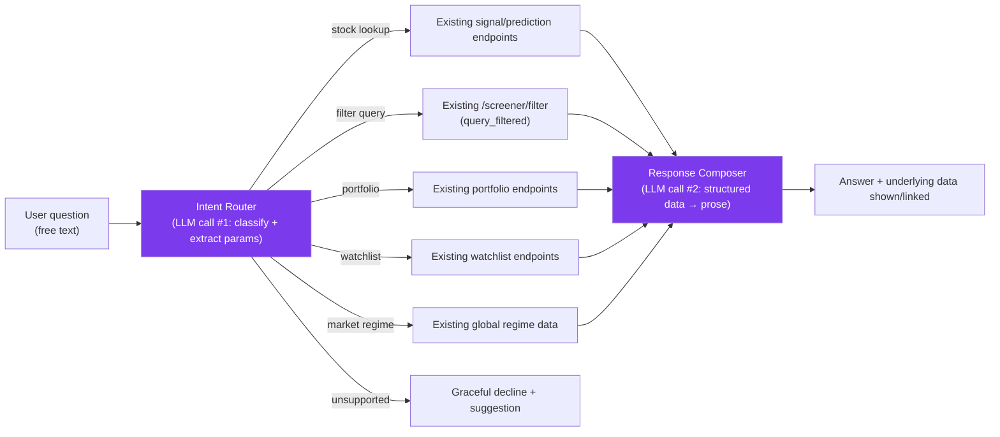

# Natural-Language Research Assistant — Design Study

**Status:** Design proposal only. No code implemented, no existing architecture modified. This document settles scope and boundary questions before implementation is attempted, following the same sequencing the [Financial Strength Intelligence Design Study](Financial-Strength-Intelligence-Design-Study.md) used ahead of Epic 002.

---

## 1. Trigger

The same competitive review that surfaced the Advanced Screener gap (see [Advanced-Screener-Saved-Queries.md](../Releases/Advanced-Screener-Saved-Queries.md)) also surfaced a chat-style, natural-language query interface as a feature worth evaluating — "ask a question about a stock, get an answer," rather than navigating filters and dashboards. That release deliberately did not attempt this idea, scoping it out as materially larger: a new AI-provider integration, real per-query cost, and a different design-review cycle than a SQL-backed filter form. This document is that separate cycle.

Confirmed by direct code search (`grep` across `backend/services` and `backend/api`) before writing this: **StockSense360 has no existing LLM-chat integration today.** `case_generator.py` and the postmortem/market-leadership "explanation" modules that matched an `llm`-adjacent keyword search are template-based narrative text generators over already-computed engine outputs — they interpolate numbers into fixed sentence structures, they do not call an LLM API. This is genuinely new infrastructure, not an extension of something that already exists.

---

## 2. What question this answers

*"Can a user ask StockSense360 a plain-English question about a stock or the market and get a grounded, trustworthy answer, without learning the screener's filter fields or the dashboard's layout?"*

Example queries this should handle: "Why did the model flag INFY as a buy?", "Show me IT stocks with ROE above 20 and low debt", "How did my portfolio do this month?", "What's driving the market regime score right now?"

This is explicitly a **query and explanation surface over data StockSense360 already computes** — not a new source of financial judgment. That framing drives every boundary decision below.

---

## 3. Design Philosophy

Three commitments, each chosen because an existing StockSense360 pattern already validates it or an existing standard already requires it:

1. **Grounded, not generative, financial content.** The assistant must never let the LLM invent a number, a recommendation, or a signal. Every fact in a response must trace to an existing engine output, cache row, or API response (Daily Picks signal, Business Quality score, `stock_fundamentals_cache` row, portfolio holdings, etc.) — the LLM's job is natural-language *routing and phrasing* of data StockSense360 already produced, the same "interpolate numbers into sentences" pattern `case_generator.py` already uses, just with a flexible input instead of a fixed template. This is not a stylistic preference; it is what keeps the feature inside "explain what the model already said" and out of "an AI gives investment advice," which the security/action-boundary rules governing this assistant's own operation explicitly prohibit for financial advice generally, and which SES-005 (Branding Standard) independently disallows if it drifts into the investor-persona-guru framing raised and rejected during the screener review.
2. **Provider independence.** No route, cache key, or response shape should hard-code a specific LLM vendor's API shape into the rest of the codebase — a thin adapter boundary (`services/chat_provider.py` or similar), mirroring the provider-independence pattern Epic 001/002 already proved for market-data providers (`india_business_quality_adapter.py` / `us_*_adapter.py` shape), so switching or A/B-testing providers later doesn't touch calling code.
3. **Cost and abuse are first-class scope, not an afterthought.** Every existing StockSense360 data endpoint is free to call because it's cached SQL or a bounded local computation. An LLM call has real, variable, per-query marginal cost and a realistic abuse surface (a user or bot scripting thousands of queries). Rate limiting, per-user quotas, and a hard cost ceiling must be designed alongside the feature, not bolted on after a bill arrives.

---

## 4. Scope

### In scope (v1)

- A single chat surface (new `/assistant` page, or a persistent widget — see Open Questions) that accepts a free-text question.
- **Intent routing**, not open-ended chat: the LLM's first job is classifying the question into one of a small set of supported intents (stock lookup + explanation, screener-style filter query, portfolio summary, watchlist summary, market regime explanation) and extracting structured parameters (symbol, filter criteria, date range) from the free text.
- Each intent maps to an **existing, already-implemented data path** — the new `/screener/filter` (query_filtered) endpoint, the existing prediction/signal endpoints, existing portfolio/watchlist read endpoints, existing global market regime data. No new data computation is introduced by this feature.
- A final LLM pass turns the structured result into a natural-language answer, with the underlying numbers still shown/linkable (not hidden behind prose) so a skeptical user can verify the answer against the same UI the rest of the app already shows.
- Conversation is stateless per-question in v1 — no multi-turn memory, no follow-up-question context carried automatically. This is the single largest scope-reduction lever available and should not be given up without a specific reason once implementation begins.

### Explicitly out of scope (v1)

- **Any personalized investment advice or recommendation phrased as advice** ("you should sell X") — the assistant explains and summarizes existing signals; it does not generate new ones or tell the user what to do with their money. Responses about a stock should read like "the Daily Picks model flagged X as a BUY on Sept 10 with 78% confidence, driven by..." — reporting what StockSense360 already concluded — never "I recommend buying X."
- **Trade execution via chat** ("buy 10 shares of X") — out of scope entirely; StockSense360 does not execute real trades anywhere in the product today (Paper Trade is simulated), and a chat interface must not become the first place that changes.
- **Multi-turn conversational memory / follow-up context** — deferred; see above.
- **Free-form open-ended chat** unrelated to the supported intents ("what's the weather," general finance Q&A unconnected to StockSense360's own data) — the assistant should decline gracefully and redirect, not attempt to answer from the LLM's general knowledge. This is a grounding boundary, not a politeness feature: answering from general model knowledge instead of StockSense360's own computed data is exactly the failure mode Section 3's first commitment exists to prevent.
- **Voice interface** — text only for v1.

---

## 5. Proposed Architecture

- **`services/chat_provider.py`** (new): thin adapter around one LLM vendor's API (model choice is an open question, §7). Owns the API key, timeout, retry, and error-mapping — nothing else in the codebase imports the vendor SDK directly, matching the provider-independence pattern used for market-data adapters.
- **`services/assistant_intent_router.py`** (new): the "LLM call #1" step — a constrained classification prompt (fixed intent enum, JSON-schema'd output) so the model cannot return an unsupported action. Rejects/declines anything outside the enum.
- **`api/routers/assistant.py`** (new): orchestrates router → existing data endpoint(s) → composer, mirroring how existing routers already call into `services/`.
- **No new data engine, no new cache table for facts** — the composer only ever receives data that already came from an existing, tested engine or endpoint. The only new persistent state is the conversation log itself (for cost/abuse auditing, not for feeding future answers — see §4's statelessness decision).

---

## 6. Cost, Rate-Limiting, and Abuse Controls (mandatory scope, not optional)

- **Per-user rate limit**, reusing the existing `USER_DATA_RATE_LIMIT`-style pattern already applied to watchlist/saved-screens endpoints, sized specifically for LLM-call economics rather than reused verbatim from a cheap-endpoint limit.
- **Hard daily cost ceiling** at the service level (a circuit breaker that disables the assistant and returns a clear "temporarily unavailable" message, the same `safe_error_message` pattern the screener rewrite already uses for its own failure path) — must not be capable of silently running up an unbounded bill.
- **Signed-in users only** — no anonymous access, both for abuse containment and because portfolio/watchlist intents inherently require `require_owner`-style ownership checks identical to the existing pattern in `watchlist.py`/`screener.py`.
- **Two LLM calls per user question** (router + composer) is the current design's per-query cost unit; a cheaper single-call design (one prompt doing both classification and composition) is a legitimate alternative to evaluate during implementation planning, traded against the grounding guarantee a hard-schema'd separate router step gives — this tradeoff should be decided with real cost numbers in hand, not assumed here.

---

## 7. Open Questions (must be resolved before implementation begins)

1. **LLM provider and model** — which vendor, which model tier, and at what per-query cost target. Not decided by this document.
2. **Where the assistant surfaces in the UI** — a dedicated `/assistant` page (simplest, matches every other feature's existing per-page pattern) vs. a persistent widget available from any page (more useful, materially more UI-integration work). Recommend starting with a dedicated page for v1, matching the incremental approach the Advanced Screener took (ship the simpler shape first, expand later if adopted).
3. **Conversation logging retention and privacy** — questions may reference a user's own portfolio holdings; logging policy needs to be decided against StockSense360's existing data-retention posture, not invented ad hoc here.
4. **Where nav placement goes** — if this ships, it becomes an eleventh entry in `NAV_LINKS` (`frontend/src/app/layout.tsx`); the just-completed nav-grouping work (Daily Picks/Dashboard/Multibagger/Screener/Heatmap as "discovery," Watchlist/Alerts/Portfolio/Paper Trade as "personal tracking," Validation as "trust/evidence") did not anticipate a chat feature, and this document does not resolve which group it belongs in — likely its own category, decided when this feature is actually scheduled.

---

## 8. Non-Goals (explicit, not just omissions)

- Does not replace or modify any existing prediction engine, the Business Quality/Financial Strength/Growth/Valuation engines, or Daily Picks generation — this is a read-only presentation layer over their already-computed outputs.
- Does not introduce a second way to filter/screen stocks that could drift from the Advanced Screener's own filter logic — the "filter query" intent calls the same `query_filtered()` function the Screener page's Advanced Filter form calls, never a parallel implementation.
- Does not attempt personalized financial advice, portfolio optimization suggestions, or any output framed as "you should" — see §4.

---

## 9. Rollback

Fully additive: a new router, two new services, one new frontend page. Nothing existing is modified except `NAV_LINKS` (one new entry) if/when it ships. Disabling is a feature flag or simply removing the nav entry and route; no other feature reads from or depends on anything this introduces.
