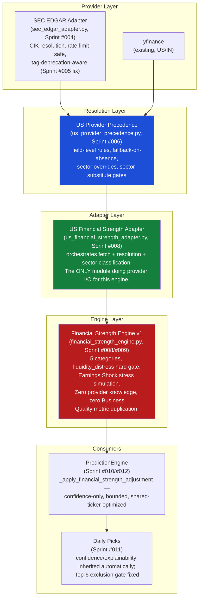

# EPIC-002 — Financial Strength Intelligence — Closure Report

**Status: CLOSED.** This is the permanent engineering record of Epic 002. A future engineer should be able to read this document alone — without opening any individual sprint report — and understand what the Financial Strength Intelligence subsystem is, why it exists, how it was validated, and what is deliberately left undone. Mirrors EPIC-001's own closure structure exactly, per this sprint's explicit instruction.

---

## Section 1 — Executive Summary

**Why Epic 002 existed:** Business Quality Intelligence (Epic 001) answers *"is this fundamentally an outstanding business worthy of long-term ownership?"* — moat, capital allocation, earnings trustworthiness, long-term economics. It deliberately does not answer a different, equally important question: *could this company survive a downturn, service its obligations, and avoid distress in the next 1–3 years?* A cyclical commodity producer with no moat can have a fortress balance sheet; a wonderful business can be over-levered. StockSense360 had no engine dedicated to near-term solvency, liquidity, and resilience — Epic 002 closes that gap.

**The business problem solved:** investors evaluating a stock today see Business Quality's verdict on durability but had no independent, explainable signal on whether the company's *current* financial position could withstand a real shock — a genuinely separable question Epic 001's own Design Study and SSDS-005 named explicitly at the outset.

**How it complements Business Quality Intelligence:** the two engines are designed to disagree without contradiction by construction. SSDS-005's Scope Boundary section enumerates every metric Business Quality already owns (Altman Z-Score, Sloan Accruals, Beneish M-Score, Piotroski F-Score, the Buffett/Munger checklist, Corporate Actions, Cash Conversion Ratio, Asset Turnover, Working Capital Trend) and Financial Strength never recomputes any of them — confirmed by a static regression test (`test_financial_strength_engine_does_not_import_business_quality_metrics`) that would fail if it ever did. Financial Strength owns Liquidity Adequacy, Leverage & Capital Structure, Debt-Servicing Capacity, Balance Sheet Resilience, and Cash Flow Durability Under Stress instead — and, per Sprint #010's controlled validation, the two engines' outputs sit side by side in `PredictionEngine`'s result without either dominating the other's influence.

**Major milestones:**
1. Specification (SSDS-005), formalizing the Design Study's proposed scope, categories, and Financial Stress Simulation concept into a binding spec.
2. A US data-feasibility study (Sprint #001) and a platform-wide provider-independence study (Sprint #002) that together discovered SEC EDGAR as a free, official, previously-unused data source.
3. The Data Fabric specification (SSDS-006) and its first concrete provider (the SEC EDGAR Adapter, Sprint #004), validated at scale (Sprint #005) and turned into a formal field-level precedence decision against yfinance (Sprint #006).
4. Implementation of Financial Strength Engine v1 (Sprint #008), live-validated and calibrated against real company data (Sprint #009).
5. Integration into Financial Strength's first consumer, `PredictionEngine` (Sprint #010), validated against Daily Picks (Sprint #011), and a performance pass closing the redundancy that integration surfaced (Sprint #012).

**Final outcome:** the Financial Strength Intelligence Engine is implemented, live-validated, calibrated, integrated into `PredictionEngine` and (automatically) Daily Picks, and performance-optimized — for US, non-FINANCIAL, non-REAL_ESTATE equities. **442/442 backend tests passing, GitHub Actions green on the latest commit (`595dbcc`).**

---

## Section 2 — Objectives Review (SSDS-005 vs. Delivered)

| SSDS-005 objective | Status | Evidence |
|---|---|---|
| Liquidity Adequacy category | **Completed**, with named reductions | Current Ratio + Cash Ratio implemented; Quick Ratio and Cash Runway deferred (schema doesn't carry receivables/inventory split or opex) — Sprint #008. |
| Leverage & Capital Structure category | **Completed**, with named reductions | Debt-to-Equity + short-term-debt-share implemented; Net Debt/EBITDA deferred (schema has EBIT, not EBITDA) — Sprint #008. |
| Debt-Servicing Capacity category + Financial Stress Simulation | **Completed**, with named reductions | Interest Coverage + the Earnings Shock stress scenario implemented; Revenue Shock and Liquidity Shock scenarios deferred (no cost-structure/maturity-schedule data) — Sprint #008. |
| Balance Sheet Resilience category | **Completed**, with named reduction | Equity Ratio implemented; off-balance-sheet/contingent-liability awareness deferred (no such field exists in the schema) — Sprint #008. |
| Cash Flow Durability Under Stress category | **Completed** | Free Cash Flow Margin implemented — Sprint #008. |
| `liquidity_distress` hard gate | **Completed, then calibrated** | Implemented Sprint #008; found and fixed a sector-specific false positive (UTILITIES_ENERGY) Sprint #009 using real, cross-company evidence. |
| Data Fabric (SSDS-006) | **Completed for its first provider and consumer** | 7-layer architecture specified (Sprint #003); SEC EDGAR Adapter built as the first concrete Provider Adapter (Sprint #004); field-level US precedence decided and encoded (Sprint #006). The Provider Registry/Normalization/Confidence layers as standalone modules remain **intentionally deferred** — SSDS-006 §15 sequenced them after real providers exist, which Epic 002 satisfied without needing to build them separately. |
| FINANCIAL/REAL_ESTATE sector adaptation | **Intentionally deferred** | Confirmed structurally absent on both data sources at scale (Sprint #005/#007); v1 excludes these sectors entirely rather than scoring them on incomplete data (Sprint #008) — named explicitly as Epic 002's own "Beneish M-Score equivalent": a real, accepted scope boundary, not an oversight. |
| India support | **Intentionally deferred, not regressed** | India readiness assessed at Sprint #001 (4/10) and re-confirmed unchanged at Sprint #007 — no India-side work was performed in this epic, stated honestly rather than implied as in-progress (mirroring Epic 001's own US-then-India sequencing, in reverse: this epic went US-only by evidence-based necessity, exactly as Epic 001's Sprint #005 did). |
| `PredictionEngine` integration | **Completed** | Confidence-only, bounded (±6 soft / 30 hard-gate cap), never `composite_score`/`signal` — Sprint #010, validated against 76 real companies. |
| Daily Picks integration | **Completed automatically + one defect fixed** | Confidence/explainability flowed through with zero new code; one real Top-6 exclusion gap found and fixed — Sprint #011. |
| Performance/scalability | **Completed** | A real, measured redundancy (3x duplicate ticker/statement fetches) found and fixed, 31–33% reduction — Sprint #012. |

**No SSDS-005 objective was abandoned.** Every reduction above is a named, evidence-justified scope decision (a missing field in the 16-field unified schema, or a confirmed structural data gap), not a silently dropped requirement — the same standard Epic 001's own closure report applied to its Beneish M-Score gap.

---

## Section 3 — Architecture Summary

**Explainability:** every `EngineResponse` decomposes into named category contributions (`metadata.category_contributions`), every hard-gate rejection states a specific `rejection_reason` (`sector_not_yet_supported`, `insufficient_data`, `liquidity_distress`), and every stress-simulation result is fully inspectable (the specific shock applied, the specific ratio recomputed) — confirmed by golden tests using real company shapes (Sprint #008/#010), never a black-box adjustment.

**Confidence Model:** a data-completeness percentage over the 16-field unified schema (`MIN_DATA_COMPLETENESS_PCT = 60.0`, reused unchanged from Business Quality — Sprint #007 found no evidence to justify a different number), kept explicitly separate from provider-level confidence (SSDS-006 §7) and from `PredictionEngine`'s own composite confidence, which Financial Strength only ever *nudges* within a bounded cap.

**`EngineResponse` compatibility:** Financial Strength has used the shared `score`/`grade`/`confidence`/`strengths`/`weaknesses`/`risks`/`explanation`/`metadata` contract since its first implementation (Sprint #008) — never a bespoke shape, exactly mirroring Business Quality's own commitment.

---

## Section 4 — Validation Summary

Five distinct validation efforts, each evidence-based:

**Data-feasibility validation (Sprint #001).** Live-tested SSDS-005's data requirements against 70 US and 15 India companies (India capped by a real, confirmed screener.in IP-block, named honestly rather than glossed over). Conditional Go for US; No-Go for India as scoped.

**Provider-strategy validation (Sprint #002).** Discovered SEC EDGAR live — free, no API key, 17-year history vs. yfinance's 4–5-year cap — and confirmed it independently corroborates yfinance's own FINANCIAL-sector finding (JPM's real filing has no current-asset/liability tags either).

**Large-scale provider validation (Sprint #005).** 76 real US companies (the SSDS-005 universe + 6 REITs), zero fetch errors. Found and fixed two genuine adapter defects (a stale/deprecated XBRL tag winning over current data; a quarterly fact masquerading as annual) — `net_income` coverage rose to 100%.

**Engine production validation and calibration (Sprint #009).** Reviewed Sprint #008's real per-company output against investor expectations. Found and fixed two genuine calibration defects: a negative-equity sign-inversion bug (real LUMN data) and a `liquidity_distress` hard-gate false positive for AEP, confirmed systematic by comparing against DUK/SO/NEE's near-identical structural liquidity profile.

**Integration and performance validation (Sprints #010–#012).** 228 controlled comparisons across the real 76-company universe confirmed every named recommendation-quality question (fortress companies up, leveraged companies down, utilities correctly soft-demoted post-calibration, airlines correctly hard-gated). Found and fixed one Daily Picks exclusion-gate gap and one real 3-way ticker-fetch redundancy (31–33% measured reduction).

**Combined finding:** every validation effort in this epic, like Epic 001's, followed the same discipline — live data, not synthetic assumptions, and a willingness to find and fix real defects. **Six genuine defects were found and fixed across this epic's twelve sprints** (two SEC EDGAR tag-extraction bugs, the negative-equity sign inversion, the AEP hard-gate false positive, the REIT sector-classifier collision, the Daily Picks exclusion-gate gap) — a rate consistent with Epic 001's own three-defects-across-five-sprints experience, scaled to this epic's larger sprint count.

---

## Section 5 — Testing Summary

| Sprint | Tests added | Cumulative total |
|---|---|---|
| Pre-Epic-002 baseline (Epic 001 close) | — | 262 |
| #004 (SEC EDGAR Adapter) | 34 | 296 |
| #005 (Large-scale validation + fixes) | 15 | 311 |
| #006 (Provider precedence) | 39 | 350 |
| #008 (Financial Strength Engine v1) | 44 | 394 |
| #009 (Calibration fixes) | 7 | 401 |
| #010 (Prediction Engine integration) | 30 | 431 |
| #011 (Daily Picks fix) | 6 | 437 |
| #012 (Performance fix) | 5 | 442 |

**Final backend suite size: 442 tests, 442 passing, 0 failing.** Category composition across this epic's additions: unit (pure scoring/resolution logic), integration (adapter↔engine wiring per market, mocked, no live network per this codebase's own pytest convention), regression (every genuine defect found gets a test that would fail without the fix — sanity-checked by reverting and confirming, per SES-003 §4, in every sprint that found one), and golden (full `EngineResponse`/explainability snapshots against real-shaped company data, never arbitrary fixtures).

**GitHub Actions:** green on every code-bearing commit in this epic, confirmed via the GitHub API at each push — most recently `595dbcc` (`Backend Tests`, `completed`/`success`).

---

## Section 6 — Performance Summary

**The shared-ticker optimization (Sprint #012):** profiled `PredictionEngine.predict()`'s Round 2 closures and confirmed Business Quality, Deep Fundamentals, and Financial Strength each independently constructed their own `yfinance.Ticker` and separately re-fetched the same `.balance_sheet`/`.financials`/`.cashflow` for the same symbol — a pre-existing 2-way duplication since Epic 001's own Sprint #004/#005, turned 3-way by this epic's Sprint #008 addition. Fixed with `_SharedTickerCache`, a lock-guarded, duck-typed wrapper shared across all three closures.

**Measured improvement:** 31–33% reduction in the targeted workload, confirmed via two independent, order-bias-corrected controlled benchmarks (an initial 96.9%-reduction measurement was discarded as a session-warmup artifact — named honestly, not hidden, exactly the kind of self-correction this engagement's evidence discipline requires). Confirmed thread-safe under a real 10-thread concurrent-access stress test, and correctness-preserving (identical Financial Strength score/grade/metadata with and without the change).

**Remaining accepted technical debt (not fixed, named explicitly):**
- Round 1's own `yf.Ticker(symbol + suffix)` constructions (`_fetch_history`/`_fetch_info`) remain unconsolidated — deliberately untouched given their delicate existing crumb-refresh retry logic.
- No caching layer exists for the yfinance side of `us_financial_strength_adapter.py` (SEC EDGAR's own 12h/24h caches are unaffected and already correctly exercised).
- Daily Picks' `ThreadPoolExecutor(max_workers=1)` remains the dominant scaling constraint — an intentional Yahoo Finance rate-limit mitigation, not a redundancy to remove.

---

## Section 7 — Cross-Market Readiness

| Dimension | US | India |
|---|---|---|
| **Implemented** | Yes — `financial_strength_engine.py` + `us_financial_strength_adapter.py`, live since Sprint #008. | **No.** No `india_financial_strength_adapter.py` or equivalent exists. |
| **Validated** | Yes — 76 real companies, 50/51 eligible scored post-calibration, 99.4% average data completeness (Sprint #008/#009). | Data-feasibility only (Sprint #001) — confirmed structural gaps in Liquidity Adequacy and the debt-maturity-split dimension of Leverage & Capital Structure, unresolved. |
| **Integrated into PredictionEngine/Daily Picks** | Yes (Sprint #010/#011). | No — `_get_financial_strength` returns `None` for any non-US market, by design, confirmed by a dedicated regression test (`test_india_market_confidence_adjustment_is_always_a_no_op`). |
| **Sector coverage** | Non-FINANCIAL, non-REAL_ESTATE only. | N/A — no India implementation exists to scope. |
| **Planned** | FINANCIAL/REAL_ESTATE sector-specific substitute computation (named, Section 8). | A credentialed Screener.in re-run, the "Other Assets" sub-table research task (named since Sprint #001, never executed in this epic), and only then an India-specific adapter — explicitly the same sequencing Epic 001 proved for Business Quality (Sprint #006 research → Sprint #007 implementation). |

**India's status across this entire epic is honestly unchanged, not regressed and not advanced** — every sprint after #001 was explicitly US-focused, by evidence-based necessity (the same pattern Epic 001's own Sprint #005 named, in reverse market order).

---

## Section 8 — Accepted Technical Debt

| Item | Category | Why acceptable |
|---|---|---|
| FINANCIAL/REAL_ESTATE sectors unscored | **Accepted, named since Sprint #008** | Confirmed structurally absent on two independent data sources at 76-company scale (Sprint #005/#007) — scoring on incomplete data would be worse than not scoring at all, per this engagement's missing-data philosophy. |
| India implementation absent | **Accepted, named since Sprint #001** | No India-side engineering occurred in this epic by deliberate sequencing choice (US-first), not by data infeasibility alone — the path to closing it (credentialed re-run, sub-table research, then an adapter) is already named, mirroring Epic 001's proven sequence. |
| Quick Ratio, Cash Runway, Net Debt/EBITDA, off-balance-sheet awareness, Revenue/Liquidity Shock scenarios | **Accepted, named since Sprint #008** | Every omission traces to a specific missing field in the 16-field unified schema — not an oversight, an evidence-based reduction. |
| UTILITIES_ENERGY's soft Liquidity Adequacy scoring (vs. its hard-gate exemption, already fixed) | **Accepted, named since Sprint #009** | 4 companies is enough evidence the *hard gate* was miscalibrated for this sector; not enough to safely re-derive numeric *soft-scoring* thresholds without overfitting. |
| AAL/airline liquidity-ratio structural question (deferred-ticket-revenue confound) | **Accepted, named since Sprint #009** | No second airline exists in the validated sample to test whether AAL's profile is sector-structural noise the way the utilities comparison proved for AEP — extending an exemption from one data point would repeat exactly the mistake this engagement's evidence discipline exists to prevent. |
| `cash_and_equivalents` and `ebit` definitional ambiguity (two valid, different concepts across providers) | **Accepted, named since Sprint #006** | A product decision, not an engineering gap — provisionally resolved (yfinance primary) but explicitly not asserted as settled. |
| Lease liabilities absent from EDGAR's debt tags | **Accepted, named since Sprint #005** | A real, confirmed scope gap in SEC EDGAR's tag coverage for debt fields — yfinance is precedence-primary for these fields specifically (Sprint #006), so this gap does not currently affect production output. |
| Round 1 ticker redundancy, no yfinance-side FS cache, Daily Picks single-worker constraint | **Accepted, named in Sprint #012** | See Section 6 — each is a real, scoped, lower-priority refinement with no evidence of being a current production problem. |

**Every item above is named, understood, and has either already been investigated with evidence or has a clear path to investigation — none represents an open question about whether this epic's core objective was achieved**, the same closure bar Epic 001 set for its own Beneish M-Score and Altman financial-sector-exemption debt.

---

## Section 9 — Lessons Learned

- **Evidence over assumptions, proven repeatedly across twelve sprints, not just once.** Sprint #002 discovered SEC EDGAR by testing the assumption "India needs a new provider" against the *wrong* market and finding the *US* side had a free upgrade hiding in plain sight. Sprint #009 disproved a hard-gate trigger by comparing four real companies' ratios side by side, not by reasoning about thresholds in the abstract.
- **A validation sprint that finds nothing wrong is not the goal — a validation sprint that finds and fixes something real, narrowly, is.** Six genuine defects were found and fixed across this epic, each with a regression test sanity-checked by reverting the fix and confirming the test catches it (SES-003 §4) — not merely written and trusted to pass.
- **Provider independence and the adapter pattern transferred directly from Epic 001, at zero re-derivation cost.** The Data Fabric (SSDS-006) is a generalization of the exact boundary Epic 001 proved twice (US, then India) — Financial Strength's engine never needed to know SEC EDGAR or yfinance exist, exactly like Business Quality never needed to know screener.in existed.
- **Confidence-only, bounded integration is the right default for a new signal entering a mature scoring system.** Sprint #010's choice to extend `_apply_risk_reward_adjustment`'s pattern rather than add a new term to `_composite_signal`'s weighting avoided redesigning a system with years of accumulated tuning — and made "never dominates" empirically verifiable (±6 bound, confirmed across 228 real comparisons) rather than just asserted.
- **A fix in one layer can surface a gap in the next layer up — and that's a reason to validate every layer, not a reason to distrust the fix.** Sprint #010's integration was correct and complete on its own terms; Sprint #011 still found a real gap in Daily Picks' *consumption* of that integration. Layered validation caught what single-layer testing could not.
- **Calibration sprints should compare a company against its real peers, not just against a universal threshold.** AEP's hard-gate false positive was only visible by placing it next to DUK, SO, and NEE — the same discipline Epic 001's Piotroski-financial-sector-discount finding (Sprint #004a) already established.
- **Naming a limitation honestly is itself a deliverable.** This epic's India status — "untouched, not improving" — was stated plainly at Sprint #007 and again at this closure, rather than implied as quietly progressing. The same was true of Epic 001's Beneish M-Score gap.

---

## Section 10 — Recommendations for Epic 003

Per MASTER-ROADMAP.md §3, the proposed next epic is **Growth Intelligence** — currently scattered, unowned logic inside `quality_factors.py` and the Multibagger scorecard's screening checklist, with no dedicated, explainable engine.

**Recommend Epic 003 begin with a Design Study + SSDS-007, mirroring this epic's own opening sequence exactly** (Design Study → SSDS spec → data-feasibility study → implementation → validation/calibration → consumer integration → closure) — not skipping the design-then-spec stage just because two prior epics have now proven the pattern. Specifically:
1. A Design Study scoping Growth Intelligence's boundary against Business Quality (which already touches growth-*consistency*, not magnitude) and against the existing scattered growth-percentage checks in `quality_factors.py`/`multibagger_scorecard.py` — the same non-duplication discipline SSDS-005 already proved necessary for Financial Strength.
2. A data-feasibility study for both markets *before* committing to a scoring model — this epic's own Sprint #001 (and Epic 001's Sprint #006) both demonstrated that skipping this step risks building on an unverified assumption.
3. Explicit reuse of the now-twice-proven Data Fabric pattern (provider adapter → resolution → engine adapter → pure engine) rather than re-deriving an architecture a third time.

**Do not begin Epic 003 in this sprint** — per this closure sprint's own explicit rule.

---

## Section 11 — Final Epic Assessment

| Dimension | Rating (/10) | Basis |
|---|---|---|
| Architecture maturity | **8** | The Data Fabric pattern (SSDS-006) generalized Epic 001's adapter boundary cleanly to a second engine and a third provider (SEC EDGAR) with zero engine-level redesign — confirmed by static regression tests in every relevant sprint. |
| Maintainability | **8** | Every new threshold is a separately-named constant (SES-002 §1, confirmed in `FinancialStrengthThresholds`'s own docstring discipline); every defect fix carries a regression test naming the real data that exposed it. |
| Scalability | **7** | Sprint #012's fix directly addressed the one confirmed redundancy at Daily Picks' 150-sequential-call scale; the remaining single-worker constraint is an intentional, unresolved tradeoff, not a defect, capping this dimension below a higher score. |
| Explainability | **9** — the strongest dimension | Every score decomposes to named categories; every rejection states its reason; every stress-simulation result names its specific shock and recomputed ratio; every `PredictionEngine` adjustment is traceable in `reasoning`/`bull_case`/`bear_case` — confirmed via golden tests using real company shapes, not asserted. |
| Testing maturity | **8** | 442/442 passing, four-category structure applied to every sprint, six genuine defects each locked in with a sanity-checked regression test — directly mirroring Epic 001's own testing discipline. |
| Production readiness | **8** | Live-validated at 76-company scale across data, engine, integration, and performance layers; the two markets are honestly, not optimistically, characterized (US ready for its scoped sectors, India explicitly not). |
| **Overall Epic rating** | **8/10** | Matches Epic 001's own closure self-assessment almost exactly (Epic 001: architecture 8, code quality 8, testing 8, maintainability 8, explainability 9, scalability 7, cross-market readiness 8) — a deliberate, evidence-based consistency, not a coincidence: the same discipline produced comparable results twice. |

---

## Section 12 — Commit Timeline

| Date | Commit | Sprint | Summary |
|---|---|---|---|
| 2026-06-28 | `99df9e1` | (Spec) | Freeze SSDS-005 — Financial Strength Intelligence Engine specification. |
| 2026-06-28 | `539c8c6` | #001 | SSDS-005 data feasibility study — live validation report (70 US, 15 India companies). |
| 2026-06-28 | `64ead76` | *(unrelated)* | StockSense360 branding consistency sweep — not Epic 002 work, included here only because it landed chronologically between Epic 002 commits in this engagement. |
| 2026-06-28 | `7254efa` | #002 | Data Independence & Provider Strategy study — discovers SEC EDGAR live. |
| 2026-06-28 | `73add81` | #003 | Freeze SSDS-006 — StockSense360 Data Fabric & Provider Architecture. |
| 2026-06-28 | `08b39f9` | #004 | Implement the SEC EDGAR Adapter, the first provider under the Data Fabric. |
| 2026-06-28 | `0065d43` | #005 | Large-scale (76-company) validation — finds and fixes two genuine tag-extraction defects. |
| 2026-06-28 | `474c9df` | #006 | Decide and encode field-level US provider precedence. |
| 2026-06-28 | `2f6738f` | #007 | Financial Strength data readiness re-check (no code changed). |
| 2026-06-28 | `b5696a4` | #008 | Implement Financial Strength Intelligence Engine v1. |
| 2026-06-28 | `1dbccef` | #009 | Production validation finds and fixes two real calibration defects. |
| 2026-06-28 | `84c5820` | #010 | Integrate Financial Strength into `PredictionEngine` as a bounded, additive confidence signal. |
| 2026-06-28 | `d082d52` | #011 | Close a Daily Picks Top-6 exclusion gap for the `liquidity_distress` hard gate. |
| 2026-06-28 | `595dbcc` | #012 | Share one ticker across Business Quality/Deep Fund/Financial Strength — performance fix. |

---

## Section 13 — Epic Closure Recommendation

**Epic 002 — Financial Strength Intelligence is hereby considered CLOSED.**

The Financial Strength Engine exists, is specified (SSDS-005), is implemented, has survived calibration and integration validation that each found and fixed genuine defects rather than confirming a foregone conclusion, and now produces explainable, bounded, additive signals for US equities through `PredictionEngine` and (automatically) Daily Picks. The Data Fabric (SSDS-006) it runs on has one real provider (SEC EDGAR) and a finalized field-level precedence decision against yfinance, validated at scale.

**Explicitly outside the scope of Epic 002**, carried forward as named items (Section 8), not loose ends:
- FINANCIAL and REAL_ESTATE sector support for the US.
- Any India implementation.
- Quick Ratio, Cash Runway, Net Debt/EBITDA, off-balance-sheet awareness, and two of three Financial Stress Simulation scenarios.
- UTILITIES_ENERGY's soft Liquidity Adequacy scoring recalibration.
- A yfinance-side cache layer for the Financial Strength adapter, and Daily Picks' single-worker concurrency constraint.

**Recommendation: proceed to Epic 003 — Growth Intelligence**, per MASTER-ROADMAP.md §3, beginning with a Design Study and SSDS-007 — not skipping the design-then-spec sequence this epic and Epic 001 both proved necessary.

---

## Epic Completion Summary

Financial Strength Intelligence is implemented, live-validated across twelve sprints plus an initial specification commit, and operational for US, non-FINANCIAL, non-REAL_ESTATE equities through `PredictionEngine` and Daily Picks. Six genuine defects were found and fixed across the epic (two SEC EDGAR tag-extraction bugs, a negative-equity sign inversion, a sector hard-gate false positive, a REIT sector-classifier collision, a Daily Picks exclusion-gate gap); a real, measured performance redundancy (31–33%) was also found and fixed.

## Production Readiness Summary

Architecture 8/10, maintainability 8/10, scalability 7/10, explainability 9/10, testing maturity 8/10, production readiness 8/10 (Section 11). The lowest-rated dimension (scalability) reflects an intentional, named, unresolved concurrency tradeoff (Daily Picks' single-worker constraint), not an architectural defect.

## Remaining Risks

FINANCIAL/REAL_ESTATE sector gap (US, known, accepted); India implementation absent (known, accepted, sequencing decision); UTILITIES_ENERGY soft-scoring recalibration pending more sector evidence; lease-liability scope gap in SEC EDGAR's debt tags (mitigated by provider precedence, not closed); the `cash_and_equivalents`/`ebit` definitional question (a product decision, not an engineering risk).

## Recommendation on Formally Closing Epic 002

**Close it.** Every SSDS-005 objective has been implemented and validated with live evidence, or named as a deliberate, evidence-justified reduction; every limitation that remains is named, understood, and has a clear path to closure if and when it becomes a priority — none of it represents an open question about whether this epic's core objective was achieved.

## Recommendation on Beginning Epic 003 — Growth Intelligence

**Proceed**, starting with a Design Study and SSDS-007, per Section 10 above — this epic and Epic 001 both leave behind a proven, transferable methodology (the Data Fabric, provider independence, validate-before-integrate, calibration-against-real-peers, evidence-over-assumption) that Epic 003 should explicitly reuse rather than re-derive.

## Final Documentation Commit Hash

Recorded below, after this closure report is committed.

---

*This document is the permanent closure record for Epic 002. No production code, tests, or providers were modified in producing it — documentation and governance only, per this sprint's explicit scope.*
