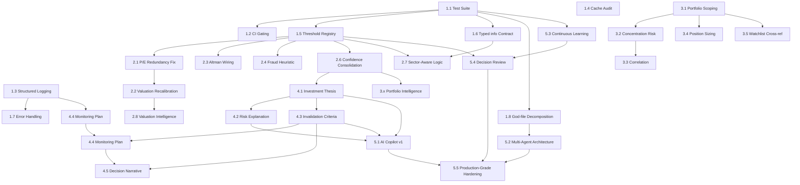

# Master Implementation Roadmap — Selection Engine

**Status:** Planning artifact only. No code has been modified, refactored, or optimized in producing this document.
**Derived from:** SEAR-001 (`Architecture/Sprint-001-Selection-Engine-Audit.md`) and the current Engineering Handbook skeleton.

**Inputs note, stated plainly:** this roadmap was also asked to review "SES Standards" and "SSDS Specifications." Both were searched for directly across the repository (`Documentation/`, root `README.md`, `CLAUDE.md`) — neither exists anywhere; the only hits were substring false positives inside unrelated words (e.g. "u**SES**," "pha**SES**"). This roadmap is therefore built entirely from SEAR-001's verified findings and the (currently empty-skeleton) Engineering Handbook. If SES/SSDS are real standards intended to govern this work, they need to be authored or supplied before Sprint 002 begins — proceeding without them risks the roadmap optimizing against assumptions instead of an actual house standard.

---

## Executive Summary

SEAR-001 found a system whose *investment logic* is more sophisticated than its *engineering discipline* supports. The roadmap below is sequenced on one governing principle: **build the safety net before touching anything the net is supposed to catch.** Phase 1 (testing, logging, typed contracts, threshold centralization) is not optional preamble — it is the precondition that makes every later phase's changes verifiable rather than speculative. Phases 2–4 then address the audit's substantive intelligence, portfolio, and explainability gaps, each scoped so it can be validated against the Phase 1 harness as it lands. Phase 5 is explicitly deferred until the codebase has the structural decomposition (Phase 1) and richer explainability data (Phase 4) that AI Copilot / multi-agent work would otherwise have nothing solid to stand on.

Ten execution sprints (Sprint 002–011) are proposed to take the Selection Engine from its current state to production-grade quality, continuing the numbering from SEAR-001 (Sprint 001 = the audit itself).

---

## Recommended Development Order

1. **Phase 1 — Engineering Foundation** (Sprints 002–003): nothing else should land without this in place first.
2. **Phase 2 — Intelligence Improvements** (Sprints 004–005): the audit's most evidence-backed, highest-confidence fixes.
3. **Phase 3 — Portfolio Intelligence** (Sprint 006): the single largest product-led gap; deliberately sequenced after Phase 2 since it depends on a stable scoring contract.
4. **Phase 4 — Explainability** (Sprints 007–008): builds on Phase 2's confidence work and produces the data Phase 5 would need.
5. **Phase 5 — AI & Future Capabilities** (Sprints 009–011): deliberately last — multi-agent decomposition needs Phase 1's test harness as a precondition, and the Copilot needs Phase 4's richer explainability data to be grounded in something real rather than the current flat reasoning list.

---

## Phase 1 — Engineering Foundation

| # | Recommendation | Priority | Business Value | Eng. Effort | Risk | Dependencies | Files Likely Affected | Est. Time | Sprint |
|---|---|---|---|---|---|---|---|---|---|
| 1.1 | Baseline automated test suite for pure-logic functions (`_quality_gate`, `_compute_risk_penalty`, IC weight derivation, optimizer) | **Critical** | High — closes the single largest risk in the audit; everything downstream becomes safer | L | Low (additive, no behavior change) | None — can start immediately | New `tests/` tree; fixtures mirroring `info`-shaped test data | 2–3 weeks | 002 |
| 1.2 | CI wiring so the new test suite actually gates merges (GitHub Actions) | High | High — tests with no enforcement are advisory only | S | Low | 1.1 | `.github/workflows/` | 2–3 days | 002 |
| 1.3 | Structured logging rollout (replace `print()` with `logging`, add levels) | High | Medium-High — directly would have caught the prepared-statement bug sooner | M | Low | None | `daily_picks.py` (31 prints), `weight_adapter.py` (11), `meta_model.py` (7), remaining `alpha_engine/*.py` | 1–2 weeks | 002 |
| 1.4 | Audit all 6 ad hoc in-memory caches for the "caches failures for the full TTL" footgun already found once and fixed in `screener_data.py` | High | Medium-High — this is a *confirmed pattern*, not a hypothetical; likely already biting in at least one of the other five | M | Low | None | `market_data.py`, `news_sentiment.py`, `ic_engine.py`, others identified during 1.1's fixture-building | 1 week | 002 |
| 1.5 | Centralized threshold registry (ROE/ROCE/D-E/growth/valuation cutoffs) | **Critical** | High — directly enables Phase 2's valuation fix and prevents the next inconsistent-threshold bug | M | Medium (must not silently change live behavior while consolidating — needs 1.1 first) | 1.1 | `prediction_engine.py`, `multibagger_scorecard.py`, new `services/thresholds.py` (or similar) | 1–2 weeks | 003 |
| 1.6 | Typed contract for the `info` dict (dataclass/Pydantic, documenting guaranteed-present keys post-augmentation) | High | High — removes the single largest "tribal knowledge required" risk in the codebase | L | Medium (touches nearly every Selection Engine file; best done incrementally, not as one PR) | 1.1 | `prediction_engine.py`, `quality_factors.py`, `screener_data.py`, `us_fundamentals.py`, `market_data.py` | 3–4 weeks (incremental) | 003 |
| 1.7 | Error-handling pass: distinguish "data source unavailable" from "programming error" in the broad `except Exception` patterns; add minimal alerting hooks | Medium | Medium — would have surfaced the prepared-statement bug without needing a human reading raw logs live | M | Low | 1.3 | Same files as 1.3 | 1–2 weeks | 003 |
| 1.8 | Begin decomposition of the two god-files (`prediction_engine.py` 1,886 lines / 26 methods, `quality_factors.py` 1,831 lines / 23 functions) into smaller, single-responsibility modules | Medium | Medium-High — pays down the audit's #1 architecture weakness, and is a precondition for Phase 5's multi-agent work | XL | High — large blast radius, every consumer of `PredictionEngine` is affected | 1.1 (must have tests before this starts) | `prediction_engine.py`, `quality_factors.py`, every importer of either | 4–6 weeks, can be done incrementally across multiple sprints | 003 (start), continues into 010 |

---

## Phase 2 — Intelligence Improvements

| # | Recommendation | Priority | Business Value | Eng. Effort | Risk | Dependencies | Files Likely Affected | Est. Time | Sprint |
|---|---|---|---|---|---|---|---|---|---|
| 2.1 | Fix the `P/E < 35` structural redundancy (SQL filter + identical checklist entry — the checklist item can never fail in practice) | High | Medium — a correctness/integrity fix independent of the calibration question | S | Low | 1.5 | `services/multibagger_scorecard.py`, the Multibagger SQL screen definitions | 2–3 days | 004 |
| 2.2 | Recalibrate the Quality Compounder valuation gate using the proven live evidence (Pidilite, Asian Paints, Havells, Nestlé all excluded *only* by this one number) | **Critical** | High — currently excludes real, high-quality compounders; directly affects what users see as "good" | M | Medium — a judgment call needing stakeholder/product input, not just an engineering threshold bump | 2.1, 1.5 | Same as 2.1 | 1 week (incl. stakeholder review) | 004 |
| 2.3 | Wire Altman Z-Score into a soft- or hard-reject signal instead of leaving it purely informational | Medium | Medium — closes a real distress-detection gap using a computation that already exists | S | Low | 1.5 | `quality_factors.py`, `prediction_engine.py`'s quality gate | 3–5 days | 004 |
| 2.4 | Add a basic forensic/fraud-risk heuristic (accruals-anomaly or Beneish-style check) to close the "quality+distress but not fraud" gap | Medium | Medium — closes a named, confirmed-absent capability | M | Low | 1.5 | `quality_factors.py` | 1–2 weeks | 004 |
| 2.5 | Make `REGIME_WEIGHT_MULTIPLIERS` horizon-aware (currently one table applied identically to short/medium/long) | Medium | Medium — a `BEAR_PANIC` regime should plausibly affect a 5-day call differently than a 3-year compounder thesis | S | Low | None | `services/alpha_engine/regime_cluster.py` | 3–5 days | 005 |
| 2.6 | Consolidate `confidence`, `confidence_score`/`confidence_band`, and the two confidence-demotion functions into one explicitly-named three-dimension model (Evidence / Data / Decision Confidence) | High | High — directly addresses a confusion the audit found was *already* causing labeling bugs in active development | M | Medium (touches the UI contract — coordinate with frontend) | 1.5 | `prediction_engine.py`'s `_confidence_engine` and the two `_apply_*_adjustment` functions, `frontend/src/components/SignalBadge.tsx` and related | 2 weeks | 005 |
| 2.7 | Formalize sector-aware logic: replace the generic financial-ratio order-book exception with an explicit sector-tagged rule set (defense/capital-goods/telecom-infra vs. everything else) | Medium | Medium — the current fix is a reasonable proxy, but a named sector rule would be more precise and auditable | M | Medium (needs a defensible sector taxonomy, not just a financial-ratio proxy) | 1.5, 1.6 | `prediction_engine.py`'s `_quality_gate` | 1–2 weeks | 005 |
| 2.8 | Valuation Intelligence: move from one static absolute P/E cutoff toward sector-relative or growth-adjusted valuation bands (PEG-style) | Medium | High (longer-term) — more durable fix than just re-tuning one number | L | Medium — needs sector-median data already partially present elsewhere in the codebase (`SECTOR_MEDIAN_PE` referenced in `quality_factors.py`) | 2.2 | `quality_factors.py`, `multibagger_scorecard.py` | 2–3 weeks | 005 |

---

## Phase 3 — Portfolio Intelligence

| # | Recommendation | Priority | Business Value | Eng. Effort | Risk | Dependencies | Files Likely Affected | Est. Time | Sprint |
|---|---|---|---|---|---|---|---|---|---|
| 3.1 | **Product scoping**: define what "portfolio-aware recommendation" should actually mean before any engineering starts | **Critical** | High — this is the single largest confirmed gap in the audit, but the *wrong* design here could erode user trust faster than the current "generic for everyone" state | S (scoping, not engineering) | High (product risk, not just engineering risk) | None | N/A — a product/design exercise | 1 week | 006 (start) |
| 3.2 | Concentration-risk check: weight recommendations against a user's existing sector/factor exposure | High | High | M | Medium | 3.1, 1.6 | New cross-reference logic in `daily_picks.py` / a new module reading `portfolio_holdings` | 2 weeks | 006 |
| 3.3 | Correlation: extend the optimizer's covariance matrix to include existing holdings, not just candidate-vs-candidate | High | High | M | Medium — changes optimizer output, needs careful validation against 1.1's harness | 3.1, 3.2 | `services/alpha_engine/optimizer.py` | 2 weeks | 006 |
| 3.4 | Position sizing: scale suggested Paper Trade quantities to account size and existing exposure | Medium | Medium | S–M | Low | 3.1 | `paper_trading.py` router, frontend `PaperTradeModal` | 1 week | 006 |
| 3.5 | Cross-reference Daily Picks / Multibagger against a user's Watchlist for personalized ranking | Medium | Medium — a smaller, more contained version of full portfolio-awareness | M | Medium | 3.1 | `daily_picks.py`, `multibagger_scorecard.py` | 1–2 weeks | 006 |

---

## Phase 4 — Explainability

| # | Recommendation | Priority | Business Value | Eng. Effort | Risk | Dependencies | Files Likely Affected | Est. Time | Sprint |
|---|---|---|---|---|---|---|---|---|---|
| 4.1 | Investment Thesis: add an explicit "why now" / catalyst field distinct from the general reasoning list | Medium | Medium-High | M | Low | 2.6 | `prediction_engine.py` reasoning assembly | 1–2 weeks | 007 |
| 4.2 | Risk Explanation: extend `bear_case` to cover liquidity risk and currency/FX risk (a liquidity dimension is already computed but unused for this) | Medium | Medium | S | Low | None | `services/case_generator.py` (bull/bear case generation) | 3–5 days | 007 |
| 4.3 | Invalidation criteria: an explicit "this thesis is wrong if X" field, distinct from the stop-loss level | High | High — named gap relative to institutional research-note conventions | M | Low | 4.1 | `prediction_engine.py`, `_trade_levels` | 1–2 weeks | 007 |
| 4.4 | Monitoring Plan: design and build post-publication signal-change tracking (distinct from `outcome_logger.py`'s statistical purpose) | High | High — confirmed zero capability today | L | Medium — needs a notification-fatigue strategy or it degrades into noise | 1.3 (logging), 2.6 | New background-job surface, likely a new `services/signal_monitor.py` | 3–4 weeks | 008 |
| 4.5 | Decision Narrative: a user-facing changelog of "this call flipped from BUY to HOLD on [date], here's why" | Medium | Medium-High — ties 4.3 and 4.4 together into something visible | M | Low | 4.3, 4.4 | New table + frontend surface, likely on the stock detail page's History tab | 2 weeks | 008 |

---

## Phase 5 — AI & Future Capabilities

| # | Recommendation | Priority | Business Value | Eng. Effort | Risk | Dependencies | Files Likely Affected | Est. Time | Sprint |
|---|---|---|---|---|---|---|---|---|---|
| 5.1 | AI Copilot v1: conversational "why this stock / why not" grounded in the existing reasoning/quality-factor data | Medium | High (differentiation) | L | Medium — only as good as the explainability data it's grounded in | 4.1, 4.2, 4.3 | New service, read-only against existing prediction output | 4–6 weeks | 009 |
| 5.2 | Multi-agent architecture: decompose `PredictionEngine` into cooperating specialized agents (technical/fundamental/sentiment/risk), each independently versionable | Low–Medium (long-horizon) | High (long-term) | XL | **High** — the largest architectural change in this entire roadmap | 1.8 (must be substantially complete first) | Nearly the entire Selection Engine | 6–8 weeks | 010 |
| 5.3 | Continuous learning: persist trained `meta_model` artifacts to Postgres/object storage instead of local disk (survives redeploys, shareable across replicas); tighten the retraining cadence | Medium | Medium-High — closes a known, already-documented durability gap | M | Medium | 1.1 | `services/alpha_engine/meta_model.py`, `weight_adapter.py` | 2 weeks | 010 |
| 5.4 | Decision review: feed the existing `signal_feedback` (thumbs up/down) table into IC weight adaptation or retraining, rather than leaving it as unused raw data | Medium | Medium | M | Medium — must avoid feedback-loop bias (popular ≠ correct) | 5.3, 1.5 | `weight_adapter.py`, `ic_engine.py` | 2–3 weeks | 011 |
| 5.5 | Production-grade hardening pass: re-run the SEAR-001 checklist end-to-end against the post-roadmap codebase and confirm each finding is closed or explicitly deferred | High | High — the actual exit criterion for "production-grade" | M | Low | Everything above | 1–2 weeks | 011 |

---

## Sprint Plan

- **Sprint 001 (complete):** SEAR-001 audit.
- **Sprint 002:** 1.1, 1.2, 1.3, 1.4 — the test harness, CI gating, structured logging, and the cache-footgun audit. Nothing else should be scheduled until this sprint closes.
- **Sprint 003:** 1.5, 1.6, 1.7, start of 1.8 — threshold centralization, the typed `info` contract (incremental), error-handling pass, and the first slice of god-file decomposition.
- **Sprint 004:** 2.1, 2.2, 2.3, 2.4 — the valuation-gate fix and recalibration (with stakeholder review), Altman Z wiring, and the fraud-risk heuristic.
- **Sprint 005:** 2.5, 2.6, 2.7, 2.8 — horizon-aware regime multipliers, the confidence-framework consolidation, sector-aware logic formalization, and valuation-intelligence upgrade.
- **Sprint 006:** 3.1–3.5 — portfolio intelligence, starting with mandatory product scoping (3.1) before any engineering on 3.2–3.5 begins.
- **Sprint 007:** 4.1, 4.2, 4.3 — investment thesis, extended risk explanation, invalidation criteria.
- **Sprint 008:** 4.4, 4.5 — monitoring plan and the decision narrative/changelog.
- **Sprint 009:** 5.1 — AI Copilot v1.
- **Sprint 010:** 5.2 (continuing 1.8's decomposition), 5.3 — multi-agent architecture and continuous-learning durability.
- **Sprint 011:** 5.4, 5.5 — decision-review feedback loop and the final production-grade hardening pass against the original SEAR-001 checklist.

---

## Dependency Graph

**Reading this graph:** Phase 1's test suite (1.1) is the root dependency for nearly everything — it gates the threshold registry, the typed contract, the god-file decomposition, *and* indirectly every Phase 2–5 item that depends on those three. Portfolio Intelligence (Phase 3) is the one branch that depends more on product scoping (3.1) than on engineering precursors — it can technically start in parallel with Phase 2 once 3.1 is done, but is sequenced after Phase 2 above for team-bandwidth reasons, not a hard technical dependency.

---

## Quick Wins

Low effort, outsized benefit relative to cost:

1. **2.1 — Fix the `P/E < 35` SQL/checklist redundancy.** A few days of work; removes a structurally guaranteed-to-pass checklist item that's currently misleading anyone reading a Multibagger score breakdown.
2. **2.5 — Make `REGIME_WEIGHT_MULTIPLIERS` horizon-aware.** The computation and data already exist; this is restructuring one dictionary to add a horizon dimension, not new research.
3. **2.3 — Wire Altman Z-Score into a reject signal.** The score is already computed; this is threshold-and-wire work, not new modeling.
4. **4.3 — Invalidation criteria.** Can largely reuse already-computed stop-loss/target data, reframed and explicitly labeled — closes a named explainability gap with minimal new computation.
5. **1.3 (partial) — Logging adoption in the two worst offenders** (`daily_picks.py` at 31 `print()` calls, `weight_adapter.py` at 11) first, before the full rollout — disproportionate debuggability gain for a small, mechanical slice of the full effort.

---

## High-Risk Changes

Architectural moves that need deliberate planning, explicit sign-off, and the Phase 1 safety net in place before they start:

1. **5.2 — Multi-agent decomposition of `PredictionEngine`.** The single largest blast radius in this roadmap — nearly every consumer of the prediction engine is affected. Must not start before 1.8's incremental decomposition has substantially de-risked the same files.
2. **1.6 — Typed `info` contract rollout.** Touches almost every file in the Selection Engine. The risk isn't the typing itself, it's the discovery process of every place silently relying on an undocumented dict shape — must be done incrementally, file by file, never as one large PR.
3. **3.1–3.3 — Portfolio-aware recommendations.** As much a product risk as an engineering one: changing *what* users are shown based on their holdings could easily be perceived as the tool "talking down" to existing positions, or could be technically correct but presented in a way that erodes trust. Requires explicit product sign-off before engineering starts (hence 3.1 being scoped as its own gating step, not bundled into 3.2).
4. **2.2 — Valuation gate recalibration.** Loosening `P/E < 35` without care risks letting through genuinely overvalued stocks. Must be paired with the Phase 1 test harness and ideally a backtest/validation pass (the existing `validation_engine.py` walk-forward tooling) before shipping, not just an engineering judgment call.
5. **5.4 — Feeding user feedback into model adaptation.** Risk of training the system to be *popular* rather than *correct* if not carefully bounded — needs explicit guardrails (e.g., feedback as one signal among many, never sole input) before implementation.

---

## Definition of Done for This Roadmap

This document is a roadmap only. No code was modified, refactored, or optimized, and no new features were created in producing it — consistent with the stated objective. Execution begins at Sprint 002.
