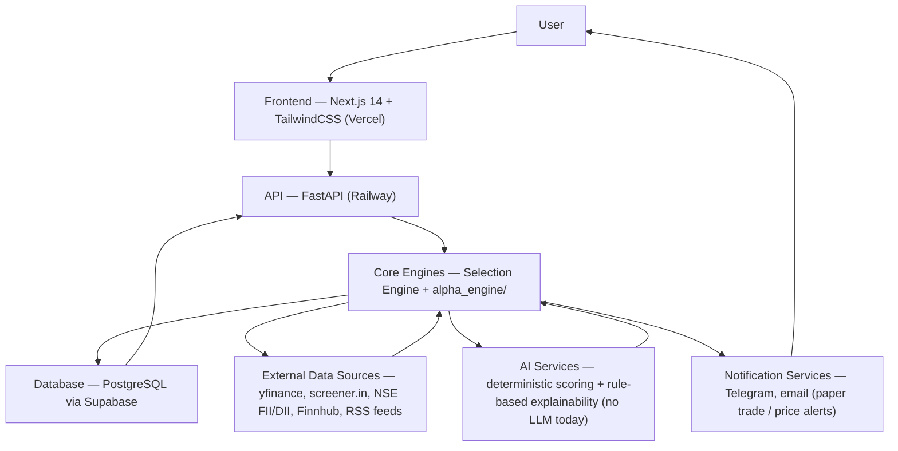
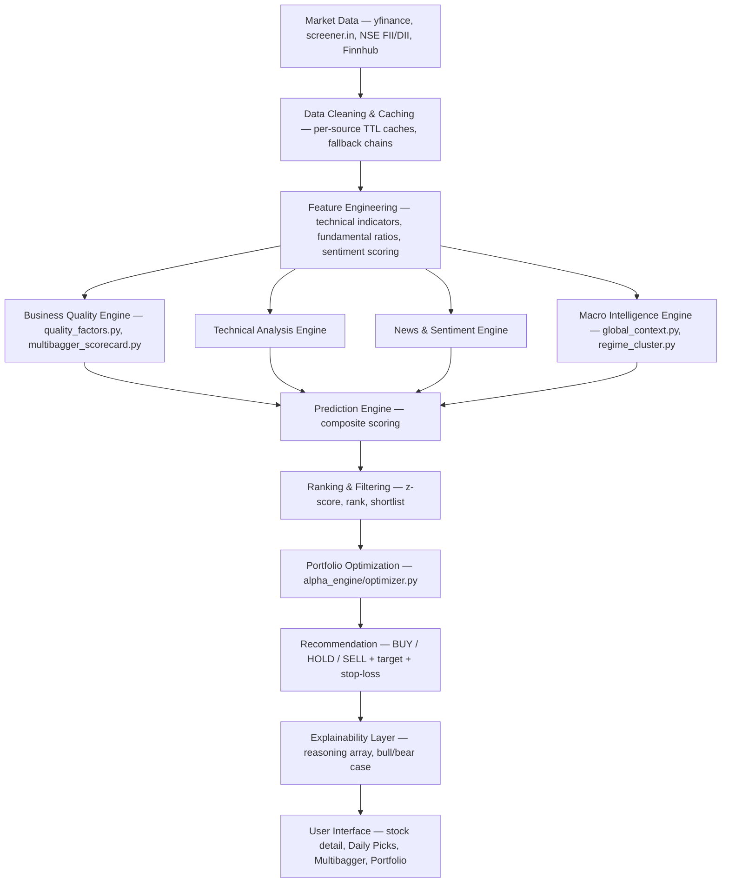
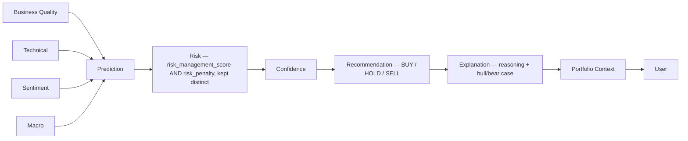
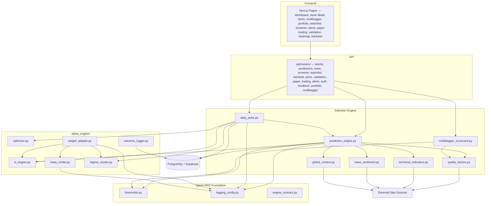

# SSDS-000 — StockSense360 System Architecture

**Status:** Active — governing. This is the highest-level System Design Specification in the StockSense360 System Design Specifications (SSDS) family.
**Purpose:** The single source of truth for how every component of StockSense360 fits together.
**Governed by:** SES-001 through SES-005, the StockSense360 Product Glossary.
**Inputs used:** the Engineering Handbook, SES-001–005, SSDS-001/002, the Product Glossary, ROADMAP.md, SEAR-001, the Sprint #002 report, and direct inspection of the current codebase (backend services/routers, frontend pages, Postgres schema). Every component named below was verified against actual code before being documented — nothing in this document is aspirational unless explicitly marked **Planned** or **Future**.
**Scope discipline:** this is a documentation exercise only. No code was written, modified, or redesigned in producing this document.

---

## 1. Platform Overview

StockSense360 is an AI-assisted stock prediction and portfolio intelligence platform serving Indian (NSE) and US equity markets, with an early, partial extension into crypto. It combines institutional-grade quantitative methods (factor scoring, Bayesian-shrunk Information Coefficients, regime-aware weighting, mean-variance portfolio optimization) with a consumer-facing interface that explains every call in plain language.

**Overall philosophy:** make institutional-grade analysis legible to a retail user, without ever asking them to trust a number they can't see the reasoning behind.

**Major capabilities, as they exist today:**
- BUY/HOLD/SELL signals with confidence, target price, and stop-loss for individual stocks across three horizons (short/medium/long).
- Daily Picks — a daily-generated shortlist of the strongest candidates per horizon, across the full NSE/US universe.
- A separate, rule-based Multibagger Screen for long-term "quality compounder" discovery.
- Paper Trading, Watchlist, Alerts, Screener, and Portfolio tracking with live AI signals on held positions.
- A Learning Alpha Engine that retrains factor weights from realized outcomes over time, independently for IN and US.

**Data-driven investment approach:** every BUY/HOLD/SELL call is the output of a deterministic, factor-based composite score — never a single number pulled from one source, and never (today) an LLM-generated judgment. See §7, AI Architecture, for the explicit deterministic-vs-AI boundary.

**Explainability-first design:** every prediction carries a `reasoning` array (indicator/signal/reason triples) and, increasingly, an explicit bull/bear case — this is treated as a first-class output, not a debugging aid. SEAR-001 named Explainability as one of the system's relative strengths, with specific, named gaps (no formal "invalidation criteria," no post-publication monitoring) tracked in ROADMAP.md Phase 4.

**Modular architecture:** the `alpha_engine/` subpackage (IC engine, meta-model, regime clustering, optimizer, weight adapter) is the architectural high-water mark of the codebase — single-responsibility modules with clean boundaries. The rest of the Selection Engine is less modular today; SEAR-001 named this explicitly (two god-files carrying most of the business logic) and ROADMAP.md Phase 1 schedules its decomposition.

**Engineering principles:** see §12 for the full list; the short version is evidence-over-assertion, scope discipline, no bare hardcoded thresholds, and a test before any "this is safe" claim — all formalized in SES-001 through SES-004 this engagement.

---

## 2. High-Level Architecture Diagram

**Reading this diagram:** the prompt's "↓" chain (User → Frontend → API → Core Engines → Database → External Data Sources → AI Services → Notification Services) is presented here as a hub-and-spoke graph instead of a strict top-to-bottom pipeline, because that's what the actual codebase does — Core Engines is the real hub: it calls out to External Data Sources and the Database on every request, and to Notification Services only on specific scheduled triggers (not on every request). A literal single top-to-bottom chain would misrepresent how often Database and External Data Sources are actually invoked (continuously, not once per request cycle).

---

## 3. Core Engine Architecture

**Status legend:** **Established** (live in production code) · **Planned** (named in ROADMAP.md with a sprint assignment) · **Future** (named as a direction, no sprint assigned).

All names below follow the StockSense360 Product Glossary exactly. Where the brief that commissioned this document used a name not in the Glossary, it is resolved in §11, not invented fresh here.

### Prediction Engine — Established
- **Purpose:** Combines technical, fundamental, and sentiment factors into one composite score and BUY/HOLD/SELL signal per stock/horizon.
- **Inputs:** OHLCV price history, yfinance `info` dict (+ screener.in-augmented `_screener_data` for IN), market regime classification, global macro context, news sentiment.
- **Outputs:** composite score, signal, confidence, target price, stop-loss, `reasoning` array, bull/bear case.
- **Dependencies:** Technical Analysis Engine, Fundamental Analysis Engine, News & Sentiment Engine, Macro Intelligence Engine, the IC engine (for factor weights).
- **Current Status:** Established — `backend/services/prediction_engine.py`'s `PredictionEngine` class. 1,886+ lines, 26 methods (SEAR-001).
- **Future Expansion:** ROADMAP item 1.8 schedules decomposing this into smaller modules; ROADMAP item 5.2 names a longer-term multi-agent split as a Future direction, gated on 1.8 first.

### Business Quality Engine — Established (as a behavior; not a literal module)
- **Purpose:** Evaluates business durability, capital allocation, management quality, and competitive advantage.
- **Inputs:** yfinance financials, screener.in fundamentals, sector/peer comparison data.
- **Outputs:** Quality Score and its sub-factor breakdown (Buffett/Munger score, Altman Z-Score, Sloan accruals, institutional flow proxy, etc.).
- **Dependencies:** none upstream; feeds into the Prediction Engine's fundamental scoring and the Multibagger Screen.
- **Current Status:** Established as a behavior, distributed across `backend/services/quality_factors.py` (`compute_all_quality_factors`, `buffett_munger_score`, `altman_zscore_signal`, `sloan_accruals_signal`, `quality_metrics_score`) and `backend/services/multibagger_scorecard.py`. No single class or file is literally named "Business Quality Engine" — see the Glossary entry for this naming decision.
- **Future Expansion:** ROADMAP item 2.3 (wire Altman Z-Score into a reject signal), 2.4 (forensic/fraud-risk heuristic).

### Ranking & Filtering — Established (as a behavior; name newly assigned by the Glossary)
- **Purpose:** Z-score-normalizes candidates, ranks them, and applies the shortlist/eligibility cutoff.
- **Inputs:** raw factor scores for the day's candidate universe.
- **Outputs:** ranked, filtered candidate list with a shortlist flag.
- **Dependencies:** Prediction Engine and Business Quality Engine outputs.
- **Current Status:** Established — `daily_picks.py`'s `_zscore_and_rank`, `multibagger_scorecard.py`'s `annotate_and_rank`.
- **Future Expansion:** none currently roadmapped beyond the threshold-consistency work already done in Sprint #002.

### "Daily Picks Engine" — terminology conflict, resolved; see §11
- This document does **not** introduce a "Daily Picks Engine" as a fourth named engine. The pipeline behind the Daily Picks feature is the Selection Engine (the established umbrella term covering Prediction Engine + Business Quality Engine + Ranking & Filtering + the portfolio optimizer), and "Daily Picks" remains the name of the **user-facing feature** that pipeline produces. See §11 for the full resolution.

### Portfolio Copilot — Future
- **Purpose:** Analyze a user's portfolio holdings; flag concentration risk, diversification gaps, and improvement opportunities.
- **Inputs (planned):** `portfolio_holdings` table, the day's Selection Engine output.
- **Outputs (planned):** portfolio-aware recommendations and risk flags.
- **Dependencies (planned):** Selection Engine, the optimizer (`alpha_engine/optimizer.py`).
- **Current Status:** **Future — not implemented.** Confirmed by direct repository search (Glossary §"Portfolio Copilot" Validation finding): zero code references this name or this behavior today. The optimizer currently diversifies only the day's new candidates against each other — it has no visibility into anything a user already owns (SEAR-001 Critical Issue #4).
- **Future Expansion:** ROADMAP Phase 3 (items 3.1–3.5) is the path to this; item 3.1 explicitly requires product scoping before any engineering starts.

### AI Research Analyst — Future (as a distinct module); the underlying capability is Established under a different name
- **Purpose:** A conversational/analyst-styled explanation layer.
- **Current Status:** **Future** as a literal separate module. The underlying *capability* — explaining a recommendation in plain language — already exists and is named **Explainability** (see below), not "AI Research Analyst." Do not treat these as the same Established thing under two names.
- **Future Expansion:** ROADMAP item 5.1 ("AI Copilot v1") is the natural home for a true conversational analyst layer, explicitly sequenced after Phase 4 (Explainability) produces richer grounding data.

### News & Sentiment Engine — Established
- **Purpose:** Evaluates corporate news, market sentiment, and macro news events.
- **Inputs:** Yahoo Finance RSS, Google News RSS.
- **Outputs:** Sentiment Score, bullish/bearish reasoning bullets.
- **Dependencies:** none upstream; feeds the Prediction Engine.
- **Current Status:** Established — `backend/services/news_sentiment.py`'s `NewsSentimentService` class (VADER + a financial-phrase lexicon; explicitly rule-based, not LLM-based).
- **Future Expansion:** SEAR-001 named this the methodologically most primitive component relative to the rest of the system — no contextual NLP, no source-credibility weighting. No sprint currently scheduled to address this.

### Explainability Layer — Established
- **Purpose:** Produces the complete, transparent reasoning behind every recommendation.
- **Inputs:** every other engine's sub-scores and reasoning fragments.
- **Outputs:** the `reasoning` array, bull/bear case text.
- **Dependencies:** all upstream engines.
- **Current Status:** Established — `backend/services/case_generator.py` (explicitly documented in its own file header: "Pure, rule-based, NO LLM/AI text — every statement maps to a concrete metric") plus the `reasoning` array assembled inline in `prediction_engine.py`.
- **Future Expansion:** ROADMAP Phase 4 — explicit invalidation criteria, extended risk explanation (liquidity/FX risk), a user-facing decision-change changelog ("this call flipped from BUY to HOLD on [date], here's why").

### Watchlist — Established (Platform Feature, not a Core Engine)
- **Purpose:** User-managed monitoring list with live prices and change%.
- **Current Status:** Established — `/watchlist` route, `watchlist` Postgres table.
- **Note:** documented here because the commissioning brief listed it under "Core Engine Architecture," but per the Glossary it is a Platform Feature, not an engine — it has no scoring/decision logic of its own; it displays Selection Engine output against a saved symbol list.

### Screener — Established (Platform Feature, not a Core Engine)
- **Purpose:** Filters the stock universe by PE, ROE, sector, signal, etc.
- **Current Status:** Established — `/screener` route, `backend/services/screener_service.py`.
- **Note:** same clarification as Watchlist above — a feature surface over existing engine output, not a separate scoring engine.

---

## 4. Data Flow

**Deviation from the brief's example flow, stated explicitly:** the brief's example chain went straight from Business Quality Engine to Prediction Engine to Ranking & Filtering to Recommendation Generation. The actual code runs Business Quality, Technical, News & Sentiment, and Macro Intelligence **in parallel**, all feeding into the Prediction Engine's composite score — not as a single linear chain. This diagram reflects the real fan-in, not the simplified example.

---

## 5. Database Architecture

**Engine:** PostgreSQL, hosted on Supabase. Connected via Supabase's transaction-mode connection pooler (port 6543, `sslmode=require`), using the `postgres` role (which carries `BYPASSRLS` by default on Supabase) — confirmed directly in `backend/services/postgres_store.py`.

**Tables confirmed live in the schema** (grep-verified against `CREATE TABLE IF NOT EXISTS` statements across the backend):

| Table | Defined in | Purpose |
|---|---|---|
| `predictions` | `postgres_store.py` | Logged predictions, factor z-scores — feeds the Learning Alpha Engine. |
| `outcomes` | `postgres_store.py` | Realized outcomes for resolved predictions. |
| `regime_log` | `postgres_store.py` | Historical market regime classifications. |
| `score_snapshots` | `postgres_store.py` | Historical score snapshots (powers the stock detail page's "History" tab). |
| `daily_picks_cache` | `postgres_store.py` | The frozen Daily Picks snapshot, regenerated 1–2×/day. |
| `factor_ic_history` | `postgres_store.py` | IC engine's factor-weight history. |
| `paper_portfolio`, `paper_trades` | `postgres_store.py` | Paper Trading positions and trade log. |
| `watchlist` | `postgres_store.py` | User Watchlist entries. |
| `terms_acceptance` | `postgres_store.py` | Disclaimer/terms acceptance per user. |
| `market_cache` | `postgres_store.py` | Generic market-data cache. |
| `signal_feedback` | `postgres_store.py` | Thumbs up/down feedback per recommendation. |
| `nps_responses` | `postgres_store.py` | Monthly NPS survey responses. |
| `portfolio_holdings` | `api/routers/portfolio.py` | User Portfolio holdings — **confirmed (SEAR-001) never read by the optimizer or Daily Picks pipeline.** |
| `price_alerts` | `api/routers/alerts.py` | User price alerts. |
| `stock_fundamentals_cache` | `fundamentals_cache.py` | Nightly-refreshed fundamentals cache feeding the Multibagger Screen. |
| `val_runs`, `val_signals` | `validation_engine.py` | Walk-forward validation run history. |

**Caching:** at least six independently-implemented in-memory TTL caches exist across `market_data.py`, `screener_data.py`, `news_sentiment.py`, `ic_engine.py`, and others (SEAR-001 Section 2) — no shared caching utility. This is a named architectural gap, not a design choice to be assumed correct.

**Historical data:** `score_snapshots` and `outcomes`/`predictions` are the system's only durable historical record of what the AI actually said and what happened next — this is the data backing the stock detail page's History tab and the entire Learning Alpha Engine.

**User data vs. platform data:** user-specific tables (`watchlist`, `paper_portfolio`, `paper_trades`, `portfolio_holdings`, `price_alerts`, `signal_feedback`, `nps_responses`, `terms_acceptance`) are cleanly separated from platform-wide tables (`daily_picks_cache`, `stock_fundamentals_cache`, `regime_log`, `factor_ic_history`) — no table mixes the two.

**Future storage requirements (Planned/Future, per ROADMAP):**
- Trained `meta_model` `.pkl` artifacts currently live on local disk, not Postgres/object storage — they don't survive a redeploy and wouldn't be shared across horizontally-scaled replicas (ROADMAP item 5.3).
- No table currently exists to support Portfolio Copilot's planned concentration/correlation analysis beyond the already-present `portfolio_holdings` — the data exists, the join to the Selection Engine does not.

---

## 6. External Integrations

Responsibilities only — no integration is redesigned here.

| Integration | Responsibility |
|---|---|
| **yfinance** | Primary market data: quotes, OHLCV, fundamentals (US relies on this almost exclusively; IN uses it for quotes/regime/fallback). |
| **screener.in** (authenticated scrape) | IN-market fundamentals: 10-year history, ROCE, CAGR, promoter holding. |
| **NSE FII/DII API** | Daily institutional flow data (₹ Cr) for IN. |
| **Finnhub** | Quote fallback, company profile, when NSE/yfinance are unavailable. |
| **Yahoo Finance RSS / Google News RSS** | Source feeds for the News & Sentiment Engine. |
| **Telegram** | Daily Picks notification delivery (`backend/services/telegram_bot.py`). |
| **Email (SMTP)** | Paper Trade target/stop-loss proximity alerts (`trade_notifier.py`), price alert notifications (`price_alert_notifier.py`). |
| **Supabase** | Managed PostgreSQL hosting + connection pooling + Auth. |
| **GitHub** | Source control; GitHub Actions runs the Daily Picks cron, Multibagger refresh (IN + US), the validation scheduler's catch-up logic, the keep-alive ping, and (as of Sprint #002) the backend test suite on every push/PR. |
| **Railway** | Backend (FastAPI) hosting. |
| **Vercel** | Frontend (Next.js) hosting. |
| **Future AI providers** | **None integrated today.** No OpenAI/Anthropic/other LLM API call exists anywhere in the backend — confirmed by direct repository search. See §7 for where an LLM provider would and would not be appropriate if integrated in the future. |

---

## 7. AI Architecture

**Where AI is used today:** nowhere, in the LLM sense. "AI" in this codebase's own vocabulary (the `confidence`/"AI Confidence" UI copy, "the AI's score") refers to the deterministic, factor-weighted scoring system — IC-weighted technical/fundamental/sentiment factors, a Ridge/XGBoost meta-model trained on realized outcomes, and KMeans regime clustering. These are statistical/ML techniques, not generative AI, and none of them are LLM-based.

**Where deterministic algorithms are used:** everywhere that produces a score or a BUY/HOLD/SELL verdict. The Prediction Engine, Business Quality Engine, Technical Analysis Engine, News & Sentiment Engine (VADER + lexicon, not an LLM), the IC engine, the meta-model, and the optimizer are all deterministic or classical-ML, never generative.

**Where explainability is produced:** `case_generator.py` and the `reasoning` array — both explicitly rule-based by design. The file header for `case_generator.py` states this directly: *"Pure, rule-based, NO LLM/AI text — every statement maps to a concrete metric."* This is a deliberate engineering choice, not an oversight: every explanatory sentence traces to a specific number, so a user (or an auditor) can verify it.

**Where LLMs would be appropriate, if introduced (Future, not implemented):**
- A conversational layer answering "why this stock / why not" *grounded in* the existing deterministic reasoning output (ROADMAP item 5.1, AI Copilot v1) — an LLM summarizing or making *already-computed, deterministic* facts conversational.
- Natural-language portfolio review summaries for Portfolio Copilot, again grounded in deterministic analysis underneath.

**Where LLMs must never replace deterministic investment logic — stated as a hard architectural principle, not a current-state observation:**
- An LLM must never independently generate a BUY/HOLD/SELL verdict, a target price, a stop-loss, a confidence score, or a quality/risk score. Every one of those numbers must trace to a deterministic calculation over real financial data, exactly as it does today.
- An LLM must never be the sole source of a fact presented as data (e.g. "this company's ROE is X%") — it may *narrate* a fact the deterministic engines already computed, never invent one.
- This boundary exists because the product's core trust proposition — every claim is independently verifiable, per `case_generator.py`'s own stated design — would be silently broken the moment a generative model could originate a number a user might mistake for a measured fact.

---

## 8. Recommendation Pipeline

**Two deviations from the brief's example pipeline, stated explicitly, both already resolved in the Product Glossary:**

1. **"Risk" is not one step.** The Glossary's Validation finding (and SEAR-001 before it) found two distinct numbers both relating to risk: `risk_management_score` (a 0–100 quality sub-factor, higher = safer — the glossary's "Risk Score") and `risk_penalty` (points subtracted from the composite score, a separate deduction mechanism). Both feed the Prediction Engine; they are not unified into one "Risk" step today, and this diagram deliberately shows that rather than implying a unification that doesn't exist.
2. **"Portfolio Context" is a Future step, not an Established one.** SEAR-001's Critical Issue #4 and the Glossary's "Portfolio Copilot" entry both confirm: nothing in the current pipeline cross-references a user's actual holdings before producing a recommendation. The arrow from Recommendation/Explanation to "Portfolio Context" in this diagram represents where ROADMAP Phase 3 work will eventually insert itself — it is not live today. Today's real pipeline ends at Explanation → User directly.

---

## 9. Component Dependency Diagram

**What this graph confirms, directly from the codebase (not asserted):** `prediction_engine.py` and `daily_picks.py` are the two highest-fan-in nodes — exactly the two files SEAR-001 named as carrying the most architectural risk. `thresholds.py`, `logging_config.py`, and `engine_contract.py` (Sprint #002's additions) sit as a foundation layer underneath, consumed by the engines above but depending on nothing else themselves — by design, per SES-002.

---

## 10. Future Expansion Points

| Direction | Current state | Clean extension point |
|---|---|---|
| **Crypto** | **Partially implemented, not purely Future.** `backend/services/crypto_engine.py` provides single-symbol crypto prediction (`predict_crypto`, used by `api/routers/predictions.py`); `screener.py` exposes a `/crypto-movers` endpoint; the frontend dashboard, watchlist, stock-detail page, and search bar already reference crypto symbols. **What's missing:** no dedicated crypto screening/Daily-Picks-equivalent pipeline, no crypto-specific quality/fundamental engine (crypto has no ROE/ROCE equivalent) — `_fear_greed` and `_on_chain_proxy` in `crypto_engine.py` are the closest analogs. |
| **US Markets** | **Already Established**, not a future direction — full US support exists across Daily Picks, Multibagger, Prediction Engine, and the alpha_engine's IN/US-separated learning pipeline. Listed here only because the original brief named it; no work is needed to "add" US markets. |
| **Options** | Future — no code references options instruments anywhere. Extension point: a new `options_engine.py` peer to `crypto_engine.py`, since neither fits the equity-fundamentals-driven Prediction Engine model. |
| **Mutual Funds** | Future — `mf_holdings.py` exists but handles fund *holdings disclosure* data (likely for cross-referencing a fund's portfolio against individual stock predictions), not fund-level prediction. Extension point: a fund-level scoring engine would need its own quality factors (expense ratio, AUM, manager tenure) distinct from the Business Quality Engine's equity-specific factors. |
| **ETFs** | Future — no code references ETF-specific logic. Likely extension point: closer to the equity Prediction Engine than a new engine, since ETFs trade like stocks but need sector/holdings-composition-aware quality scoring. |
| **Advanced Portfolio Analytics** | Future — depends on Portfolio Copilot (ROADMAP Phase 3) landing first; analytics beyond basic P&L tracking need the portfolio-awareness data join that doesn't exist yet. |
| **Personalized AI Copilot** | Future — ROADMAP item 5.1, explicitly sequenced after Phase 4 (Explainability) produces richer grounding data; see §3's "AI Research Analyst" entry. |
| **Institutional Features** | Future — no current code distinguishes a retail vs. institutional user; would likely require multi-account/team support, audit trails, and bulk export — none of which exist today. |

---

## 11. Official Terminology

This document uses the StockSense360 Product Glossary as the authoritative source throughout. Where the brief that commissioned this document proposed a name not already in the Glossary, or used an existing Glossary name with a different meaning, the conflict is listed here rather than silently resolved by inventing a third term.

| Conflict found in this task's brief | Glossary's existing ruling | Resolution in this document |
|---|---|---|
| "Daily Picks Engine" listed as a Core Engine | Glossary lists "Daily Picks" as a **Platform Feature**, with the underlying pipeline already covered by the established umbrella term **Selection Engine** | No new "Daily Picks Engine" term introduced. §3 documents the pipeline under Selection Engine's existing scope and keeps "Daily Picks" for the feature. The Glossary has been updated (same change) with a new Validation-Summary row recording this. |
| SSDS expansion: this task explicitly directs "StockSense360 System Design Specifications" as canonical | Glossary previously recommended "Specification & Design Standards" (reasoning: only scoping templates existed at the time) | **Per this task's explicit directive, "System Design Specifications" is now canonical.** The Glossary entry, its Validation Summary, its Deprecated/Disallowed table, and `Engineering-Handbook/README.md` have all been updated in this same change to reflect the new ruling and explain why it superseded the prior one (the SSDS family now includes an actual system-design document, SSDS-000, not just templates). |
| SEAR expansion: this task explicitly directs "Selection Engine Engineering Audit" as canonical | Glossary already established exactly this expansion | No conflict — reconfirmed, no change needed. |
| SES expansion: this task explicitly directs "StockSense360 Engineering Standards" as canonical | Glossary already established exactly this expansion | No conflict — reconfirmed, no change needed. |
| "StockSense360 Product Glossary" named explicitly as canonical | Already its exact title | No conflict — reconfirmed, no change needed. |
| "Risk Engine" implied as one unified component (via the Recommendation Pipeline's single "Risk" step) | Glossary already found two distinct numbers (`risk_management_score` vs. `risk_penalty`) and deliberately kept them separate | §8 documents the Recommendation Pipeline with both numbers shown distinctly rather than collapsing them, consistent with the Glossary. |
| "Portfolio Context" implied as a live pipeline step (via the Recommendation Pipeline example) | Glossary's "Portfolio Copilot" entry: confirmed not implemented | §8 explicitly marks this step as not live today. |

**No terminology was invented in this document that doesn't already trace to either the Glossary or one of the resolutions in the table above.**

---

## 12. Architecture Principles

These are the principles SES-001 through SES-005, the Sprint #002 work, and this document collectively establish as governing StockSense360's engineering going forward:

1. **Explainability first.** Every recommendation must trace to visible, verifiable reasoning — never a black-box number.
2. **Deterministic investment logic.** Every score, verdict, target, and stop-loss is computed by a deterministic algorithm over real data — never generated.
3. **AI assists, never invents.** A future LLM layer may narrate or summarize what deterministic engines already computed; it may never originate a fact, score, or verdict on its own (§7).
4. **Evidence over assumptions.** Every architectural or audit claim traces to a file:line citation or a command actually run (SES-001 §3) — this document follows that rule throughout.
5. **Modular engines.** New engines are single-purpose modules (`alpha_engine/`'s subpackage is the reference standard); existing god-files are being decomposed, not added to (SES-002 §5, ROADMAP item 1.8).
6. **No duplicated business rules.** A threshold, score, or decision rule has exactly one source of truth (`services/thresholds.py`, SES-002 §1) — SEAR-001's finding of five different D/E cutoffs across two files is the cautionary example this principle exists to prevent recurring.
7. **Centralized configuration.** Threshold values, logging setup, and engine response shapes are centralized (`thresholds.py`, `logging_config.py`, `engine_contract.py`) rather than reinvented per call site.
8. **Comprehensive testing.** No claim of "no behavior changed" is accepted without a test proving it (SES-003) — Sprint #002 closed the codebase's zero-test-coverage starting point with this principle as the explicit standard going forward.
9. **Engineering Standards compliance.** Every change is expected to follow SES-001 through SES-005 and use Glossary-sanctioned terminology — this document and the Glossary update accompanying it are themselves an instance of that compliance, not an exception to it.
10. **Scope discipline.** A task does what it was asked to do and names what it deliberately left out, rather than silently broadening or silently omitting (SES-001 §1) — this document's explicit "Future vs. Established" labeling throughout is this principle applied to architecture documentation specifically.

---

*This document describes the architecture as verified against the codebase at the time of writing. No code, API, or business logic was modified in producing it.*
