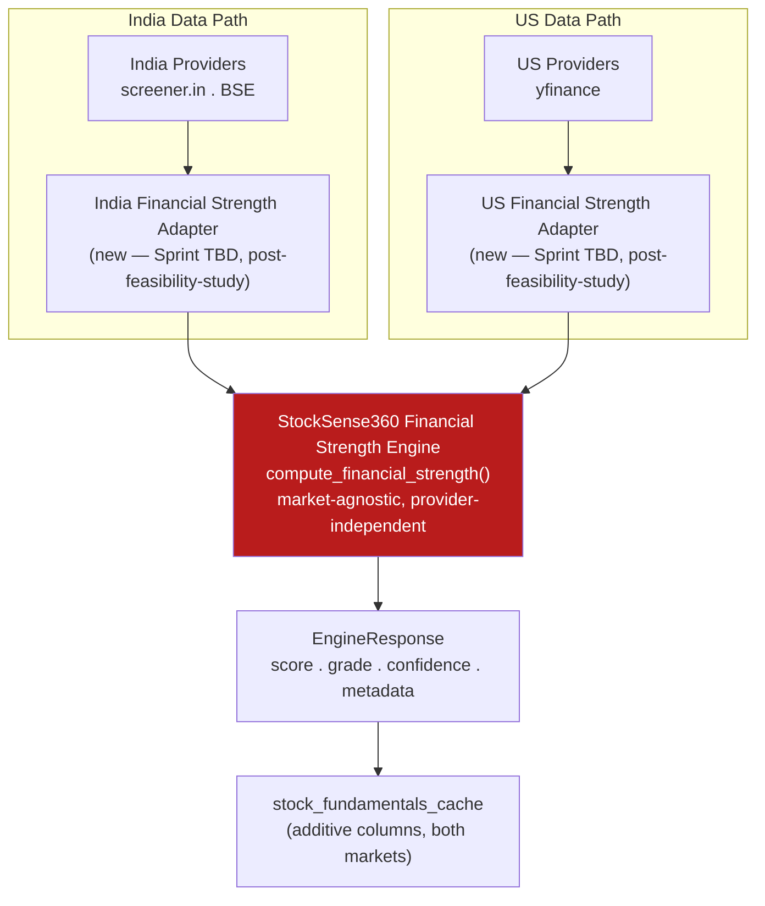

# SSDS-005 — StockSense360 Financial Strength Intelligence Engine

**Status:** Active — governing. Specification only; no implementation in this sprint.
**Governed by:** SES-001 through SES-005, the StockSense360 Product Glossary, SSDS-000, SSDS-003, SSDS-004.
**Precursor document:** [Financial Strength Intelligence — Design Study](../Architecture/Financial-Strength-Intelligence-Design-Study.md) (design proposal; this document formalizes it into a binding specification — no new scope is introduced beyond what the design study already proposed).
**Epic:** 002 — Financial Strength Intelligence (per [MASTER-ROADMAP.md](../../MASTER-ROADMAP.md) §3).

---

## Purpose & Motivating Question

The Financial Strength Intelligence Engine answers a question Business Quality Intelligence (SSDS-003) deliberately does not: **"could this company survive a downturn, service its obligations, and avoid distress in the next 1–3 years?"** This is a near-term solvency, liquidity, and resilience question, answerable independently of whether the underlying business is excellent — a cyclical commodity producer with no moat can have a fortress balance sheet; a wonderful business can be over-levered mid-LBO. StockSense360 has no engine dedicated to this question today; pieces of it are touched incidentally inside the Business Quality Engine (Altman Z-Score, a single-point D/E read) but never as a first-class, explainable diagnostic in its own right (Design Study, Objectives).

Like the Business Quality Engine, this engine does not generate a BUY/HOLD/SELL recommendation — per the Glossary's "Recommendation Engine" entry, that remains the Prediction Engine's `signal` field. This engine's responsibility ends at producing a structured, evidence-backed financial-strength assessment that downstream consumers read as one input among several.

---

## Scope Boundary vs. Business Quality Engine

This is the single most important boundary this specification freezes, carried forward verbatim from the Design Study's evidence-based findings (no re-derivation, no relocation of existing logic):

**Business Quality asks** *"is this a great business worth owning for decades?"* — moat, capital allocation discipline, earnings trustworthiness, long-term economics.
**Financial Strength asks** *"is this company financially sound right now, and resilient under stress?"* — liquidity, leverage, debt-servicing capacity.

The two questions are genuinely separable and can disagree without contradiction: a quality company can be financially strained; a financially fortress-like company can be a mediocre business (a debt-free, low-growth commodity producer).

### Metrics that remain exclusively in Business Quality Intelligence — non-duplication rule

| Metric | Why it stays exclusively in BQE |
|---|---|
| Altman Z-Score | A hard-gate bankruptcy-risk disqualifier for business quality, not a standalone solvency diagnostic. |
| Sloan Accruals, Beneish M-Score | Earnings-quality / fraud-risk signals — "can the reported numbers be trusted," not a solvency question. |
| Piotroski F-Score | A composite quality-improvement signal already blended into BQE's Profitability category. |
| Buffett/Munger checklist, Corporate Actions score | Moat and capital-allocation-discipline signals — no solvency content. |
| Cash Conversion Ratio, Asset Turnover, Working Capital Trend | Operating-efficiency and earnings-quality signals, already scoped narrowly inside BQE's existing categories. |

**Binding rule for every future Epic 002 sprint:** if Financial Strength needs any of the above as context (e.g., citing Altman's zone inside an explanation), it must **read** the value BQE already computed via a shared/passed reference — never recompute the formula independently. This directly extends Epic 001's "do not duplicate engine logic" instruction (Sprint #007) and SES-002 §2's prohibition on a second, parallel implementation of an existing pattern.

### The one nuanced case: Debt-to-Equity

BQE already uses D/E as a coarse, single-point input feeding its Capital Allocation / Balance Sheet Strength categories. **This stays untouched — no redesign of SSDS-003 or `business_quality_engine.py`.** Financial Strength computes its own, deeper D/E-family analysis (multi-year trend, debt maturity mix, peer-relative leverage) as genuinely new content, not a relocation or a second copy of the same single-point number for the same purpose.

### Metrics that should move

**None.** Per the Design Study's explicit finding: nothing reviewed is *purely* misplaced — every BQE metric in the table above genuinely serves a quality question even though some touch balance-sheet data. Epic 002 is an additive, non-overlapping layer, not a relocation of any existing Business Quality content.

---

## Engine Responsibilities

**Exclusively Financial Strength territory** (Design Study, Engine Boundaries):
- Liquidity adequacy — current ratio, quick ratio, cash runway (months of opex covered by cash + equivalents).
- Leverage trajectory and structure — D/E trend over multiple years (not a single point), debt maturity mix (short vs. long-term), refinancing risk, fixed vs. floating exposure where disclosed.
- Debt-servicing capacity under stress — interest coverage *trend*, and a forward-looking stress view (Financial Stress Simulation, below).
- Capital structure resilience — net debt/EBITDA, off-balance-sheet/contingent liability awareness where disclosed.
- A credit-risk-style synthesis verdict — a simplified "financial safety margin," distinct in framing from Altman's bankruptcy-probability lens.

The engine does not price the business, does not assess moat or capital allocation discipline, and does not duplicate any metric named in the Scope Boundary table above.

---

## Design Philosophy

Three commitments inherited directly from Epic 001, each validated under real pressure there, carried forward as binding requirements rather than aspirations (Design Study, Design Philosophy):

1. **Provider independence.** The engine itself must never know about screener.in, yfinance, or BSE as concepts — only about a shaped `info` dict and an optional `ticker` object, exactly as `compute_business_quality()` has worked since Sprint #004. Proven to generalize across two materially different markets with zero engine changes; Financial Strength inherits the same contract rather than re-deriving it.
2. **Evidence over assumption.** Every scope and threshold decision in this document remains subject to revision by the data-feasibility study this SSDS commissions (see Validation Strategy) — Epic 001 repeatedly found that even well-reasoned assumptions (e.g., "India will need a new data provider") were wrong once tested against live data. **Implementation does not begin until that study runs.**
3. **One computation, one owner.** No metric is computed in two places for two different purposes if it can instead be computed once and read by both — Epic 001's adapter pattern and Sprint #007's explicit "do not duplicate engine logic" instruction both encode this; it is the primary tool for resolving every Business-Quality-vs-Financial-Strength boundary question in this document.

---

## Proposed Architecture

Reuses the pattern Epic 001 proved twice (US and India) — no new architectural shape introduced:

A new `services/financial_strength_engine.py` (naming illustrative, consistent with `business_quality_engine.py`'s convention — the implementation sprint decides the exact module name), shaped exactly like the Business Quality Engine: a pure function `compute_financial_strength(symbol, ticker, df, info, market)` returning an `EngineResponse`, fed by per-market adapters that supply an already-shaped `info` dict. The engine never touches a provider directly — the adapter boundary is where market-specific unit conversion, field renaming, and any validated derivations live, exactly as `india_business_quality_adapter.py` demonstrated in Sprint #007. Per SES-002 §5, this is a new, single-purpose module, not an addition to either existing god-file (`prediction_engine.py`, `quality_factors.py`).

---

## Scoring Categories

Five categories, following the same "base + capped buckets" pattern SSDS-003 §2 established (and that pattern itself reuses `prediction_engine.py`'s `_fundamental_score` convention) — not a new aggregation style:

| Category | Investment Question | Cap (± around base 50) — illustrative, to be calibrated post-feasibility-study |
|---|---|---|
| **Liquidity Adequacy** | Does this company have enough near-term liquid resources (current ratio, quick ratio, cash runway) to meet obligations without distress? | ±20 |
| **Leverage & Capital Structure** | Is the company's debt load, and its trend and maturity structure, sustainable rather than fragile? | ±20 |
| **Debt-Servicing Capacity** | Can earnings comfortably cover interest obligations today, and would they continue to under a plausible stress scenario? | ±20 |
| **Balance Sheet Resilience** | Does the company carry off-balance-sheet/contingent liability exposure or an inadequate equity cushion that isn't visible in the headline leverage ratio? | ±15 |
| **Cash Flow Durability Under Stress** | Does free cash flow hold up across cycles, distinct from BQE's earnings-quality framing (which asks whether reported income can be trusted, not whether cash flow survives pressure)? | ±15 |

Combined score = `50 + Σ(category_score)`, clamped to `[0, 100]` — identical clamping convention to Business Quality and the rest of the Selection Engine, per SES-002 §3/§4's preference for one shared contract over per-engine ad hoc shapes.

**Calibration deferred, not omitted:** the specific point caps above are carried directly from the Design Study's proposal and are explicitly **illustrative, not finalized** — SSDS-003's own categories were calibrated against two rounds of live-data validation before being trusted (Sprint #004 → #004a cycle), and this specification does not skip that step by pretending these numbers are final. The data-feasibility study and subsequent implementation sprint's live-data calibration (mirroring Sprint #004a) own finalizing these weights.

### Hard Quality Gate

Mirroring SSDS-003's pattern but with a distinct trigger, so the two engines can disagree without contradiction (Design Study, Proposed Scoring Categories):

- **Trigger:** severe liquidity crisis — current ratio far below 1, combined with negative free cash flow and near-term debt maturities — produces `Grade.REJECTED` with `metadata.rejection_reason = "liquidity_distress"`.
- **Explicit non-overlap with BQE's gate:** Business Quality's hard gate (`distress_and_aggressive_accruals` / `fraud_risk`) and Financial Strength's gate (`liquidity_distress`) are deliberately different AND-conditions over different evidence. A company can fail one gate without failing the other — this is by design, not an inconsistency to reconcile.
- Following SSDS-003 §2's precedent: a deliberately minimal, narrow AND-condition, not a sprawling list — consistent with SEAR-001's critique (carried into SSDS-003) that gate-sprawl is a risk to avoid repeating.
- **Sector exemption:** financial-sector companies (banks/NBFCs/insurance, per the existing `is_financial` flag) skip the leverage-dependent components of this gate, exactly as `prediction_engine.py`'s and SSDS-003's existing exemption already does for their own gates — not a new exemption mechanism, reuse of the existing one.

### Soft Adjustments

Everything in the five categories that is not the hard-gate condition above is a soft, capped-bucket adjustment, consistent with SSDS-003 §2's existing distinction between hard-reject and soft-penalty mechanisms — this engine does not blur that distinction.

---

## Financial Stress Simulation — Scenario Framework

The single most distinctive, additive capability this engine offers that nothing else in the Selection Engine provides today (Design Study, Financial Stress Simulation Concept) — it operationalizes "resilience" rather than just measuring a static snapshot.

**Concept:** apply a small number of named, simple, transparent stress scenarios to a company's most recent reported financials, and report whether debt-servicing capacity and liquidity would survive each one. Not a forecasting model, not a Monte Carlo simulation — a deterministic, fully explainable "what if" recompute of 2–3 existing ratios under a stated shock. This matches SSDS-000 §7's hard architectural principle ("AI assists, never invents") exactly: the simulation recomputes real ratios under a stated, inspectable assumption — it does not generate a prediction.

**Proposed initial scenarios — explicitly illustrative placeholders, not calibrated values, per the Design Study's own framing:**

| Scenario | Shock | Recomputed ratio | Pass condition (illustrative) |
|---|---|---|---|
| Earnings shock | EBIT down 20% | Interest coverage | Stays above a minimum threshold (to be calibrated) |
| Revenue shock | Revenue down 15%, fixed costs held constant | Interest coverage (recomputed via the resulting EBIT) | Same as above |
| Liquidity shock | Next 12 months of scheduled debt maturities must be refinanced at a higher rate, or repaid from cash on hand | Cash runway | Cash runway survives the shock |

**Design constraint, binding:** each scenario's logic must be inspectable in the `explanation` field — the specific shock applied and the specific ratio recomputed, never a black-box adjustment. This is a hard requirement of the Explainability Philosophy (below), not a nice-to-have.

**What this specification freezes vs. defers:** the *framework* (three scenario types, the recompute-don't-forecast approach, the explainability requirement) is frozen by this SSDS. The *specific shock magnitudes* (20%, 15%, the "higher rate" multiplier) and *pass-condition thresholds* are explicitly deferred to calibration against live data — naming them as placeholders now, exactly as the Design Study does, rather than inventing precision this document has no evidence to support.

---

## Data Requirements

Per category, the underlying financial-statement line items required (Design Study, Data Requirements):

- **Balance sheet:** current assets, current liabilities, total debt (ideally split short- vs. long-term), cash & equivalents, total equity, EBIT/EBITDA.
- **Income statement:** interest expense, EBIT/EBITDA history (3–5 years, for trend).
- **Cash flow statement:** operating cash flow, free cash flow, multi-year history for stability assessment.

**Mapping to existing pipeline data is proposed, not confirmed:** these map to fields already collected per market in Epic 001 (e.g., screener.in's `borrowings_latest_cr` / `interest_coverage_ratio`, yfinance's balance sheet) — but per SSDS-004's own precedent (the Total-Assets-via-balance-sheet-identity hypothesis, unverified until Sprint #006 tested it), availability and reliability at the *trend* and *maturity-split* granularity this engine needs has **not** been validated. This SSDS does not assume Business Quality's data-coverage experience transfers — it commissions a dedicated study to check (see Validation Strategy).

**Named, highest-priority unknown, carried forward verbatim from the Design Study's Open Questions:** is debt-maturity-split data (short- vs. long-term debt breakdown) reliably available from screener.in at all, or only from yfinance/BSE? This is the single highest-priority question for the data-feasibility study, since the Leverage & Capital Structure category depends on it.

---

## Sector Adaptations

Reuses `sector_quality_applicability.py`'s taxonomy and exemption *philosophy*, not its code — leverage in the FINANCIAL sector (banks/NBFCs) is the business model itself, not a risk signal, exactly as already proven true for Business Quality and equally true here.

| Sector bucket | Proposed treatment | Status |
|---|---|---|
| FINANCIAL (banks/NBFCs/insurance) | D/E and current-ratio concepts likely need **exemption**, not adjustment — debt is their raw material, not leverage risk in the same sense (same rationale already documented and reused from `prediction_engine.py`'s `is_financial` comment). | Proposed hypothesis — requires empirical validation, not assumed by analogy. |
| UTILITIES_ENERGY, REAL_ESTATE | Likely need **adjusted thresholds**, not exemption — structurally high, stable leverage is normal for both and not itself a distress signal. | Proposed hypothesis — requires empirical validation. |
| All other sectors (per SSDS-003 §4's existing 9-bucket taxonomy plus Telecom) | Universal thresholds apply unless the data-feasibility study or subsequent live-data calibration finds evidence otherwise. | Default — no exemption assumed without evidence. |

**Binding rule, carried from the Design Study verbatim:** these are proposed hypotheses, not conclusions. They require the same empirical validation discipline Epic 001 applied throughout (the Total-Assets hypothesis was tested and confirmed before being trusted; the FINANCIAL/UTILITIES_ENERGY/REAL_ESTATE hypotheses above receive the same treatment, not an assumption carried over by analogy.

---

## Confidence Model

Identical philosophy to Business Quality Intelligence (SSDS-003 §5), no new mechanism invented:

- A data-completeness percentage over Mandatory inputs, computed independently of the score itself, with its own `MIN_DATA_COMPLETENESS_PCT`-style insufficient-data path (a new, named constant in `services/thresholds.py` at implementation time, per SES-002 §1 — not a raw literal).
- **Binding rule on derived data, carried forward from Sprint #007's established precedent:** confidence must **not** drop when a validated derivation is used in place of a directly-scraped field. A derivation proven by evidence (e.g., a future India debt-maturity derivation, if the feasibility study finds one) is a fully legitimate input, not a lower-confidence substitute for direct data — exactly the standard Sprint #007 established and enforced for India's Total-Assets-via-identity derivation.
- If fewer than 60% of a sector's Mandatory metrics (per the sector-adaptation table above — exempted metrics don't count against completeness) are available, the engine returns `grade = REJECTED` with `metadata.rejection_reason = "insufficient_data"`, mirroring SSDS-003 §5's existing threshold exactly, pending recalibration if the feasibility study finds a materially different data-availability profile for Financial Strength's specific inputs (debt-maturity-split, current-ratio components) than Business Quality's inputs had.

---

## EngineResponse Contract

No new contract. The engine returns the existing shared `services.engine_contract.EngineResponse` shape exactly as Business Quality does — `score: float`, `grade: Grade`, `confidence: float`, `strengths: list[str]`, `weaknesses: list[str]`, `risks: list[str]`, `explanation: str`, `metadata: dict[str, Any]` — per SES-002 §3's instruction that a new engine uses `EngineResponse` from the start, and per the Design Study's explicit rejection of a second contract shape ("would fragment the platform's explainability story for no benefit").

| `EngineResponse` field | Financial Strength Engine specifics |
|---|---|
| `score` | The 0–100 combined Financial Strength Score from the Scoring Categories section. |
| `grade` | Reuses the existing `Grade` enum (`strong_buy`/`buy`/`hold`/`watch`/`sell`/`avoid`/`rejected`) — the same vocabulary as the rest of the Selection Engine; the same word means something different in this engine's context, exactly as Business Quality and the rest of the platform already coexist without confusion (Design Study, EngineResponse Philosophy). |
| `confidence` | Per the Confidence Model above. |
| `strengths` | The highest-contributing Mandatory metrics, by category. |
| `weaknesses` | The lowest-contributing Mandatory metrics, by category. |
| `risks` | Reserved for capital-preservation-relevant flags: hard-gate-adjacent conditions (approaching the liquidity-distress trigger) and any stress-scenario failure. |
| `explanation` | A short narrative synthesizing the category scores and, where applicable, the specific stress scenario(s) that failed — deterministically templated, not generated, per SSDS-000 §7. |
| `metadata` | `sector`, `sector_bucket`, `data_completeness_pct`, `rejection_reason` (if applicable), `category_contributions`, key ratios (current ratio, D/E trend, net debt/EBITDA, interest coverage), `stress_simulation_results` (per-scenario pass/fail with the specific shock and recomputed ratio). |

---

## Explainability Philosophy

Matches Business Quality's bar exactly, with no exceptions (Design Study, Explainability Philosophy):

- Every score decomposes into named category contributions (`metadata.category_contributions`).
- Every hard-gate rejection states a specific `rejection_reason`.
- Every derived or market-adapted input field carries the same `[DIRECT]` / `[DERIVED/PROVEN]` / `[DERIVED/SUPPORTED]` / `[UNAVAILABLE]` provenance tagging proven in Sprint #007's adapter — this is a binding carry-forward requirement, not a nice-to-have, given how central derived-data confidence is to this engine's data-availability profile (debt-maturity-split, in particular, is likely to require derivation or be unavailable per market).
- A user-facing explanation must be able to state *why* a company is "financially strong" or "financially strained" in plain language tied to specific ratios and, where applicable, a specific stress-scenario result — never just a bare number.

---

## Validation Strategy

Directly inherits Epic 001's proven sequence, in order (Design Study, Validation Strategy; MASTER-ROADMAP.md §7's Development Lifecycle):

1. **Data-feasibility study (next sprint, commissioned by this SSDS, Sprint #006-style)** — per market, before any scoring logic's thresholds are finalized. Specifically tests whether debt-maturity-split and multi-year trend data are actually available at the granularity this engine needs, since that has **not** been demonstrated the way Total Assets and Altman/Sloan inputs were for Business Quality. This is the immediate next sprint — see Recommended Next Sprint below.
2. **Production-readiness live validation** — against 50+ real companies per market, deliberately spanning known-distressed names (a company in real, public financial distress should score low) and known-fortress names (a recognized low-leverage, high-liquidity company should score high) — falsifiability by design, the same technique used throughout Epic 001's Production Readiness Validation.
3. **Evidence-over-assumption discipline at every step** — every claim traced to a live run, not memory or analogy to Business Quality's results, per SES-001 §3.

### Testing Strategy (for the eventual implementation sprint)

The same four-category structure proven across Epic 001, per SES-003 §1: unit (scoring sub-functions, stress-simulation recomputation logic, sector adaptations), integration (adapter ↔ engine wiring per market), regression (no behavior change to Business Quality Intelligence or any existing consumer — a binding non-negotiable given the Scope Boundary section above), golden (representative real-shaped companies per sector, both markets, including at least one genuinely distressed and one genuinely fortress-balance-sheet company per market). Carries forward Sprint #007's specific lesson: a live-data validation pass can surface defects in modules it wasn't explicitly testing — keep live-data validation as a standing practice through implementation, not a one-time gate.

---

## Known Limitations & Out-of-Scope Items (named up front, per SES-001 §1)

1. **Debt-maturity-split data availability is unverified for both markets** — the data-feasibility study exists specifically to resolve this before implementation; this SSDS does not assume it transfers from Business Quality's experience.
2. **The specific Financial Stress Simulation shock magnitudes and pass-condition thresholds are illustrative placeholders**, not calibrated values — calibration against live data is explicitly deferred to the implementation sprint, mirroring SSDS-003's own deferred-then-calibrated category caps (Sprint #004 → #004a).
3. **Sector-adaptation hypotheses (FINANCIAL exemption, UTILITIES_ENERGY/REAL_ESTATE adjustment) are proposed, not validated** — named explicitly as requiring the same empirical discipline Epic 001 applied, not assumed by analogy to Business Quality's sector taxonomy.
4. **No code is implemented by this specification** — `services/financial_strength_engine.py`, any adapter, and any threshold-registry entries are all future-sprint work, contingent on the data-feasibility study's findings.
5. **Cross-reference behavior between Business Quality and Financial Strength explanations is undecided** — per the Design Study's Open Questions, whether Financial Strength should cite BQE's Altman zone as context, or remain fully independent in its explanations, is not resolved here. Leaning toward independence (to avoid implying false correlation between two deliberately separable questions), but explicitly left open for the implementation sprint to decide with evidence, not assumption.
6. **Combined-engine consumer behavior (Business Quality + Financial Strength disagreement) is out of scope for this SSDS** — what a downstream consumer does when, e.g., a company is `strong_buy` on Business Quality but `rejected` on Financial Strength is a downstream integration question for whichever sprint first combines both engines' outputs, named here so it isn't forgotten, not designed here.
7. **US interest-coverage asymmetry, inherited from SSDS-003's own Known Limitation #1, is not re-solved by this document** — if Financial Strength's debt-servicing category needs US interest coverage and it remains undefined when this epic reaches implementation, that gap blocks symmetric scoring exactly as it already does for Business Quality, and should be resolved once, shared by both engines, not twice.

---

## Future Sprint Roadmap

| Sprint | Scope | Gated on |
|---|---|---|
| **Next (immediate)** | Financial Strength data-feasibility study — per-market live test of debt-maturity-split availability, current-ratio component availability, and multi-year trend depth, mirroring Sprint #006's methodology exactly. | This SSDS being finalized (this document). |
| **Following** | Implementation: `financial_strength_engine.py`, wired additively (no consumer behavior change), reusing the feasibility study's confirmed data paths only. | Feasibility study's findings. |
| **Following** | Live-data production-readiness validation (50+ companies per market, adversarial cases included), mirroring Sprint #004→#004a's cycle. | Implementation sprint. |
| **Following** | First consumer integration — scope (which consumer, which market(s)) decided based on data-availability parity between markets at that point, mirroring Sprint #005's explicit "US-only, named as a finding" precedent if parity isn't yet achieved. | Validation sprint's findings. |
| **Eventual, not yet scheduled** | A combined "Investment Readiness" view synthesizing Business Quality and Financial Strength without merging their engines (Design Study, Future Considerations) — the natural next integration point once both exist independently. | First consumer integration of Financial Strength landing successfully. |

---

## Open Questions (carried forward from the Design Study, not resolved by this SSDS)

- Should the Financial Stress Simulation's shock scenarios be fixed (a small, named set) or sector-adjustable (e.g., a smaller earnings shock for historically low-volatility sectors like Utilities)? Needs a calibration pass against real sector volatility data — not an a priori decision this SSDS makes.
- Is debt-maturity-split data reliably available from screener.in at all, or only from yfinance/BSE? The single highest-priority question for the upcoming data-feasibility study.
- Should Financial Strength read BQE's Altman zone as cross-reference context in its explanation, or remain fully independent? Leaning toward independence; not decided.
- What should a downstream consumer do when Business Quality and Financial Strength disagree sharply? Explicitly out of scope for this SSDS; named so it isn't forgotten.

---

## List of Assumptions

1. The implementation sprint will build the Financial Strength Engine as a new module, shaped identically to `business_quality_engine.py`'s `compute_business_quality()` pattern — a pure function over a market-agnostic `info`/`ticker` shape, never reading a provider directly.
2. The data-feasibility study (next sprint) will follow Sprint #006's exact methodology — a live, evidence-based per-market study, not a synthetic-fixture exercise — before any scoring threshold in this document is treated as final.
3. The sector-adaptation hypotheses in this document are proposals pending validation; no implementation sprint should encode them as fact without the same empirical check Epic 001 applied to its own sector-adaptation table.
4. No metric named in the Scope Boundary section's non-duplication table will be recomputed by Financial Strength under any circumstance; any apparent need to do so is itself evidence the boundary needs revisiting in a deliberately-scoped follow-up to this SSDS, not a license to duplicate inline.

---

## Update to INDEX.md

Per SES-004 §7 — `INDEX.md`'s "System Design Specifications (SSDS)" section now lists SSDS-005 alongside SSDS-000/001/002/003/004 (see the commit accompanying this document), and the Epic 002 entry is updated to point at this specification as the now-frozen scope, with the data-feasibility study named as the next concrete action.

---

*This document is a specification only. No code was written or implemented in producing it. No existing business logic was modified. The data-feasibility study this SSDS commissions has not yet been run — every data-availability claim above is a proposal carried forward from the Design Study, not a verified fact.*
