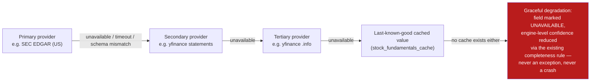

# SSDS-006 — StockSense360 Data Fabric & Provider Architecture

**Status:** Active — governing. Specification only; no implementation in this sprint.
**Governed by:** SES-001 through SES-005, the StockSense360 Product Glossary, SSDS-000, SSDS-003, SSDS-004, SSDS-005.
**Inputs reviewed:** [MASTER-ROADMAP.md](../../MASTER-ROADMAP.md), [EPIC-001 Closure Report](../EPICS/EPIC-001-Business-Quality-Intelligence-Closure.md), SSDS-000, SSDS-003, SSDS-004, SSDS-005, [StockSense360 Data Independence & Provider Strategy](../Architecture/Epic-002-Sprint-002-StockSense360-Data-Independence-Provider-Strategy.md), the StockSense360 Product Glossary, SES-001 through SES-005, and direct reading of `services/thresholds.py`, `services/engine_contract.py`, `services/fundamentals_cache.py`, `services/fundamentals_refresh.py`, `services/screener_data.py`, `services/india_business_quality_adapter.py`.
**Epic:** 002 — Financial Strength Intelligence, Sprint #003.
**Scope discipline:** this document specifies architecture only. No production code is written, no existing provider (`screener_data.py`, `bse_data.py`, `nse_client.py`, `us_fundamentals.py`) is modified, and no existing engine (`business_quality_engine.py`, the forthcoming Financial Strength Engine) is redesigned. Every layer below is additive in front of what already exists.

---

## Purpose

Epic 001 proved that an intelligence engine reading only a normalized, market-agnostic `info`/`ticker` shape — never a provider name — survives a second market with zero engine changes (Sprint #007's India adapter: ~180 new lines, zero touches to `business_quality_engine.py`). Epic 002's own Data Independence & Provider Strategy report then established that StockSense360 is moving from "one provider per market" to **several interchangeable providers per market** (Screener.in + BSE + a future enhanced scrape for India; yfinance `.info` + yfinance statements + SEC EDGAR for the US). That shift changes the problem: with one provider per market, an adapter is enough. With several providers per market that can disagree, go stale, or fail independently, something has to own *which provider wins for which field, why, and with what confidence* — a responsibility no existing adapter or engine was ever asked to carry, and that none of them should be asked to carry, because doing so would re-introduce exactly the provider-coupling Epic 001 spent five sprints removing.

**The StockSense360 Data Fabric is that something.** It is the permanent layer between the Provider Layer (Epic 002's report) and the Engine Layer (Epic 001's proven contract) — normalizing multiple providers' native shapes into one schema, resolving disagreement between them, attaching provenance and confidence to every field, and handling failover — so that every current and future intelligence engine continues to see exactly one thing: a single, already-resolved, already-explained `info`/`ticker`-shaped input, never a provider.

### Why intelligence engines must never depend directly on providers

Three pieces of evidence from this engagement already prove this, independent of any new argument this document could make:

1. **Sprint #007 (Epic 001):** adding India support to the Business Quality Engine cost one new adapter file and zero engine changes — possible only because the engine had never been written to know `screener.in` existed.
2. **The SSDS-005 Data Validation Report:** discovered that screener.in's *unauthenticated* access pattern gets IP-blocked at batch volume — a fact about one provider's operational behavior that would have leaked into every engine's logic had any engine ever called `fetch_screener_data()` directly instead of through an adapter.
3. **The Data Independence & Provider Strategy report:** found that SEC EDGAR can become a second, independent US fundamentals source — a change that, under the existing one-provider-per-market pattern, would require touching `us_fundamentals.py`'s call sites wherever they exist, but under the Data Fabric, requires only registering a new provider adapter; every consuming engine is unaffected, automatically.

If an engine ever imports `screener_data`, `bse_data`, or a future `sec_edgar_adapter` directly, the Data Fabric has failed at its one job. The architectural test for "did we get this right" is the same one Epic 001 already passed twice: **adding or replacing a provider should require zero engine changes.**

---

## Section 2 — Architectural Principles

Ten principles, each either already proven elsewhere in this engagement (cited) or newly required by the multi-provider shift this document addresses:

| Principle | Statement | Basis |
|---|---|---|
| **Provider independence** | No engine ever references a provider by name; every engine reads only the Data Fabric's normalized output. | Proven twice in Epic 001 (US, then India); restated, not re-derived, here. |
| **Single source of truth** | Once the Data Fabric resolves a field's value for a symbol/market/date, every consumer reads that one resolved value — never a per-consumer re-derivation of the same field from raw provider data. | Extends SES-002 §1's threshold-registry principle ("a threshold... lives in `services/thresholds.py`, not inline") to data values, not just constants. |
| **Field normalization** | Every provider's native field names/units map into one StockSense360 schema before anything downstream sees them. | New this document — see Section 5. |
| **Explainability** | Every resolved field, every confidence score, and every failover decision must be traceable to a stated reason, not a black box. | Direct extension of SSDS-000 §12 principle #1 and SSDS-005's Explainability Philosophy. |
| **Provenance tracking** | Every field carries its originating provider, retrieval time, provider/schema version, and derivation status. | Generalizes Sprint #007's `[DIRECT]`/`[DERIVED/PROVEN]`/`[DERIVED/SUPPORTED]`/`[UNAVAILABLE]` tagging from "an India-adapter-specific idea" to "a Data-Fabric-wide requirement." |
| **Confidence scoring** | Provider-level confidence (this document, Section 7) is computed and preserved separately from engine-level confidence (SSDS-003 §5/SSDS-005's existing data-completeness model) — the two must never be conflated. | New this document; explicitly resolves a question SSDS-005 left implicit. |
| **Fail-soft engineering** | A provider being unavailable degrades the Data Fabric's output (lower confidence, a cached or stale value, a smaller field set) — it never propagates as an exception into an engine. | Direct extension of the fail-soft pattern already proven across every layer of Epic 001 (`quality_metrics_score(None, ...)`, the adapters' try/except, per-symbol refresh-loop isolation). |
| **Backward compatibility** | The Data Fabric is additive in front of existing providers and engines — `business_quality_engine.py`'s existing `EngineResponse` contract, `screener_data.py`'s existing function signatures, and `stock_fundamentals_cache`'s existing columns are all unchanged by this document. | Mandated by this sprint's own scope rule ("do not modify existing providers... do not redesign existing engines") and SES-001 §1's scope discipline. |
| **Incremental provider replacement** | Adding, reordering, or retiring a provider is a Data-Fabric-internal configuration/registration change, never a multi-file refactor. | The architectural test stated in Purpose above; the direct generalization of what made SEC EDGAR's addition (Epic 002 Sprint #002) cheap in principle. |
| **Evidence over assumption** | Every precedence rule, confidence weight, and failover order in this document is provisional until validated against live data — exactly as SSDS-005's own category caps and stress thresholds are explicitly marked illustrative pending its feasibility study. | Restates SES-001 §3 and the pattern proven repeatedly across Epic 001 (Sprint #006 reversing the India-needs-a-new-provider assumption) and Epic 002 (the SEC EDGAR finding reversing "no free US alternative exists"). |

---

## Section 3 — Overall Architecture

```mermaid
flowchart TB
    subgraph EXT["External Providers"]
        SCR["Screener.in"]
        BSE["BSE"]
        YF["yfinance .info"]
        YFS["yfinance statements"]
        EDGAR["SEC EDGAR"]
        FUT["Future providers<br/>(NSE/BSE/MCA filings, new markets)"]
    end

    subgraph PA["Provider Adapter Layer — Section 4"]
        direction TB
        PA1["One adapter per provider.<br/>Owns: auth, retry, rate-limit,<br/>timeout, raw schema validation,<br/>error reporting, version tagging."]
    end

    subgraph NORM["Normalization Layer — Section 5"]
        NORM1["Maps each provider's native field<br/>names/units into the unified<br/>StockSense360 schema.<br/>No provider-specific logic beyond this point."]
    end

    subgraph VALID["Validation Layer"]
        VALID1["Schema/type/range sanity checks<br/>per field. Rejects malformed values<br/>before they reach resolution —<br/>never silently coerces."]
    end

    subgraph CONF["Confidence Layer — Section 7"]
        CONF1["Computes provider-level confidence<br/>per field: completeness, freshness,<br/>provider reliability, derivation status,<br/>cross-provider agreement."]
    end

    subgraph FABRIC["Data Fabric — Sections 6, 9"]
        FABRIC1["Multi-provider resolution<br/>(precedence + consensus rules).<br/>Provenance attachment.<br/>Conflict logging."]
    end

    subgraph CACHE["Cache — Section 10"]
        CACHE1["stock_fundamentals_cache<br/>(existing table, additive columns only)<br/>+ refresh-job orchestration"]
    end

    subgraph ENGINES["Intelligence Engines — Section 14"]
        ENG1["Business Quality · Financial Strength ·<br/>Growth · Valuation · Risk · Recommendation ·<br/>Portfolio · AI Research Analyst"]
    end

    subgraph CONSUMERS["Consumers"]
        CONS1["Daily Picks · Multibagger Screen ·<br/>Stock Detail · Screener · Watchlist"]
    end

    EXT --> PA --> NORM --> VALID --> CONF --> FABRIC --> CACHE --> ENGINES --> CONSUMERS

    style FABRIC fill:#1d4ed8,color:#fff
    style PA fill:#15803d,color:#fff
    style NORM fill:#15803d,color:#fff
```



### What each layer is responsible for, and what it must never do

| Layer | Responsible for | Must never do |
|---|---|---|
| **External Providers** | Existing in current code: Screener.in, BSE, yfinance. New, not yet built: SEC EDGAR, future NSE/BSE/MCA filings, future-market providers. | Nothing changes here — this document does not modify any provider. |
| **Provider Adapter** | One adapter per provider (Section 4). Speaks that provider's native protocol/auth/format. | Leak provider-specific concepts (field names, units, auth quirks) past its own boundary. |
| **Normalization** | Field-name and unit mapping into the unified schema (Section 5). | Make a precedence or confidence decision — normalization is a pure, stateless mapping, not a resolution. |
| **Validation** | Reject malformed values (wrong type, out-of-range, missing required structure) per field, before resolution. | Silently coerce a bad value into a plausible-looking one — an invalid field is `[UNAVAILABLE]`, never guessed. |
| **Confidence** | Compute a per-field, per-provider confidence score (Section 7) from completeness/freshness/reliability/derivation/agreement. | Compute engine-level confidence — that remains each engine's own responsibility (SSDS-003 §5/SSDS-005), reading the Fabric's provider-confidence as one input among several. |
| **Data Fabric (resolution)** | Apply precedence/consensus rules (Section 9) across providers for the same field; attach provenance; log conflicts. | Apply any engine-specific business rule (a sector exemption, a hard-gate threshold) — those remain inside engines, per SSDS-003/SSDS-005's existing, unmodified scope. |
| **Cache** | Persist resolved, provenance-tagged values; orchestrate refresh cadence (Section 10). | Become a second source of truth competing with the Fabric's resolution — the cache stores the Fabric's *output*, it does not re-resolve anything itself. |
| **Engines** | Score, gate, and explain — exactly as SSDS-003/SSDS-005 already specify, unmodified. | Read a provider directly, or re-implement any normalization/resolution/confidence logic the Fabric already owns. |

---

## Section 4 — Provider Adapter Standard

Every provider adapter — existing (to be wrapped, not rewritten) or future — implements the same contract:

| Concern | Standard |
|---|---|
| **Authentication** | Declares its auth mechanism (none, credential pair, API key, session-cookie) and where credentials are read from (environment variables, per SES-002's existing pattern in `screener_data.py`'s `SCREENER_EMAIL`/`SCREENER_PASSWORD`). The adapter owns auth entirely; nothing above it ever sees a credential. |
| **Retry strategy** | A bounded retry count with backoff for transient failures (timeouts, 5xx) — distinct from a hard failure (404, confirmed-unavailable symbol), which must not retry per SES-002 §6's "distinguish temporarily unavailable from a bug" rule. |
| **Rate-limit handling** | Each adapter declares its provider's known rate limit (e.g., screener.in: undocumented, observed ~12–15 requests/burst before an IP-level block per the SSDS-005 study; SEC EDGAR: documented ~10 req/sec with a mandatory descriptive `User-Agent`, per the Data Independence report) and self-throttles to stay under it — never relies on the caller to pace requests correctly. |
| **Timeout handling** | A bounded per-request timeout (existing adapters already do this — `screener_data.py`'s `timeout=10`, confirmed by code review); a timeout is a transient failure, eligible for retry, distinct from an auth or schema failure. |
| **Schema validation** | The adapter validates that the *raw* response matches what it expects to parse (e.g., a JSON shape, an expected set of HTML elements) before handing anything to Normalization — a provider changing its page/API shape must produce a loud, named failure here, not a silently wrong value downstream. |
| **Error reporting** | Every failure (auth, rate-limit, timeout, schema-mismatch) is reported through the structured logging framework (SES-002 §2) with a category tag the Confidence Layer can read — never a bare `print()`, never a swallowed exception. |
| **Metadata** | Every successful fetch returns, alongside the data: which provider, what time, and what the adapter's own confidence in *its own* fetch was (e.g., "200 OK, full schema matched" vs. "200 OK, partial schema matched, two expected fields missing"). |
| **Versioning** | Each adapter declares a schema/mapping version (e.g., `"sec_edgar_adapter_v1"`, mapped against a specific XBRL taxonomy year) so a future provider-side format change can be detected by version mismatch rather than silently misparsed — the provider-versioning concept the Data Independence report proposed in its Phase 7, now formalized as a standing requirement rather than an optional idea. |

**No provider-specific logic exists beyond this layer** — this is the single hard rule the rest of this document depends on. A future engineer adding a tenth provider only ever touches this layer plus the field-mapping table in Section 5; nothing else in the Fabric, and nothing in any engine, changes.

---

## Section 5 — Field Normalization

### The unified schema (the fields this sprint's brief names, as a representative, not exhaustive, set)

| Unified field | Screener.in native field | yfinance `.info` native field | yfinance statement native field | SEC EDGAR native field (XBRL tag) |
|---|---|---|---|---|
| Total Debt | `borrowings_latest_cr` | `totalDebt` | `Total Debt` (balance sheet) | *(sum of `LongTermDebtNoncurrent` + `LongTermDebtCurrent`, confirmed both present for AAPL in the Data Independence study)* |
| Short-term Debt | *(not scraped — confirmed gap, SSDS-005 study)* | *(not in `.info`)* | `Current Debt` | `LongTermDebtCurrent` |
| Long-term Debt | *(not scraped — same gap)* | *(not in `.info`)* | `Long Term Debt` | `LongTermDebtNoncurrent` |
| Cash & equivalents | *(not scraped — confirmed gap)* | `totalCash` | *(balance sheet, not directly probed in either study)* | `CashAndCashEquivalentsAtCarryingValue` |
| EBIT | `operating_profit_latest_cr` (documented in-code as an EBIT proxy, per SSDS-004) | *(not in `.info`)* | `EBIT` (78.6% coverage, confirmed SSDS-005 study) | `OperatingIncomeLoss` (confirmed present for AAPL; confirmed **absent** for JPM — a real fact about bank reporting, not a mapping defect) |
| EBITDA | `ebitda_cr` (a screener-side derivation, per SSDS-004) | `ebitda` | *(not directly probed)* | *(not a single XBRL tag — would require derivation; not attempted in either prior study)* |
| Equity | `reserves_latest_cr` + `equity_capital_cr` | *(not in `.info`)* | `Stockholders Equity` | *(an XBRL tag exists — `StockholdersEquity` — not directly probed in either prior study; named here as an open item, not assumed)* |
| Revenue | `sales_latest_cr` | *(implicit via other ratios, not directly probed)* | *(not directly probed)* | *(an XBRL tag exists — `Revenues` — not directly probed)* |
| Free Cash Flow | *(not scraped directly — derivable from `operating_cf_latest_cr` + `investing_cf_latest_cr`, precision unverified per the SSDS-005 study)* | `freeCashflow` | `Free Cash Flow` (100% coverage, confirmed) | *(not a single XBRL tag — typically derived as OCF − CapEx; not attempted)* |
| Interest Expense | `interest_latest_cr` | *(not in `.info`)* | `Interest Expense`/`Interest Expense Non Operating` (95.7% coverage, confirmed) | `InterestExpense` (confirmed present for AAPL) |

**This table is explicitly incomplete and provisional.** Per the Evidence-over-Assumption principle (Section 2), every mapping marked "not directly probed" must be confirmed live before being trusted, mirroring exactly how SSDS-005's own category caps remain illustrative pending its feasibility study. This document specifies the *shape* of the mapping table, not its final, fully-verified contents — completing it is named explicitly in Section 15's roadmap, not silently assumed done here.

### Conflict resolution at the normalization level

Normalization itself never resolves a conflict — it only produces, for a given field, **one normalized candidate value per provider**, each tagged with its source. Resolution across multiple candidates is the Data Fabric's job (Section 9), not Normalization's. This separation is deliberate: a unit-conversion bug and a genuine cross-provider disagreement are different problems, and conflating them inside one layer would make both harder to debug — consistent with SES-001 §1's scope-discipline reasoning for keeping concerns in single-purpose modules (SES-002 §5).

---

## Section 6 — Data Provenance

Every normalized field, once it reaches the Data Fabric, carries a provenance record:

```
{
  "field": "total_debt",
  "value": 11283.0,
  "unit": "INR_crore",
  "originating_provider": "screener.in",
  "retrieved_at": "2026-06-28T03:14:00Z",
  "provider_adapter_version": "screener_adapter_v3",
  "derivation_status": "DIRECT",   # DIRECT | DERIVED_PROVEN | DERIVED_SUPPORTED | UNAVAILABLE
  "derivation_note": null,         # populated only for DERIVED_* — e.g. "OCF + investing CF proxy, precision unverified"
  "confidence_contribution": 0.93  # this field's contribution to provider-level confidence, Section 7
}
```

This generalizes Sprint #007's already-proven provenance tagging (`[DIRECT]`/`[DERIVED/PROVEN]`/`[DERIVED/SUPPORTED]`/`[UNAVAILABLE]`) from an India-Business-Quality-adapter-specific convention into a Data-Fabric-wide, every-field, every-provider requirement. **How this improves explainability:** today, a user or auditor asking "why does this score say what it says" can trace to a category contribution (SSDS-003 §7) but not necessarily to *which provider's number* produced it or *how fresh* that number was. With per-field provenance, an explanation can state not just "Interest Coverage was strong" but "Interest Coverage was strong, computed from SEC EDGAR's FY2026 10-K filing, retrieved within the last 24 hours, full confidence" — the same standard of specific, falsifiable explanation SES-001 §3 already demands of engineering claims, now extended to the data the engines reason over.

---

## Section 7 — Confidence Framework

**Provider-level confidence is computed per field, per provider, and is distinct from engine-level confidence.** This separation did not exist as an explicit rule before this document — SSDS-003/SSDS-005 already specify engine-level confidence (a data-completeness percentage over Mandatory metrics) but were silent on whether a *single provider's own* reliability should factor in. This document resolves that silently-open question: **it should, but as a separate, named number the engine-level calculation may read, never as something baked invisibly into the engine's own completeness percentage.**

| Factor | What it measures | Example |
|---|---|---|
| **Completeness** | Did this provider return this field at all, for this symbol? | Screener.in: 0% for current assets/liabilities (confirmed structural gap, SSDS-005 study) → that field's completeness factor from Screener.in is 0, regardless of how reliable Screener.in is for fields it *does* return. |
| **Freshness** | How old is the retrieved value relative to the provider's own expected update cadence? | SEC EDGAR: quarterly/annual filing cadence — a value from the most recent 10-Q is "fresh"; the same value six months before the next expected filing is not "stale," it's simply the latest available, a different concept this factor must not conflate. |
| **Provider reliability** | A standing, slowly-updated score per provider, based on observed operational behavior. | Screener.in unauthenticated: low (confirmed IP-blocking at batch volume, SSDS-005 study). SEC EDGAR: high (documented, predictable fair-access policy; the one observed block in this engagement was a caller misconfiguration — a non-compliant `User-Agent` — not provider instability). |
| **Derivation status** | Is this a directly-reported value, or a derived/proxy value? | `operating_profit_latest_cr` is documented in-code as an EBIT *proxy*, not literal EBIT (SSDS-004) — `DERIVED_SUPPORTED`, not `DIRECT`, and weighted accordingly. |
| **Cross-provider agreement** | When two+ providers report the same field, how closely do they agree? | Not yet measured for any Financial Strength field in this engagement (named as an open question, Section 9) — the Total-Assets-via-balance-sheet-identity check (Sprint #006) is the closest existing precedent, where a 97% cross-check match was treated as confirming evidence. |

**Provider confidence vs. engine confidence — kept explicitly separate, mirroring the existing Risk Score vs. Risk Penalty distinction (Product Glossary) that this codebase has already proven works:** provider confidence answers "how much should I trust this specific number from this specific source," and is computed once, by the Fabric, for any consumer. Engine confidence answers "given everything the Fabric handed me, how confident is *this engine's score*," and remains each engine's own computation (SSDS-003 §5, SSDS-005's Confidence Model) — which may read provider confidence as one input but is never replaced by it.

---

## Section 8 — Provider Failover



**No engine should ever fail because a provider is temporarily unavailable** — this is not a new principle, it is the Fail-Soft Engineering principle (Section 2) applied specifically to the failover path. The failover order itself is provider-specific and configured per field, not hardcoded into the Fabric's logic (e.g., for US `total_debt`, the order might be SEC EDGAR → yfinance statements → yfinance `.info` → cache; for India `total_debt`, Screener.in → BSE → cache) — this mirrors the per-field provider-priority-matrix pattern SSDS-004 §6 already proposed for Business Quality's India fields, generalized here to every field and every market rather than re-derived per engine.

**A failed provider does not get silently retried forever.** Per the Provider Adapter Standard's retry/rate-limit rules (Section 4), a provider confirmed unavailable (e.g., mid-block, like screener.in's unauthenticated state observed in the SSDS-005 study) is marked unavailable for a cooldown period, and failover proceeds immediately rather than burning the refresh job's time budget retrying a source already known to be down — directly informed by this engagement's own lived experience of that exact failure mode.

---

## Section 9 — Multi-Provider Resolution

When two or more providers report a value for the same field, the Fabric must decide which value to surface — a decision this codebase has never had to formalize before, because no field has previously had more than one live source at once.

| Rule type | Definition | When it applies |
|---|---|---|
| **Precedence** | A fixed, per-field, per-market priority order (e.g., US `total_debt`: SEC EDGAR before yfinance) — the default rule, and the only one that needs no runtime decision logic. | The common case — most fields, most of the time, when providers agree or only one provider has the field at all. |
| **Consensus** | When two providers disagree beyond a tolerance band, prefer the value with higher provider confidence (Section 7); if confidence is comparably equal, prefer the precedence-ranked provider but **log the disagreement** rather than silently discarding it. | Genuine disagreement between two live, otherwise-trustworthy sources — expected to be rare but not assumed absent; this document does not yet have live evidence of how often it occurs (an open question, Section 15's roadmap). |
| **Confidence adjustment** | A field resolved despite disagreement carries a *lower* provider confidence than the same field resolved with full agreement — disagreement itself is informative, not just a tiebreak input. | Every consensus-resolved field. |
| **Manual override** | A named escape hatch for a confirmed, investigated provider defect (e.g., if a future audit finds one provider systematically wrong for a specific field/sector), expressed as a configuration entry, not a code change — mirroring SES-002 §1's threshold-registry pattern of a named, auditable override rather than a silent inline patch. | Rare, deliberately friction-ful — this is not meant to be reached for casually. |
| **Conflict logging** | Every disagreement beyond tolerance is logged (structured logging, SES-002 §2) with both values, both providers, and the resolution taken — building the evidence base a future sprint would need to tune the tolerance bands or precedence order itself. | Every consensus-rule invocation. |

**This document does not set specific tolerance bands or numeric confidence weights.** Per the Evidence-over-Assumption principle, those are calibration decisions that require live, multi-provider data this engagement does not yet have (the Data Independence report tested individual providers' availability, not their mutual agreement on shared fields) — naming this as deferred, not silently assumed, exactly as SSDS-005 deferred its own stress-simulation shock magnitudes pending calibration.

---

## Section 10 — Refresh Architecture

Extends, rather than replaces, the already-proven nightly-refresh pattern (`fundamentals_refresh.py`, confirmed by direct code review: ~2,300 India stocks at a 1.0-second politeness delay, 1–2 hours total, triggered via GitHub Actions cron — unchanged by this document):

| Concept | Specification |
|---|---|
| **Scheduled refreshes** | The existing nightly cadence continues unchanged for fields/providers already in production. A new provider (e.g., SEC EDGAR) is added to the *same* orchestrated refresh job, not a separate competing schedule — one refresh job per market, many providers feeding it, exactly as Section 3's architecture diagram shows. |
| **Incremental refresh** | Not every field needs every provider re-queried every night — a field whose provider only updates quarterly (SEC EDGAR) does not need a nightly re-fetch; the Fabric's cache-staleness check (next row) determines whether a re-fetch is worth the provider's rate-limit budget. |
| **Dependency ordering** | Within a single symbol's refresh, lower-priority providers are only queried for fields the higher-priority provider didn't supply — the same "stop at the first provider that returns the field" pattern already proven in Path A's `augment_info_with_screener` → BSE fallback (SSDS-004), generalized to N providers. |
| **Cache invalidation** | A field's cached value is considered stale based on *that provider's* expected update cadence (Section 7's freshness factor), not a single global TTL — screener.in's existing 4-hour TTL remains correct for screener.in specifically; SEC EDGAR's filings-paced data should not be re-fetched on the same clock. |
| **Retry policies** | Per the Provider Adapter Standard (Section 4) — bounded, provider-aware, never blocking the whole refresh job on one slow/down provider (the existing per-symbol exception isolation in `fundamentals_refresh.py`/`india_business_quality_adapter.py` is the proven pattern to extend, not replace). |

**No change to `stock_fundamentals_cache`'s existing columns or `fundamentals_refresh.py`'s existing orchestration is made by this document** — any schema additions (provenance columns, confidence columns) are explicitly future implementation work (Section 15), not specified to the column level here, per this sprint's "do not implement" rule.

---

## Section 11 — Monitoring & Observability

| Concern | Specification |
|---|---|
| **Provider health monitoring** | Each provider adapter (Section 4) exposes a rolling success/failure rate and last-known-status — the same metadata the adapter already returns per fetch (Section 4), aggregated over time rather than computed fresh here. |
| **Schema drift detection** | The Provider Adapter Standard's schema-validation step (Section 4) is the detection point — a validation failure that wasn't present before is the signal; the adapter's version tag (Section 4) is what lets a future engineer confirm *when* the drift started. |
| **Latency monitoring** | Per-provider, per-request latency, already implicitly measurable from the same fetch metadata — surfaced as a monitored metric rather than a one-off, this-study-only measurement (the SSDS-005 study's own per-provider timing numbers — e.g., screener.in's ~0.16–0.8s/symbol, SEC EDGAR's ~1s/company — are the kind of number this becomes a standing practice for, not just a research artifact). |
| **Refresh success** | Per-job, per-provider counts: symbols attempted, symbols succeeded, symbols failed-and-fell-back, symbols fully unavailable — extending the existing refresh-loop's per-symbol exception handling (already proven, Epic 001) into a structured summary rather than only log lines. |
| **Data completeness** | The existing engine-level completeness metric (SSDS-003 §5) read in aggregate across a refresh run, not just per-symbol — letting a future engineer ask "did completeness degrade platform-wide this week," not only "did this one symbol score low today." |
| **Anomaly detection** | A *future* capability, not specified to the algorithm level here — flagged as a Section 15 roadmap item, consistent with this document's "specify the architecture, do not over-specify unvalidated detail" discipline. |

---

## Section 12 — Future Expansion

The Data Fabric is designed so that none of the following require a redesign — only new provider adapters and, where genuinely novel, new normalized fields:

| Direction | What changes | What does not change |
|---|---|---|
| **New equity markets** (UK, Europe, Australia) | New provider adapter(s) per market (e.g., a UK Companies House filings adapter), new market-specific entries in the precedence/failover tables (Section 9) | The Normalization schema (most financial-statement concepts are market-universal), the Confidence Framework, every existing engine |
| **Crypto** | A fundamentally different field set (no ROE/ROIC/EBIT — confirmed by SSDS-003 §10's own existing finding that crypto has no equivalent business-quality concepts) — this is a *schema* extension (new unified fields for on-chain/market-structure concepts), not an architecture change. The existing `crypto_engine.py`'s `_fear_greed`/`_on_chain_proxy` proxies (SSDS-000 §10) would become Data-Fabric-normalized fields rather than ad hoc internal computations, if and when that migration is ever undertaken — not committed to by this document. | The layer structure itself (Section 3) |
| **ETFs / Mutual Funds** | New normalized fields (expense ratio, tracking error, holdings concentration, AUM, manager tenure) and new provider adapters for fund-disclosure sources — confirmed by SSDS-003 §10 to be a genuinely separate field set from equity Business Quality, not an extension of it | The layer structure; `mf_holdings.py`'s existing holdings-disclosure data becomes one more provider to register, not a special case |
| **Commodities** | New normalized fields (spot/futures pricing structure, storage costs, contango/backwardation) — not evaluated in this engagement; named here only as a category the architecture must not structurally block, not as a scoped commitment | The layer structure |

**No redesign required, by construction:** every direction above is satisfied by Section 4 (register a new adapter) and Section 5 (extend the schema), never by touching Sections 3, 6, 7, 8, 9, or 10 — those layers are deliberately written in terms of "a provider" and "a field," never in terms of a specific market or asset class.

---

## Section 13 — Security & Compliance

| Concern | Specification |
|---|---|
| **Credential handling** | Unchanged from existing practice: environment variables only (`SCREENER_EMAIL`/`SCREENER_PASSWORD` today; a future `SEC_EDGAR_CONTACT_EMAIL` for the mandatory `User-Agent`, which is not a secret but is a compliance-relevant identifier) — never hardcoded, never logged. |
| **API keys** | SEC EDGAR requires none (confirmed, Data Independence report); future paid providers, if ever adopted, would follow the same environment-variable pattern — no new mechanism specified here beyond what already exists. |
| **Secrets management** | No change proposed — this document does not introduce a new secrets store; it inherits whatever the deployment platform (Railway, per the user's own correction earlier in this engagement) already provides. |
| **robots.txt considerations** | Confirmed checked for screener.in's general access pattern in this engagement's prior research; the Provider Adapter Standard (Section 4) requires each new adapter to document its provider's published access policy (robots.txt, fair-access policy, or absence thereof) at the time it's built — a documentation requirement, not a new enforcement mechanism. |
| **Rate limiting** | Each adapter self-throttles per Section 4 — this is itself a compliance control, since exceeding a provider's documented or observed limit is both an operational risk (blocking) and, for some providers, a terms-of-service concern. |
| **Licensing awareness** | Every provider's licensing posture (per the Data Independence report's Provider Comparison table — screener.in's unresolved ToS question, SEC EDGAR's public-domain status, NSE/BSE's exchange-of-record question) is carried forward as provider metadata (Section 4's "metadata" requirement extended) — visible to whoever configures precedence, not buried. **This document does not resolve any of those open legal questions** — it ensures they're visible at the architecture level, consistent with SSDS-004 §8's own practice of naming, not adjudicating, licensing risk. |
| **Audit logging** | Conflict logging (Section 9) and provider health monitoring (Section 11) together constitute the audit trail for "why did this field have this value on this date" — no separate audit-logging subsystem is specified beyond what those two sections already require. |

---

## Section 14 — Relationship to Intelligence Engines

The Data Fabric serves every named engine identically — by design, this section is short, because *not* needing engine-specific integration logic is the point:

| Engine | What it reads from the Fabric | What changes about the engine itself |
|---|---|---|
| Business Quality Intelligence | The same `info`/`ticker`-shaped contract it already reads today | **Nothing** — `business_quality_engine.py` is unmodified by this document; the Fabric sits underneath its existing adapters without the engine knowing the difference |
| Financial Strength Intelligence | The same contract, once implemented per SSDS-005 | Nothing beyond what SSDS-005 already specifies — the Fabric is what SSDS-005's per-market adapters will sit on top of, not a change to SSDS-005 itself |
| Growth / Valuation / Risk Intelligence (future epics) | The same contract, for whatever new fields their eventual SSDS documents specify | These engines inherit a working multi-provider foundation from day one, rather than each having to invent its own provider-fallback logic the way Business Quality had to discover incrementally across Sprints #004–#007 |
| Recommendation Intelligence (`PredictionEngine`) | The same contract, for the fields it already reads via `quality_factors.py`/`screener_data.py`/`us_fundamentals.py` today | Nothing in this sprint — migrating `PredictionEngine` onto the Fabric is a future, separately-scoped task (consistent with SES-002 §3's note that existing engines are not required to migrate retroactively just because a new contract exists) |
| Portfolio Intelligence, AI Research Analyst (future, per MASTER-ROADMAP.md) | The same contract, once built | These engines benefit from provenance/confidence data that will make their eventual explanations richer (e.g., Portfolio Copilot citing not just a score but its data freshness) without needing to design that capability themselves |
| Daily Picks | Indirectly — it consumes Selection Engine output, which consumes engine output, which consumes the Fabric | No direct relationship; named here only to confirm no coupling is introduced at this level either |

**No coupling is created** because every relationship in this table is the same relationship that already exists today between an engine and its adapter-supplied `info` dict — the Fabric changes what populates that dict, not the dict's shape or the engine's contract with it.

---

## Section 15 — Implementation Roadmap

| Order | Item | Justification |
|---|---|---|
| **1** | SEC EDGAR Adapter | Lowest engineering risk (purely additive, mirrors `india_business_quality_adapter.py`'s already-proven shape), highest immediate value (closes the US history-depth and structural-completeness gaps identified in the Data Independence report), and — critically — **building it first against the *current* one-provider-priority pattern validates that a new provider can be added without the Fabric existing yet**, giving early, concrete evidence for whether the Fabric's abstractions (Sections 4–5) are shaped correctly before more is built on top of them. |
| **2** | Enhanced Screener Adapter | The Data Independence report's own Phase 4 (the unparsed "Other Assets" sub-table) is a research-then-maybe-enhance task on an *existing* provider — sequenced second because it's evidence-gated (might find nothing) and lower architectural risk than a new provider, but should not wait on the full Fabric existing, since it's an adapter-layer change only. |
| **3** | India Provider Enhancements | Contingent on item 2's findings — only proceeds to NSE/BSE/MCA filings work (Data Independence report's Phase 5) if the enhanced scrape proves insufficient; sequenced third because it is the highest-effort, highest-uncertainty item and should not block items 1–2's lower-risk progress. |
| **4** | Provider Registry | Once 2–3 real providers exist for at least one market (items 1–2 deliver this for US), a registry (the formalized version of the precedence/failover tables in Sections 8–9) becomes buildable against real cases rather than speculative ones — sequenced after, not before, real providers exist, per Evidence-over-Assumption. |
| **5** | Normalization Layer | Formalizing Section 5's mapping table into actual code is naturally sequenced after the Registry, since normalization rules are easiest to write and test against providers that are already registered and adapted. |
| **6** | Confidence Layer | Depends on having at least two providers per field, per market, to meaningfully exercise the cross-provider-agreement factor (Section 7) — sequenced after Normalization, consistent with "build the thing that needs real disagreement data last, since disagreement data doesn't exist until multiple providers are live." |
| **7** | Provider Monitoring | Naturally last among the build-it items — there is little to monitor until providers, normalization, and confidence scoring already exist and are running in production; building monitoring first would mean monitoring nothing. |
| **8** | Future Providers (new markets/asset classes) | Explicitly sequenced last — Section 12 already establishes that the architecture doesn't need to change for these; they are additive registrations once the Fabric (items 4–7) exists, not a precondition for it. |

**This order matches the brief's expected sequence exactly**, and the justification above is the engineering reasoning for why that sequence — not an arbitrary list, but a dependency chain: real providers before a registry, a registry before normalization rules, normalization before confidence (which needs real disagreement), confidence before monitoring (which needs something to monitor), and new markets last (since the architecture is designed to need no rework for them).

---

## List of Assumptions

1. SEC EDGAR's field coverage and rate-limit behavior, confirmed for AAPL and JPM in the Data Independence report, generalizes to the broader US universe — not yet confirmed at scale and named as an open question for the SEC EDGAR Adapter's own implementation sprint to verify.
2. The field-normalization mapping table (Section 5) is correct where marked confirmed and is explicitly incomplete/unverified where marked "not directly probed" — implementation must verify before trusting, not assume this document's table is final.
3. Multi-provider disagreement (Section 9) is assumed to be the rare case, not the common one — no live evidence yet exists either way, since no field in this codebase has had two simultaneously-live providers before this document's recommendations are acted on.
4. This document assumes Railway (per the user's correction earlier in this engagement) imposes no constraint on the Fabric's architecture beyond what any standard backend deployment would — not independently verified against Railway-specific documentation in this sprint.

## Known Limitations

1. **No tolerance bands, numeric confidence weights, or specific schema/table definitions are specified in this document** — per this sprint's "specification only" scope, these are calibration/implementation decisions for the sprints named in Section 15, not finalized here.
2. **The field-normalization table (Section 5) is a representative subset, not exhaustive** — covers the fields this sprint's brief named; SSDS-005's full metric inventory and any future engine's metrics will require extending it.
3. **Cross-provider agreement statistics do not yet exist** — Section 9's consensus rules are specified structurally but cannot be calibrated until real multi-provider data is collected, which is itself contingent on Section 15 item 1 (the SEC EDGAR Adapter) actually being built.
4. **This document does not resolve any of the licensing/ToS open questions** named in SSDS-004 §8 and the Data Independence report — it makes them visible at the architecture level (Section 13) without adjudicating them, consistent with this engagement's standing practice of naming, not assuming away, unresolved legal questions.

## Future Enhancements

1. Anomaly detection (Section 11) — specified as a future capability, not designed to the algorithm level here.
2. A manual-override mechanism's actual configuration format (Section 9) — named as a concept, not specified to the schema level.
3. Extending the Normalization schema (Section 5) to cover SSDS-003's full Business Quality metric set and any future Growth/Valuation/Risk Intelligence engine's metrics, once those engines have their own SSDS documents.

---

## Update to INDEX.md

Per SES-004 §7 — `INDEX.md`'s System Design Specifications section now lists SSDS-006 alongside SSDS-000 through SSDS-005, and the Epic 002 entry is updated to name this document as the permanent architectural foundation the SEC EDGAR Adapter (and every subsequent provider) should be built against (see the commit accompanying this document).

---

## Completion Report

**Executive Summary:** SSDS-006 formalizes the StockSense360 Data Fabric — the permanent layer between external providers and intelligence engines that normalizes multiple providers' data, resolves disagreement between them, attaches provenance and confidence to every field, and handles failover, so that no engine ever depends on a provider directly. It generalizes patterns Epic 001 already proved once (the adapter boundary) and formalizes patterns Epic 002's Data Independence report only proposed informally (provider versioning, the multi-tier US fallback chain) into a binding architecture every future provider and engine must follow.

**Data Fabric Architecture Summary:** seven layers (Provider Adapter → Normalization → Validation → Confidence → Data Fabric resolution → Cache → Engines), each with a single, named responsibility and an explicit "must never do" boundary (Section 3) — designed so that adding a provider touches only the Adapter layer and the Section 5 mapping table, never anything downstream.

**Provider Strategy Summary:** no provider is added, removed, or modified by this document — it specifies the *standard* every provider (existing and future) must be wrapped to meet (Section 4), and the *rules* (precedence, consensus, confidence) for resolving disagreement once multiple providers exist for the same field (Section 9).

**Future Scalability Assessment:** the architecture is designed, by construction, to require no rework for new equity markets, crypto, ETFs, mutual funds, or commodities (Section 12) — each is satisfied by registering new adapters and extending the normalized schema, never by touching the resolution/confidence/cache/engine layers. This is a structural claim, validated only by the same kind of reasoning Epic 001's adapter pattern already validated twice (US, then India) — not yet validated against a third market or a non-equity asset class with live data, named explicitly as a forward-looking architectural bet rather than a proven fact.

**Recommended implementation order:** SEC EDGAR Adapter → Enhanced Screener Adapter (India, research-gated) → India Provider Enhancements (contingent) → Provider Registry → Normalization Layer → Confidence Layer → Provider Monitoring → Future Providers — justified in full in Section 15.

**Remaining open questions:**
- Does the field-normalization mapping (Section 5) hold at scale, beyond the two companies (AAPL, JPM) tested in the Data Independence report?
- How often, in practice, will two live providers disagree on the same field — common enough to need carefully-tuned consensus rules, or rare enough that simple precedence suffices?
- What does Screener.in's authenticated (not unauthenticated) behavior actually look like at batch volume — still untested in this engagement?
- Should `PredictionEngine` ever migrate onto the Fabric's contract, given SES-002 §3's note that existing engines aren't required to retroactively migrate — a product/roadmap decision, not an architectural one this document resolves?

**Recommendation on beginning SEC EDGAR Adapter implementation: proceed.** It is the lowest-risk, highest-value, most evidence-backed item in this entire epic — confirmed live and free in Epic 002 Sprint #002, structurally specified by this document's Provider Adapter Standard (Section 4) and Normalization mapping (Section 5), and sequenced first in Section 15's roadmap precisely because building it first generates the real multi-provider evidence every later Fabric layer (Registry, Confidence, Monitoring) needs to be calibrated correctly rather than guessed at.

**Documentation commit hash:** recorded below, after this document is committed.

---

*This document is a specification only. No code was written or implemented in producing it. No existing provider was modified. No existing engine was redesigned.*
